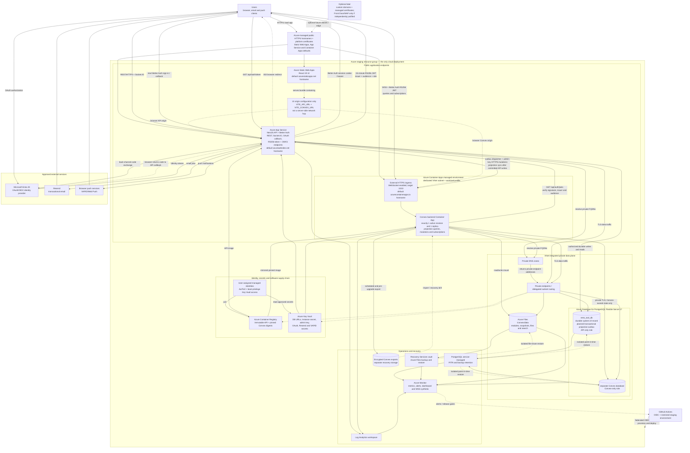

# Convex Self-Hosting on Azure Container Apps

> Status: Container Apps alternative to the App Service plan
> Scope: local Docker development and one Azure staging environment
> Research date: 2026-07-17

## Executive decision

Run exactly one cloud Convex deployment:

- one Azure Container App for staging;
- local Docker Compose for development.

Create one VNet-integrated Container Apps workload-profiles environment for staging. Run the official Convex backend container as exactly one active replica, expose only the browser/API endpoint on container port 3210, mount Azure Files at `/convex/data`, and connect to a separate Convex database/role on the staging Azure Database for PostgreSQL Flexible Server.

Keep the React UI on Azure Static Web Apps and NestJS API on App Service. Convex remains a reconstructable realtime projection layer; PostgreSQL through NestJS remains the authoritative system of record.

This is an alternative to [the App Service architecture](./CONVEX-AZURE-SELF-HOSTING-PLAN.md), not a replacement for it. Container Apps provides better container-native probes, revision controls, resource limits, and Log Analytics integration. It also introduces a new Azure control plane and a revision-overlap risk that requires a stop-first deployment procedure.

## Non-negotiable constraints

1. **One live staging backend.** Set `minReplicas=1` and `maxReplicas=1` in steady state. Never use KEDA rules, autoscale, traffic splitting, or multiple active revisions for Convex.
2. **No scale-to-zero.** Browsers maintain WebSocket subscriptions and the backend must remain ready.
3. **No zero-downtime runtime rollout assumption.** Container Apps single-revision mode starts the replacement before retiring the old revision. Self-hosted Convex does not document active-active backend support.
4. **Persistent `/convex/data`.** PostgreSQL alone does not retain deployed modules, file/search artifacts, and snapshot staging data.
5. **Immutable releases.** Mirror a pinned upstream image digest into ACR and pin the npm SDK to an exact tested version.
6. **Only port 3210 is public.** This repo defines no application `httpAction`, so 3211 is unnecessary. Do not expose dashboard port 6791.
7. **Separate local and cloud security boundaries.** Local Docker must never reuse the staging instance name, secret, admin key, database role, or file-share credentials.

## Repository findings that drive this design

### Application data flow

```text
Browser -- REST/HTTP --> NestJS API -- durable writes --> PostgreSQL
Browser -- Socket.IO --> NestJS API -- room events ----> browsers
NestJS  -- mutation ---> Convex ------ subscriptions --> browsers
```

Convex is not the durable application database. The API owns writes and authorization, then module-local `*-projection-sync.service.ts` services push collaboration snapshots to Convex.

Reports v2 read PostgreSQL through NestJS and do not require Convex.

### Convex state inventory

The schema has 15 tables:

- session/board projections: `liveRetroSessions`, `liveRetroBoards`, `liveEstimateSessions`, `liveEstimateBoards`, `liveIcebreakerSessions`, `liveIcebreakerBoards`, `liveStandupEntries`, and `liveStandupBoards`;
- product projections: `livePolls`, `liveSurveys`, and `liveNotifications`;
- ephemeral/security state: `livePresence`, `liveTyping`, `liveReadyStatus`, and `liveTeamMembers`.

Only team membership currently has complete mark-and-sweep reconciliation through `syncAllMemberships`. Other projection services refresh/delete individual objects but cannot rebuild an empty deployment end to end. A complete reconciliation operation is the main application prerequisite for switching staging to self-hosting.

### Existing fallbacks

| Feature           | Convex alternative                       |
| ----------------- | ---------------------------------------- |
| Retros            | Socket.IO                                |
| Estimates         | Socket.IO                                |
| Icebreakers       | Socket.IO                                |
| Standups          | Socket.IO                                |
| Notifications     | Socket.IO                                |
| Polls and surveys | REST polling when Convex is unconfigured |
| Reports           | Already PostgreSQL/API                   |

These fallbacks support a maintenance switch, but the UI URL is compiled into the Static Web App artifact. Retain Cloud-configured and self-hosted staging UI artifacts for rollback.

### Current deployment gaps

- [`docker/docker-compose.local.yml`](../docker/docker-compose.local.yml) uses mutable `latest` images, does not mount `/convex/data`, and lacks the official `/version` health check.
- [`infra/main.bicep`](../infra/main.bicep) has no Container Apps environment/app, Key Vault, Azure Files, private network data plane, or Convex monitoring.
- [`.github/workflows/deploy-api.yml`](../.github/workflows/deploy-api.yml) configures a Convex target but does not deploy a self-hosted backend/functions.
- [`.github/workflows/deploy-ui.yml`](../.github/workflows/deploy-ui.yml) omits the icebreaker and standup realtime build flags.
- [`retro-tool-api/src/ensure-convex-database.ts`](../retro-tool-api/src/ensure-convex-database.ts) creates only a database, not a least-privilege Convex owner role.
- API projection delivery is best-effort and has no transactional outbox, so a maintenance pause can currently lose intermediate projection updates until full reconciliation.
- `GET /health/ready` currently returns HTTP 200 even when its body says `not_ready`; it cannot safely gate a slot swap until dependency failure returns HTTP 503.
- `ENABLE_CRON_JOBS` is parsed into configuration but is not consumed by the scheduled services, so setting it to `false` does not currently make an inactive slot scheduler-safe.
- The current PostgreSQL defaults—Burstable B1ms, 32 GiB, seven-day retention, public networking, and no HA—are insufficiently proven for combined API and Convex staging load.
- Both Convex packages declare `^1.18.0`; deployment needs an exact SDK/backend compatibility pair.

## Target architecture



The diagram is the single staging deployment stamp. Static Web Apps can remain in its supported region while the API, Container Apps environment, PostgreSQL, storage, and private networking stay co-located. Local Docker uses only local credentials and state.

PostgreSQL through NestJS remains authoritative. The Convex database and Azure Files mount contain reconstructable realtime projection state and Convex runtime artifacts, not durable Retro Tool business records. Browser subscriptions go directly to the Container App over WSS, while every authorized business mutation goes to NestJS first and is then projected to Convex.

Start with the Azure-managed HTTPS hostnames and certificates on Static Web Apps, App Service, and Container Apps. Custom domains and managed certificates are optional later work. Front Door/WAF is also optional and should be added only for a separately approved global edge or WAF requirement; neither is a day-one dependency.

The browser—not Static Web Apps as a server—calls the API and Convex endpoints. The dotted UI-origin relationships describe compile-time configuration embedded into the JavaScript bundle. Better Auth handles the Microsoft Entra OAuth redirect/callback, stores sessions/accounts and RS256 JWKS in the application database, and returns a short-lived JWT from `/api/auth/token`. The browser presents that token to Convex, whose auth configuration retrieves the API's `/api/auth/jwks` and validates the exact issuer and audience.

Keep exactly one API instance serving the staging hostname and use only the inactive deployment slot for warm-up/smoke traffic. Expect Socket.IO/WebSocket clients to reconnect during the explicit slot swap and make reconnect success a release gate.

The projection outbox is also target state. Current projection calls are best-effort rather than transactionally durable. Before relying on a stop-first Convex maintenance window, persist a projection event in the same PostgreSQL transaction as each business mutation, deliver it asynchronously with idempotency keys, retain failures for retry, and finish with full reconciliation/drift detection.

### Staging deployment boundary

| Layer                      | Staging design                                          |
| -------------------------- | ------------------------------------------------------- |
| Container Apps environment | One dedicated staging workload-profiles environment     |
| Container App              | `retrotool-convex-staging`                              |
| Instance name/database     | `retrotool-convex-staging` / `retrotool_convex_staging` |
| PostgreSQL                 | Existing staging server with a separate Convex DB/role  |
| Azure Files                | One staging-only share mounted at `/convex/data`        |
| Secrets/admin key          | Staging-only Key Vault secrets                          |
| Public URL                 | Default Azure Container Apps staging hostname           |

No second cloud environment or cloud development Container App is needed.

## Container Apps platform design

### Managed environment

Use a modern **workload-profiles environment**, not the legacy consumption-only environment. Supply a dedicated VNet subnet; Azure documents `/27` as the minimum for workload-profile environments, but reserve at least `/26` to avoid immediate address pressure.

Enable:

- Log Analytics as the log destination;
- zone redundancy only after verifying South Africa North support, cost, and whether it provides meaningful benefit with a single application replica;
- private DNS resolution for PostgreSQL, storage, ACR, and Key Vault private endpoints;
- required outbound access for Azure platform dependencies, image pulls, JWKS retrieval, and operational tooling.

The Convex ingress remains external because browsers subscribe directly. Use its Azure-managed HTTPS hostname initially. An internal-only environment or a separate Front Door/Application Gateway edge is optional later architecture and requires its own routing, certificate, security, and cost decision.

### Workload profile and sizing

Start with the Consumption profile at one fixed replica if load testing stays within its 4 vCPU/8 GiB per-replica limits:

| Environment | Initial request/limit | Scale        |
| ----------- | --------------------- | ------------ |
| Staging     | 1 vCPU / 2 GiB        | min 1, max 1 |

These are hypotheses, not capacity guarantees. Load test WebSocket concurrency, Convex query/mutation latency, memory, CPU, restarts, and PostgreSQL/file-share behavior.

Move staging to a Dedicated D4/E4 workload profile only when measured capacity, memory, network controls, or steady-state cost justify it. Dedicated profiles allocate nodes at the environment level, so compare the full profile cost rather than only the container request.

Do not use the Flex profile while it is preview or unavailable in South Africa North.

### Ingress and ports

Configure:

- external HTTP ingress;
- target port 3210;
- transport `auto` for HTTP/1.1 and WebSocket support;
- HTTPS-only traffic on the default Azure Container Apps hostname and platform-managed certificate;
- no session affinity unless testing proves Convex requires it (one replica makes it irrelevant);
- no additional TCP ports;
- no Dapr.

Set `CONVEX_CLOUD_ORIGIN` to the Container App's Azure-managed public origin. The backend may retain an internal/default `CONVEX_SITE_ORIGIN`, but do not route port 3211. A future custom domain, `httpAction`, or `VITE_CONVEX_SITE_URL` use must trigger an origin, certificate, port, and routing review.

Do not deploy the dashboard. Run it locally/on demand through a protected operator path if required.

### Health probes

Configure all three HTTP probes on port 3210 and path `/version`:

- startup probe with enough failures/delay for database migrations and module loading;
- readiness probe to remove an unready replica from ingress;
- liveness probe with conservative thresholds to avoid restart loops during transient PostgreSQL/storage latency.

`/version` proves process readiness only. Add an external authenticated synthetic that subscribes to a harmless query and verifies WebSocket reconnect. Alert separately on both.

### Runtime configuration

| Setting               | Source                                     | Secret |
| --------------------- | ------------------------------------------ | ------ |
| `INSTANCE_NAME`       | Bicep parameter                            | No     |
| `INSTANCE_SECRET`     | Key Vault-referenced Container Apps secret | Yes    |
| `POSTGRES_URL`        | Key Vault-referenced Container Apps secret | Yes    |
| `CONVEX_CLOUD_ORIGIN` | Bicep parameter                            | No     |
| `DO_NOT_REQUIRE_SSL`  | Unset/false in Azure                       | No     |
| `RUST_LOG`            | Controlled app setting                     | No     |
| approved image digest | compatibility manifest                     | No     |

`JWT_ISSUER`, `JWT_AUDIENCE`, and `JWT_JWKS_URL` are Convex function environment variables. Set and verify them through the self-hosted Convex CLI after the backend is ready; container environment variables alone do not configure `convex/auth.config.ts`.

### Identity and secrets

- Use a user-assigned managed identity for ACR pull and Key Vault references.
- Grant only ACR Pull and Key Vault Secrets User as needed.
- Separate runtime and GitHub/bootstrap deployment identities.
- Use GitHub OIDC instead of an Azure client secret.
- Reference versionless Key Vault secret URIs where the rotation behavior is acceptable and restart the active revision after secret changes.
- Never expose the Convex admin key in Bicep outputs, UI variables, logs, or deployment summaries.

The admin key is a signed token derived from `INSTANCE_SECRET` — **not
deterministic**: each `generate_admin_key.sh` run mints a different but equally
valid token, and issuing a new one does not revoke earlier ones. Container
recreation with an unchanged `INSTANCE_SECRET` keeps an already-issued (stored)
key valid. Generate it once with the exact pinned image, mask it immediately,
and **persist that exact value** in Key Vault / the protected GitHub environment
(you re-read it, you don't re-derive it); only a change to `INSTANCE_SECRET`
invalidates previously issued keys.

## Persistence and database design

### PostgreSQL

Reuse the existing staging Flexible Server, but not the API database or API role. Create a database matching normalized `INSTANCE_NAME` and a role limited to that database.

Encode the official Convex constraints:

- use PostgreSQL 17, the currently documented tested version;
- keep backend and database in the same Azure region;
- pass `POSTGRES_URL` without a database name or query parameters;
- require TLS and private DNS/network access;
- redeploy functions after a database-provider/empty-database change.

Move the staging server from Burstable to a load-tested General Purpose SKU if combined API and Convex measurements exceed its CPU, memory, connection, or I/O headroom. Choose zonal/zone-redundant HA only if the agreed staging availability objective justifies it; the Burstable tier cannot provide zone-redundant HA.

A dedicated Convex PostgreSQL server is not initially necessary because all business state is reconstructable from the API database. Move to a dedicated server when measured CPU/IOPS/connection contention, independent maintenance, compliance, or backup/HA requirements justify it.

Create the database/role through an idempotent, VNet-connected bootstrap job using short-lived administrative access. Do not run server-level administration during ordinary API startup or migration.

### Azure Files mount

Create one staging-only share and mount it read/write at `/convex/data`.

Two supported choices:

| Choice          | Trade-off                                                                                                                                                |
| --------------- | -------------------------------------------------------------------------------------------------------------------------------------------------------- |
| Azure Files SMB | Simpler/cheaper starting point, but the Container Apps environment storage definition requires a storage account key that must be protected and rotated. |
| Azure Files NFS | Network-isolated and avoids an SMB account-key mount, but requires Premium Files, custom VNet routing, and validation of NFS semantics/performance.      |

Start with SMB in staging and keep it only after lifecycle, performance, and recovery tests. Configure the environment storage definition through a protected deployment step that retrieves the storage key without printing it. Key Vault references for Container App environment variables do not automatically remove the environment-level Azure Files credential requirement.

Enable storage firewall/private endpoint access, soft delete, Azure Backup, capacity/latency/throttling alerts, and documented key rotation.

PostgreSQL does not replace this mount. The official backend uses filesystem storage for deployed modules, snapshot imports/exports, files, and search artifacts unless its five S3-compatible buckets are configured.

Azure Blob Storage is not automatically an S3-compatible Convex target. Do not set the S3 variables to Blob endpoints without a proven compatibility layer. If Azure Files is unsuitable, evaluate an explicitly supported S3-compatible service and migrate with Convex export/import.

### Backup and recovery

Use three recovery layers:

1. PostgreSQL Flexible Server's service-managed PITR/backups with 14–35 day retention according to policy; this is not stored in the Azure Files backup vault.
2. Azure Files protection and restore through its supported Recovery Services/Azure Backup path, independent of Container Apps and PostgreSQL PITR.
3. Encrypted `npx convex export` before every backend upgrade and on an agreed schedule.

Initial proposed target for this reconstructable layer: RPO <= 24 hours and RTO <= 2 hours. Product/platform owners must approve it. Tighten the target if Convex ever holds non-reconstructable files/business state.

Quarterly restore into isolated resources:

1. restore/clone PostgreSQL;
2. restore the file share or create a fresh mount;
3. deploy the pinned backend image;
4. restore function environment and deploy functions;
5. run full projection reconciliation;
6. pass authenticated WebSocket and cross-team authorization tests.

## Revision and process lifecycle

### Why normal rolling revisions are unsafe

Container Apps single-revision mode is designed for zero-downtime updates: it starts the new revision, waits for it to become ready, shifts traffic, and then deprovisions the old revision. That creates a period with two running Convex backend processes against the same PostgreSQL database and file share.

Multiple-revision traffic splitting has the same fundamental problem and adds direct access to older revisions.

Because upstream self-hosting guidance does not define a clustered/active-active topology, neither behavior is approved. Set multiple-revision mode only if needed for explicit activation/deactivation control, and enforce **at most one active revision** with a deployment check.

### Stop-first backend image deployment

Backend image/resource-template changes require a maintenance window:

1. switch supported UI features to their fallback artifact, keep business writes available, and pause Convex delivery while transactionally buffering projection events in PostgreSQL;
2. disable public ingress or otherwise drain external traffic;
3. take and verify a logical Convex export;
4. deactivate the current revision and wait until all replicas are stopped;
5. deploy/activate the new pinned revision;
6. wait for startup/readiness probes and Convex migration-complete logs;
7. deploy compatible functions/environment if required;
8. reconcile and run authenticated synthetic tests;
9. restore ingress/API/UI traffic;
10. retain the inactive revision metadata, but rely on restore—not image-only rollback—after database migrations.

The workflow must query active revisions/replicas and fail if more than one exists. Rehearse the exact CLI/API procedure in staging because revision-scope and application-scope changes behave differently.

Function code deployment through the Convex API normally does not create a Container Apps revision and can follow the backward-compatible function/API/UI release order.

### Shutdown signal mismatch

Azure Container Apps sends `SIGTERM` and then `SIGKILL` after the termination grace period (30 seconds by default). The official Convex Docker Compose example explicitly requests `SIGINT` with a grace period.

Before enabling the staging deployment:

- verify with the pinned image that `SIGTERM` performs an orderly Convex shutdown;
- configure an adequate `terminationGracePeriodSeconds`;
- inspect logs and database/filesystem consistency after repeated revision deactivation;
- if SIGTERM is not handled equivalently, build a minimal, reproducible wrapper image/entrypoint that forwards SIGTERM as SIGINT, pin both upstream and wrapper digests, scan it, and test it. Do not silently accept forced SIGKILL.

## Infrastructure implementation

### Bicep modules

Keep [`infra/deploy.bicep`](../infra/deploy.bicep) as the environment entry point and split [`infra/main.bicep`](../infra/main.bicep) into reviewable modules:

- `networking.bicep`: VNet, dedicated Container Apps subnet, private endpoints/DNS, NSG/egress;
- `container-apps-environment.bicep`: workload-profiles environment and Log Analytics;
- `convex-storage.bicep`: storage account/share, environment storage definition, private access, backup;
- `convex-container-app.bicep`: app, identity, ACR, ingress, resources, probes, volume, secrets, revision mode;
- `key-vault.bicep`: secrets and least-privilege role assignments;
- `postgres.bicep`: staging sizing/backup/HA/network posture;
- `monitoring.bicep`: diagnostics, alerts, action group, workbook.

Deploy the cloud Convex modules only for staging. Reject main/develop/local targets.

Add Bicep/workflow validations for:

- immutable image digest, never `latest`;
- `minReplicas=1` and `maxReplicas=1`;
- no KEDA/custom scale rules;
- target port 3210 only;
- `/convex/data` mount present and read/write;
- startup/readiness/liveness probes present;
- unique instance/database/storage values;
- dashboard and Dapr disabled;
- staging PostgreSQL SKU has measured headroom for the combined workload.

Some secrets and database/storage data-plane operations should remain in protected bootstrap jobs rather than ARM outputs. Mark secure Bicep parameters appropriately and never emit secret values.

### Immutable compatibility manifest

Add a source-controlled manifest containing:

- upstream Convex backend tag and digest;
- mirrored ACR digest;
- exact `convex` npm version;
- optional wrapper-image digest;
- staging test date/evidence.

Use a scheduled workflow to open update PRs, not auto-deploy releases. Merge an update only after its pinned digest and SDK pair pass the complete staging test matrix.

## CI/CD design

Create `.github/workflows/deploy-convex-container-apps.yml` with GitHub OIDC and one non-canceling staging concurrency lock. A push to the `staging` branch drives the only cloud deployment.

### Automated release and rollback architecture

```mermaid
flowchart TB
    trigger["Push to staging branch<br/>or manual staging rollback dispatch"]
    validate["CI gates<br/>lint, type-check, unit/integration tests,<br/>dependency and image scan, Bicep lint + what-if"]
    build["Build commit-scoped backend artifacts once<br/>API image digest + Convex function bundle"]
    stagingUi["Build staging primary + fallback UI artifacts<br/>same commit, staging VITE origins/flags"]
    evidence[("Signed release manifest<br/>commit, backend digests, staging UI hashes,<br/>SBOM, migration and compatibility metadata")]
    previewUi["Deploy staging-configured UI artifacts to a temporary<br/>Static Web Apps preview; validate origins, auth and fallback mode"]
    predeploy{"CI + preview gates passed?"}
    kind{"Convex backend image,<br/>container resources or mount changed?"}

    subgraph ordinary["Near-zero-downtime application release"]
        direction TB
        backupApp["Verify PITR/backup freshness"]
        expand["VNet-connected job<br/>expand-only PostgreSQL migration"]
        functions["Deploy backward-compatible Convex functions<br/>no Container Apps revision"]
        apiSlot["Deploy API digest to inactive App Service slot<br/>P0: wired ENABLE_CRON_JOBS=false"]
        apiGate["Warm /health/ready + auth, REST, projection and contract smoke<br/>P0: not_ready must be HTTP 503, not 200"]
        swap["Explicit health-gated App Service slot swap<br/>no auto-swap for Linux containers;<br/>keep previous slot warm for rollback"]
        schedulerGate["Verify schedulers off in old slot; enable serving slot only<br/>PostgreSQL advisory lock + idempotency on every job"]
        ui["Deploy exact preview-validated staging UI artifact<br/>to the default staging hostname; all 5 flags explicit"]
        reconcileApp["Idempotent full projection reconciliation + drift gate"]
        soakApp["Authenticated REST, Socket.IO and WSS synthetics<br/>error budget + Azure Monitor release gate"]
    end

    subgraph runtime["Convex runtime upgrade — automated stop-first maintenance"]
        direction TB
        fallback["Activate preview-validated staging fallback UI artifact<br/>Socket.IO / REST polling"]
        freeze["Route committed projection events to durable outbox<br/>pause dispatcher and drain Convex ingress"]
        export["Verify PITR + Files backup<br/>create and validate encrypted Convex export"]
        stop["Deactivate old revision<br/>wait for 0 active replicas"]
        invariant{"Exactly 0 old replicas<br/>and no active revision?"}
        newrev["Create/activate pinned new revision<br/>min 1, max 1; never split traffic"]
        runtimeGate["/version startup/readiness + migration-complete logs<br/>verify exactly 1 active revision/replica"]
        functionRuntime["Restore function environment<br/>deploy compatible function bundle"]
        replay["Resume idempotent outbox dispatcher<br/>replay every event committed during maintenance"]
        reconcileRuntime["Full reconciliation + drift gate"]
        smokeRuntime["Authenticated query/mutation/subscription,<br/>RBAC, reconnect and projection smoke"]
        resume["Resume normal projection delivery and ingress<br/>restore primary staging UI artifact"]
    end

    release["Mark staging release successful<br/>retain artifacts, prior slot/revision metadata and evidence"]
    appFail{"Ordinary release gate failed?"}
    appRollback["Automated application rollback<br/>swap API slot back + redeploy prior UI artifact;<br/>leave expand schema in place and roll functions forward<br/>or redeploy only a verified compatible prior bundle"]
    runtimeFail{"Runtime upgrade gate failed?"}
    compatible{"Storage schema compatible<br/>with previous image?"}
    fastRuntimeRollback["Keep ingress off; deactivate failed revision;<br/>reactivate pinned previous revision, then reconcile"]
    rollbackSmoke["Authenticated rollback smoke<br/>WSS reconnect + projection drift gate"]
    cloudReady{"Retained Cloud escape hatch<br/>configured and smoke-tested?"}
    cloudRollback["Gated target-state RTO escape hatch<br/>restore retained Cloud-configured API/UI artifacts,<br/>reconcile Cloud from PostgreSQL"]
    incident["Fail release, preserve logs/state and open incident"]

    trigger --> validate --> build --> stagingUi --> evidence --> previewUi --> predeploy
    predeploy -->|"no"| incident
    predeploy -->|"yes"| kind

    kind -->|"no: functions/API/UI/data"| backupApp
    backupApp --> expand --> functions --> apiSlot --> apiGate
    apiGate -->|"pass"| swap --> schedulerGate --> ui --> reconcileApp --> soakApp --> appFail
    apiGate -->|"fail before swap"| incident
    appFail -->|"no"| release
    appFail -->|"yes"| appRollback --> incident

    kind -->|"yes: backend runtime"| fallback
    fallback --> freeze --> export --> stop --> invariant
    invariant -->|"no"| incident
    invariant -->|"yes"| newrev --> runtimeGate
    runtimeGate -->|"pass"| functionRuntime --> replay --> reconcileRuntime --> smokeRuntime --> runtimeFail
    runtimeGate -->|"fail"| runtimeFail
    runtimeFail -->|"no"| resume --> release
    runtimeFail -->|"yes"| compatible
    compatible -->|"yes"| fastRuntimeRollback --> rollbackSmoke
    rollbackSmoke -->|"pass"| resume
    rollbackSmoke -->|"fail"| cloudReady
    compatible -->|"no / unknown"| cloudReady
    cloudReady -->|"yes"| cloudRollback --> incident
    cloudReady -->|"no"| incident
```



The release controller should be one orchestrating workflow that calls reusable validation, infrastructure, Convex, API, UI, reconciliation, smoke, and rollback workflows. The current independent path-triggered API and UI workflows cannot guarantee this ordering or prevent a partial release. Build the API image and Convex function bundle once for the staging commit, record their digests, and deploy those exact artifacts to staging.

The UI is different because Vite embeds `VITE_API_URL`, `VITE_CONVEX_URL`, and realtime flags at compile time. Build one staging-configured primary artifact and one staging-configured fallback artifact from the same commit, record both hashes, deploy them to a temporary Static Web Apps preview, smoke-test them, and redeploy the exact validated artifact to the default staging hostname. The alternative is to implement a verified runtime configuration bootstrap; only then can one environment-neutral UI artifact serve both local and staging configurations.

Near-zero downtime is realistic for backward-compatible function, API, UI, and expand-only database changes. Use App Service deployment slots for the API, deploy API before UI, keep contract changes additive across at least one release, and defer destructive database changes to a later contract migration. Before slots become a release gate, change `/health/ready` to return HTTP 503 when a dependency is not ready; checking a `not_ready` body delivered with HTTP 200 is insufficient. Also wire the parsed `ENABLE_CRON_JOBS` configuration into every static and dynamic scheduled service, because it currently has no effect. Keep jobs disabled in the inactive slot, protect each job with a PostgreSQL advisory lock and idempotency key, explicitly swap only after health/smoke success, verify jobs are off in the old slot, and then enable them only in the serving slot. Do not rely on auto-swap for the Linux container.

Keep one API instance serving the staging hostname. The inactive slot receives only warm-up and synthetic traffic before the explicit swap. A swap can still disconnect REST keep-alives, Socket.IO, and WebSocket clients, so exponential reconnect, token refresh, state resubscription, and authenticated reconnect synthetics are release gates.

A Convex backend image or stateful Container App template upgrade is intentionally different: the one-replica safety rule prevents a true zero-downtime rolling replacement. Automation minimizes the maintenance window by prebuilding both primary and fallback UI artifacts, validating backups before traffic is drained, writing new projection work to a durable PostgreSQL outbox, enforcing zero old replicas before activation, replaying that outbox, and restoring primary traffic only after full reconciliation and authenticated WSS smoke tests. The fallback artifact keeps retros, estimates, icebreakers, standups, and notifications on Socket.IO and polls/surveys on REST polling during the window. It must never briefly overlap two Convex revisions to claim zero downtime.

Detection, traffic switching, health gates, slot swap-back, UI artifact rollback, and compatible Convex revision reactivation are fully automated for staging. Prefer an automated roll-forward for ordinary failures and never run a down migration during automatic rollback. A destructive PostgreSQL/Azure Files restore remains a separate operator-invoked recovery workflow because it rewrites shared state. Convex Cloud rollback is a gated target-state escape hatch, not a capability the current workflows provide: it exists only while the staging Cloud deployment, credentials, Cloud-configured API/UI artifacts, and tested reconciliation automation are deliberately retained.

Required workflow structure:

- `release.yml`: `staging` branch trigger, one staging concurrency lock, release manifest, evidence, notifications, and rollback coordination;
- reusable `validate.yml`: monorepo tests, compatibility checks, secret-free Bicep validation/what-if, dependency/image scanning, and Mermaid/document checks;
- reusable `deploy-convex-container-apps.yml`: function-only path plus guarded stop-first runtime path and one-revision invariant;
- reusable `deploy-api.yml`: immutable-digest slot deployment, scheduler suppression, HTTP-correct readiness, warm-up, health/smoke, explicit swap, single-serving-instance verification, scheduler lock/idempotency checks, and swap-back;
- reusable `deploy-ui.yml`: same-commit staging primary/fallback artifacts, all realtime flags, temporary-preview validation, default-site deployment, and deterministic prior-artifact restore;
- reusable `migrate-and-reconcile.yml`: VNet-connected expand migration, idempotent seed/reconciliation, drift results, and contract migration in a later release;
- reusable `smoke-and-observe.yml`: signed-out/authenticated flows, two-tenant denial tests, REST, Socket.IO, WSS subscription/reconnect, projection freshness, Azure Monitor query, and automated rollback threshold.

Use one non-canceling GitHub concurrency group so only one release or rollback mutates staging at a time. A push to `staging` deploys automatically after CI and preview gates; manual dispatch selects only a recorded staging rollback manifest. Emit deployment status and evidence without secrets, and alert operators on every automated rollback.

### Initial deployment

1. Validate the compatibility manifest, Convex functions/tests, Bicep, and `what-if`.
2. Mirror/scan the approved image digest into ACR.
3. Provision networking, Key Vault, storage, managed environment, monitoring, database/role, and initial Container App.
4. Wait for startup/readiness probes and `/version`.
5. Generate/retrieve the stable admin key without logging it.
6. Set `JWT_ISSUER`, `JWT_AUDIENCE`, and `JWT_JWKS_URL` through the self-hosted CLI.
7. Run `convex deploy`.
8. Run complete projection reconciliation.
9. Execute signed-out, authenticated, cross-team, mutation, subscription, and reconnect smoke tests.
10. Publish only non-secret resource names, digest, revision, counts, durations, and test results.

### Normal application release

Recommended order:

1. backward-compatible Convex functions;
2. NestJS API;
3. UI artifact.

Fix `.github/workflows/deploy-ui.yml` to explicitly pass/validate all five realtime backend flags. Archive Cloud/self-hosted UI artifacts because `VITE_CONVEX_URL` is compiled at build time.

### Backend upgrade

Use the stop-first revision procedure, not a normal Bicep rolling update. Convex officially recommends an export before in-place upgrades and waiting for migration-complete logs. If in-place migration fails, stop traffic and use export/import into restored/fresh state.

An old inactive revision is not a sufficient rollback: database migrations may make the old image incompatible.

## Full projection reconciliation

Implement one protected super-admin/CLI operation that rebuilds every required projection from PostgreSQL.

It must:

- process membership/security first;
- cover active retros, estimates, icebreakers, standups, polls, surveys, and the required notification window;
- start presence, typing, ready state, and rate-limit state empty;
- mark and sweep records no longer present in PostgreSQL;
- be idempotent, batched, retryable, and safe to repeat;
- report scanned, inserted/updated, deleted, skipped, failed, and duration per projection;
- use a stable run/correlation ID;
- fail the release on partial error or unexplained drift.

Prefer PostgreSQL reconstruction over importing Convex Cloud data. Audit first and use Cloud export only for state that cannot be reconstructed.

## Migration runbook

### Phase 0: readiness

- Pin a tested SDK/backend compatibility pair.
- Add `/convex/data`, health checks, and graceful stop behavior to local Docker.
- Implement/rehearse complete reconciliation against an empty target.
- Validate SIGTERM shutdown behavior or build/test the minimal wrapper.
- Fix missing UI build flags and retain rollback artifacts.
- Establish owners, maintenance window, RPO/RTO, alerts, backup, restore, and secret-rotation runbooks.

### Phase 1: provision and validate staging

1. Provision the staging Container Apps environment/app and private data plane.
2. Deploy functions/auth environment and reconcile staging PostgreSQL.
3. Test all realtime features, RBAC boundaries, token refresh, reconnect, and API projection writes.
4. Load test at expected and failure-boundary concurrency.
5. Deactivate/reactivate and perform a stop-first image upgrade to prove no overlapping live revisions.
6. Confirm `/convex/data` survives replica/revision replacement.
7. Exercise PostgreSQL, Azure Files, and logical export recovery.
8. Operate through at least one representative peak-usage period.

### Phase 2: activate staging self-hosting

1. Freeze unrelated staging changes and record the current Cloud URLs, secret versions, API image, and UI artifact.
2. Run final full reconciliation and verify team membership first.
3. Deploy the staging API candidate slot with the self-hosted Convex URL/key and pass readiness, auth, projection, and contract smoke tests.
4. Explicitly swap the API slot, then deploy the preview-validated self-hosted staging UI artifact with all five feature flags.
5. Test two tenants plus a system admin across reads, writes, unauthorized rejection, subscriptions, reconnect, token refresh, Entra sign-in, and JWKS verification.
6. Monitor through a representative staging usage period while retaining the Cloud-configured staging artifacts.

Avoid indefinite dual-write. If reconciliation exceeds the maintenance window, use the transactional outbox and a temporary, explicitly measured dual-target dispatcher rather than duplicating calls ad hoc.

### Phase 3: automate steady-state staging releases

1. Enable the single `staging` branch workflow and one environment lock.
2. Prove an ordinary function/API/UI release, automatic slot swap-back, and UI artifact restore.
3. Prove a stop-first Convex runtime upgrade and compatible automatic revision rollback.
4. Exercise the gated Cloud escape hatch and the separate PostgreSQL/Azure Files recovery workflow.
5. Keep release evidence, drift results, backup status, and synthetic results for every staging deployment.

### Rollback

Trigger rollback for sustained subscription/auth failures, projection drift, PostgreSQL saturation, repeated restarts, mount/module loss, or failed reconciliation:

1. restore API Convex Cloud URL/key;
2. redeploy the Cloud-configured UI artifact;
3. verify Cloud writes/subscriptions;
4. reconcile Cloud from PostgreSQL for the self-hosted interval;
5. isolate/preserve Container Apps resources for diagnosis.

Do not remove the staging Convex Cloud escape hatch until at least 30 stable days, two successful backend upgrades, one complete restore drill, and an explicit decision to accept restore-only rollback.

## Security and observability

### Security

- GitHub OIDC, a staging GitHub environment with restricted secrets, and one non-canceling deployment lock.
- Separate runtime/deployment identities and least-privilege RBAC.
- Key Vault references for runtime secrets; protected handling for environment storage credentials.
- Private endpoints/DNS for PostgreSQL/storage/Key Vault/ACR where supported.
- TLS 1.2+ and HTTPS-only public ingress.
- No dashboard, Dapr, public 3211, secret Bicep outputs, or admin key in UI.
- Restrict deployment/control-plane access and audit Key Vault/Container Apps changes.
- Verify JWKS reachability and exact JWT issuer/audience.
- Avoid logging tokens, keys, connection strings, projection payloads, card text, or survey answers.

### Monitoring and alerts

Monitor:

- environment/system logs, revision activation/deactivation, replica count, restarts, OOM/exit 137, CPU, memory;
- startup/readiness/liveness probe failures and external authenticated synthetic failures;
- HTTP 5xx/429, request latency, WebSocket connection/disconnection spikes;
- Convex function deployment/migration failures, query/mutation latency, scheduled-job lag;
- PostgreSQL CPU, IOPS/latency, connections, locks, storage, HA/PITR status;
- Azure Files latency, capacity, throttling, availability, backup;
- API projection errors, stale projection age, reconciliation failure, drift, JWT/JWKS failures.

Page on backend unavailability, more than one live replica/revision, repeated restart, database/storage critical, failed backups, authorization-wide failures, and failed release reconciliation.

## Acceptance criteria

- Exactly one cloud deployment exists in staging; development remains local Docker.
- Staging has one active revision and exactly one running replica.
- No scale rules, traffic splitting, Dapr, dashboard, or public 3211/6791.
- The approved digest and exact SDK version match the compatibility manifest.
- Startup/readiness/liveness probes and authenticated synthetic checks pass.
- API `/health/ready` returns HTTP 503 whenever its dependency body would be `not_ready`.
- Exactly one API slot serves users; the inactive slot has schedulers disabled, and every scheduled job uses a PostgreSQL advisory lock plus idempotency.
- SIGTERM/deactivation stops cleanly without corruption or forced SIGKILL.
- A stop-first upgrade is rehearsed and automation proves no overlapping revisions.
- `/convex/data` survives revision replacement and has a verified restore.
- Convex DB/role is isolated and cannot access `retro_tool_db`.
- Staging PostgreSQL sizing/HA/backup posture meets the defined objective.
- Every realtime feature, reconnect, token refresh, and two-tenant authorization test passes.
- Entra sign-in, Better Auth session/token issuance, JWKS retrieval, and Convex issuer/audience/signature validation pass on the Azure-managed hostnames.
- Projection events committed during a stop-first upgrade remain in the durable outbox, replay idempotently, and converge under full reconciliation.
- Complete reconciliation is repeatable, deletes stale data, and reports failures.
- PostgreSQL PITR, Azure Files restore, Convex export/import, and Cloud rollback are rehearsed.
- Peak load meets the error/latency budget with at least 50% CPU/memory headroom.

## Implementation backlog

| Priority | Change                                                                                                                           |
| -------- | -------------------------------------------------------------------------------------------------------------------------------- |
| P0       | Implement complete projection reconciliation and tests.                                                                          |
| P0       | Add a transactional PostgreSQL projection outbox, idempotent dispatcher, replay metrics, and a maintenance pause/resume control. |
| P0       | Return HTTP 503 from `/health/ready` on dependency failure and make the slot gate require it.                                    |
| P0       | Wire `ENABLE_CRON_JOBS` into every scheduled service; add PostgreSQL advisory locks, idempotency, and inactive-slot tests.       |
| P0       | Pin the Convex SDK/backend image compatibility manifest.                                                                         |
| P0       | Harden local Docker persistence, health, and shutdown.                                                                           |
| P0       | Add Container Apps/VNet/storage/Key Vault/PostgreSQL/monitoring Bicep modules.                                                   |
| P0       | Add protected Container Apps deployment, backup, and stop-first upgrade workflow.                                                |
| P0       | Fix all UI realtime flag inputs and archive rollback artifacts.                                                                  |
| P1       | Add least-privilege private database/role bootstrap.                                                                             |
| P1       | Validate SIGTERM or build a minimal signal-forwarding wrapper.                                                                   |
| P1       | Add authenticated WebSocket synthetic and revision/replica invariant checks.                                                     |
| P1       | Add restore, upgrade, rotation, rollback, and incident runbooks.                                                                 |

## Risks and mitigations

| Risk                                                     | Mitigation                                                                                                           |
| -------------------------------------------------------- | -------------------------------------------------------------------------------------------------------------------- |
| Rolling revision overlaps two Convex processes           | Stop traffic and deactivate old revision before activating new; fail if more than one live revision/replica.         |
| ACA sends SIGTERM while official Compose requests SIGINT | Validate pinned image; configure grace; use a tested minimal signal-forwarding wrapper if required.                  |
| One replica causes maintenance downtime                  | Accept/document it, use fallbacks and planned stop-first upgrades, retain Cloud rollback.                            |
| Filesystem modules/search disappear                      | Azure Files at `/convex/data`, backup, lifecycle/restore tests.                                                      |
| Azure Files key/latency                                  | Protected environment storage configuration, rotation, benchmark; consider NFS or compatible S3 only after testing.  |
| Shared PostgreSQL contention                             | Separate DB/role, load-tested staging SKU, monitoring, measured dedicated-server trigger.                            |
| In-place DB migration blocks binary rollback             | Export first, exact staged digest, migration log gate, restore/import recovery.                                      |
| Fresh target is incomplete                               | Full idempotent reconciliation and drift checks, membership first.                                                   |
| Projection changes occur while Convex is stopped         | Transactional outbox, idempotent replay, then full reconciliation before primary traffic resumes.                    |
| More than one API instance fragments Socket.IO rooms     | Keep exactly one API instance serving users; candidate slot traffic is limited to controlled warm-up and synthetics. |
| Static UI embeds URL                                     | Retain and deterministically redeploy complete staging build artifacts.                                              |
| New platform adds operational burden                     | Dedicated runbooks/alerts/owners and cost comparison against App Service/Convex Cloud.                               |

## Recommendation compared with App Service

Choose Container Apps when container-native resource controls, probes, Log Analytics, and explicit revision APIs are worth the new environment and stop-first deployment complexity.

Choose App Service when minimizing Azure platform variety is more important and the single-port Web App constraints are acceptable.

For either option, the same blockers remain: complete projection reconciliation, persistent `/convex/data`, exact version pinning, staging PostgreSQL validation, controlled deployments, and tested restore/rollback.

## Primary sources

Convex:

- [Self-hosting overview](https://docs.convex.dev/self-hosting)
- [Official self-hosted README](https://github.com/get-convex/convex-backend/blob/main/self-hosted/README.md)
- [Official Docker Compose reference](https://github.com/get-convex/convex-backend/blob/main/self-hosted/docker/docker-compose.yml)
- [Hosting and routing origins](https://github.com/get-convex/convex-backend/blob/main/self-hosted/advanced/hosting_on_own_infra.md)
- [PostgreSQL requirements](https://github.com/get-convex/convex-backend/blob/main/self-hosted/advanced/postgres_or_mysql.md)
- [Filesystem/S3 storage](https://github.com/get-convex/convex-backend/blob/main/self-hosted/advanced/s3_storage.md)
- [Upgrade procedures](https://github.com/get-convex/convex-backend/blob/main/self-hosted/advanced/upgrading.md)

Azure Container Apps:

- [Container Apps environments](https://learn.microsoft.com/azure/container-apps/environment)
- [Workload profiles](https://learn.microsoft.com/azure/container-apps/workload-profiles-overview)
- [Ingress](https://learn.microsoft.com/azure/container-apps/ingress-overview)
- [Revisions](https://learn.microsoft.com/azure/container-apps/revisions)
- [Revision management and deactivation](https://learn.microsoft.com/azure/container-apps/revisions-manage)
- [Application lifecycle and SIGTERM behavior](https://learn.microsoft.com/azure/container-apps/application-lifecycle-management)
- [Health probes](https://learn.microsoft.com/azure/container-apps/health-probes)
- [Azure Files storage mounts](https://learn.microsoft.com/azure/container-apps/storage-mounts)
- [Managed identities](https://learn.microsoft.com/azure/container-apps/managed-identity)
- [ACR pull with managed identity](https://learn.microsoft.com/azure/container-apps/managed-identity-image-pull)
- [Key Vault-backed secrets](https://learn.microsoft.com/azure/container-apps/manage-secrets)
- [Custom VNet integration](https://learn.microsoft.com/azure/container-apps/vnet-custom)
- [PostgreSQL Flexible Server high availability](https://learn.microsoft.com/azure/postgresql/flexible-server/concepts-high-availability)
- [PostgreSQL backup and restore](https://learn.microsoft.com/azure/postgresql/backup-restore/concepts-backup-restore)
