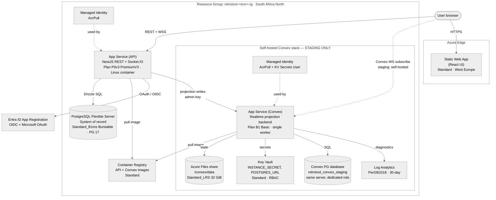
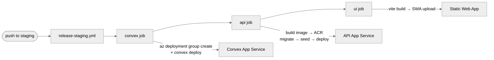

# Retro Tool — Cloud Architecture (Azure)

How every Azure resource maps to a part of the app, which environment owns it,
and its provisioning + pricing model. Two independent IaC stacks live in
[`infra/`](../../infra/):

- **Core app stack** — [`infra/deploy.bicep`](../../infra/deploy.bicep) (subscription
  scope, creates the resource group) → [`infra/main.bicep`](../../infra/main.bicep)
  (resource-group scope). Provisioned per environment via the Azure CLI.
- **Self-hosted Convex stack** — [`infra/convex-staging.bicep`](../../infra/convex-staging.bicep)
  + [`infra/modules/`](../../infra/modules/). **Staging only**, deployed into the
  existing `retrotool-staging-rg`.

> App-level architecture (modules, data flow, auth, realtime) is in
> [`overview.md`](overview.md). This document is infrastructure only.

---

## 1. Environment → branch → resource group

Each environment is a fully isolated resource group. The Bicep `environment`
parameter takes `prod` / `staging` / `develop`; the matching GitHub environments
are named `production` / `staging` / `develop` (names must match for OIDC + env
secrets).

| Environment | Bicep param | Branch | Resource Group | Self-hosted Convex? |
|---|---|---|---|---|
| Production | `environment=prod` | `main` | `retrotool-prod-rg` | No — Convex Cloud |
| Staging | `environment=staging` | `staging` | `retrotool-staging-rg` | **Yes** |
| Development | `environment=develop` | `develop` | `retrotool-develop-rg` | No — Convex Cloud |

**Regions:** everything is in **South Africa North**, except the **Static Web
App**, which is in **West Europe** (Static Web Apps are not offered in South
Africa North). Naming prefix: `retrotool-<env>` (ACR strips hyphens →
`retrotool<env>acr`).

---

## 2. High-level topology

> **Prod & develop** are identical to the top of the diagram (UI + API + PostgreSQL +
> ACR + identity) but the UI/API talk to **Convex Cloud** instead of the
> self-hosted Convex stack — that entire `convex` subgraph exists only in staging.

---

## 3. Core stack resources (all environments)

Provisioned by [`infra/main.bicep`](../../infra/main.bicep). Deployed via the Azure CLI
(`az deployment sub create`), **not** a GitHub workflow.

| # | Resource | Azure type | Name pattern | SKU / tier | Pricing model | Houses / role |
|---|---|---|---|---|---|---|
| 3a | Container Registry | `Microsoft.ContainerRegistry/registries` | `retrotool<env>acr` | **Standard** | Fixed per-registry/day | API Docker images (+ mirrored Convex image in staging). `adminUserEnabled: false`, pulled via managed identity |
| 3b | User-Assigned Managed Identity | `Microsoft.ManagedIdentity/userAssignedIdentities` | `retrotool-<env>-identity` | — | **Free** | Passwordless **AcrPull** for the API App Service |
| 3c | PostgreSQL Flexible Server | `Microsoft.DBforPostgreSQL/flexibleServers` | `retrotool-<env>-db` | **Standard_B1ms — Burstable** (1 vCore / 2 GiB) | Burstable compute + 32 GiB P4 storage | **System of record** — all durable business data (`retro_tool_db`). PG 17, 7-day backup, HA off, `AllowAzureServices` firewall, `?sslmode=require` |
| 3d | App Service Plan (API) | `Microsoft.Web/serverfarms` | `retrotool-<env>-plan` | **P0v3 — PremiumV3**, Linux | Dedicated, always-on compute | Hosts the API web app |
| 3e | App Service — API | `Microsoft.Web/sites` (`app,linux,container`) | `retrotool-<env>-api` | (on 3d) | (plan-based) | **NestJS REST + Socket.IO**. HTTPS-only, Always On, HTTP/2, **WebSockets on**, TLS 1.2, FTPS off, AcrPull via identity |
| 3f | Static Web App | `Microsoft.Web/staticSites` | `retrotool-<env>-ui` | **Standard**, **West Europe** | Standard tier | **React UI**, edge-served. Staging environments enabled |

> **Entra ID App Registration** (global, not Bicep-managed) backs GitHub OIDC
> login and Microsoft OAuth / Better Auth social sign-in.

---

## 4. Self-hosted Convex stack (staging only)

Provisioned by [`infra/convex-staging.bicep`](../../infra/convex-staging.bicep) +
[`infra/modules/`](../../infra/modules/), into the existing `retrotool-staging-rg`,
**reusing** the staging ACR and PostgreSQL server. The backend image must be
digest-pinned (`@sha256:`). Deployed by the
[`deploy-convex.yml`](../../.github/workflows/deploy-convex.yml) workflow.

| # | Resource | Azure type | Name | SKU / tier | Pricing model | Houses / role |
|---|---|---|---|---|---|---|
| 4a | App Service Plan (Convex) | `Microsoft.Web/serverfarms` | `retrotool-staging-convex-plan` | **B1 — Basic**, Linux | Dedicated (cheapest tier with Always On + WebSockets) | Hosts the Convex web app |
| 4b | App Service — Convex | `Microsoft.Web/sites` (`app,linux,container`) | `retrotool-staging-convex` | (on 4a) | (plan-based) | **Self-hosted Convex realtime backend**. `WEBSITES_PORT=3210`, **single worker** (`numberOfWorkers: 1`), `/version` health check, `/convex/data` mount, KV-referenced secrets |
| 4c | Storage Account | `Microsoft.Storage/storageAccounts` | `retrotoolstaging<hash>` | **Standard_LRS**, StorageV2 | Per-GB stored + transactions | Backs the Azure Files share. Shared-key access on (BYOS mount needs it) |
| 4d | Azure Files share | `.../fileServices/shares` | `convex-data` | 32 GiB, TransactionOptimized | Per-GB | **Durable Convex state** at `/convex/data` — deployed functions, snapshots. 14-day soft-delete |
| 4e | Key Vault | `Microsoft.KeyVault/vaults` | `retrotool-staging-cvx-<hash>` | **Standard** (family A) | Per-operation | Stores `convex-instance-secret` + `convex-postgres-url`. RBAC-auth, soft-delete 14d. Emits **version-pinned** secret URIs so rotations aren't served stale |
| 4f | Managed Identity (Convex) | `Microsoft.ManagedIdentity/userAssignedIdentities` | `retrotool-staging-convex-identity` | — | **Free** | **AcrPull** on ACR + **Key Vault Secrets User** on the vault |
| 4g | Log Analytics Workspace | `Microsoft.OperationalInsights/workspaces` | `retrotool-staging-convex-logs` | **PerGB2018** | Pay-per-GB ingested (5 GB/mo free), 30-day retention | Convex App Service diagnostic logs/metrics |
| 4h | Convex PostgreSQL database | `.../flexibleServers/databases` | `retrotool_convex_staging` | (on the shared 3c server) | (shared server) | Convex's own DB on the existing staging server, with a **dedicated role** scoped to this DB only — never `retro_tool_db` |

### Design constraints
- **Single instance only.** Open-source Convex is single-instance: no scale-out,
  autoscale, or deployment slots. The plan is pinned to one worker and the deploy
  workflow refuses to proceed if it finds more than one.
- **No VNet / private endpoints** on day one — public + TLS. Deferred as future
  work.
- **Image digest-pinned** (`@sha256:`), enforced by the workflow and
  `convex-backend/compatibility.json`.
- **Not runnable on Free/Shared (F1) tiers** — Convex requires WebSockets, Always
  On, and the `/convex/data` file mount, none of which F1 supports. B1 Basic is
  the floor.

---

## 5. Pricing / cost posture summary

| Resource | SKU / tier | Pricing model |
|---|---|---|
| Container Registry (core + staging) | Standard | Fixed registry tier |
| PostgreSQL Flexible Server | Standard_B1ms | **Burstable** (lowest-cost compute) + 32 GiB storage |
| API App Service Plan | P0v3 | **PremiumV3** (dedicated, always-on) |
| Static Web App | Standard | Standard tier |
| Managed Identities | — | Free |
| Convex App Service Plan (staging) | B1 | **Basic** (cheapest tier with Always On + WebSockets) |
| Convex Storage / Azure Files (staging) | Standard_LRS | Standard, 32 GiB |
| Convex Key Vault (staging) | Standard | Per-operation |
| Convex Log Analytics (staging) | PerGB2018 | Pay-per-GB ingested (5 GB/mo free), 30-day |

**Cost principles** (from the self-hosting plan + `infra/README.md`):
- The biggest predictable cost is **always-on App Service compute**. Start on the
  smallest tier that meets load; scale **vertically on evidence**. Do **not**
  enable scale-to-zero — Convex subscriptions need a live backend.
- Convex reuses the existing staging Burstable Postgres server (no separate
  server) to keep cost down; move to a dedicated / General Purpose server only on
  measured contention.
- Log Analytics is kept lean (PerGB2018, 30-day, Convex-only categories) and the
  backend runs at `RUST_LOG=warn` to avoid flooding ingestion with per-request
  INFO lines.
- **On-demand savings:** `az webapp stop`/`start` the staging Convex app when it
  isn't in use — stopped compute isn't billed, no tier change needed.

---

## 6. Which GitHub workflow deploys what

All workflows authenticate with Azure OIDC (`azure/login@v3`); Node 24, pnpm
11.13.0. Core infrastructure is CLI-provisioned — the workflows deploy **apps**,
not core resources.

| Workflow | Target | What it does |
|---|---|---|
| [`release-staging.yml`](../../.github/workflows/release-staging.yml) | orchestrator | On push to `staging` (path-filtered) or dispatch: runs `convex` → `api` → `ui` in order |
| [`deploy-convex.yml`](../../.github/workflows/deploy-convex.yml) | `retrotool-staging-convex` | Validate (digest-pin + `az bicep build`) → single-worker guard → **stop-first** image upgrade (export → pause outbox → stop) → `az deployment group create` → start → wait `/version` → set Convex `JWT_*` env → `convex deploy` → resume outbox + reconcile |
| [`deploy-api.yml`](../../.github/workflows/deploy-api.yml) | `retrotool-<env>-api` | Validate → build & push image to ACR → DB migrate → seed → set app settings (**GitHub is the source of truth** — overwrites portal edits) → deploy container → `/health/ready` check |
| [`deploy-ui.yml`](../../.github/workflows/deploy-ui.yml) | `retrotool-<env>-ui` | Validate realtime flags → Vite build → `static-web-apps-deploy` upload of `dist` |

> Deploy-time config lives in the GitHub environment (secrets + variables), synced
> in bulk with [`scripts/sync-github-env.mjs`](../../scripts/sync-github-env.mjs)
> (`pnpm gh:env:sync <env>`). See [`infra/README.md`](../../infra/README.md).

---

## 7. Related docs

- [`overview.md`](overview.md) — application architecture (modules, data,
  auth, realtime, workflows)
- [`infra/README.md`](../../infra/README.md) — Bicep deployment commands + GitHub env config
- [`docs/deployment/convex-azure-self-hosting-plan.md`](../deployment/convex-azure-self-hosting-plan.md) — self-hosted Convex design
- [`docs/deployment/convex-staging-runbook.md`](../deployment/convex-staging-runbook.md) — Convex deploy runbook + rollback
- [`docs/deployment/new-azure-subscription.md`](../deployment/new-azure-subscription.md) — full fresh-subscription runbook
