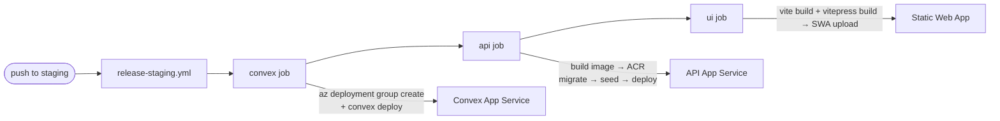

# Retro Tool — Cloud Architecture (Azure)

How every Azure resource maps to a part of the app, which environment owns it,
and its provisioning + pricing model. Two independent IaC stacks live in
[`infra/`](../../infra/):

- **Core app stack** — [`infra/deploy.bicep`](../../infra/deploy.bicep) (subscription
  scope, creates the resource group) → [`infra/main.bicep`](../../infra/main.bicep)
  (resource-group scope). Provisioned per environment via the Azure CLI.
- **Self-hosted Convex stack** — [`infra/convex-staging.bicep`](../../infra/convex-staging.bicep)
  (staging) and [`infra/convex-production.bicep`](../../infra/convex-production.bicep)
  (production) + [`infra/modules/`](../../infra/modules/). **Staging and production only**,
  each deployed into that environment's existing resource group
  (`retrotool-staging-rg` / `retro_tool`). `develop` is not provisioned in Azure at all —
  see §1.

> App-level architecture (modules, data flow, auth, realtime) is in
> [`overview.md`](overview.md). This document is infrastructure only.

---

## 1. Environment → branch → resource group

Each environment is a fully isolated resource group. The Bicep `environment`
parameter takes `prod` / `staging` / `develop`; the matching GitHub environments
are named `production` / `staging` / `develop` (names must match for OIDC + env
secrets).

| Environment | Bicep param                                            | Branch      | Resource Group                                                                                           | Self-hosted Convex?                                                 |
| ----------- | ------------------------------------------------------ | ----------- | -------------------------------------------------------------------------------------------------------- | ------------------------------------------------------------------- |
| Production  | `environment=prod`                                   | `main`    | `retro_tool` (legacy — predates this Bicep; see [`infra/provisioning.md`](../infra/provisioning.md)) | **Yes** — manual `workflow_dispatch` only                  |
| Staging     | `environment=staging`                                | `staging` | `retrotool-staging-rg`                                                                                 | **Yes** — automatic on every push to `staging`             |
| Development | `environment=develop` (accepted by Bicep, never run) | `develop` | *(none — not provisioned)*                                                                            | N/A — no Azure Convex deployment;`develop` runs entirely locally |

> **`develop` has no Azure footprint.** `infra/main.bicep`'s `environment` parameter *accepts*
> `develop` as a value, but nobody has ever run it that way — there is no `retrotool-develop-rg`,
> no develop ACR, PostgreSQL server, App Service, Static Web App, or Convex deployment (Cloud or
> self-hosted). All `develop`-branch work happens locally, the same Docker Compose / self-hosted
> Convex workflow used for any other branch (`pnpm local:up`, `pnpm dev:api`, `pnpm dev:ui`,
> `pnpm dev:convex`).

**Regions:** everything is in **South Africa North**, except the **Static Web
App**, which is in **West Europe** (Static Web Apps are not offered in South
Africa North). Naming prefix: `retrotool-<env>` (ACR strips hyphens →
`retrotool<env>acr`).

---

## 2. High-level topology

```mermaid
flowchart TB
    user([User browser])

    subgraph edge["Azure Edge"]
        swa["Static Web App<br/>(React UI)<br/>Standard · West Europe"]
    end

    subgraph rg["Resource Group: retrotool-<env>-rg · South Africa North"]
        api["App Service (API)<br/>NestJS REST (Convex is the sole realtime transport)<br/>Plan P0v3 PremiumV3 · Linux container"]
        pg[("PostgreSQL Flexible Server<br/>System of record<br/>Standard_B1ms Burstable · PG 17")]
        acr["Container Registry<br/>API + Convex images<br/>Standard"]
        mi["Managed Identity<br/>AcrPull"]

        subgraph convex["Self-hosted Convex — STAGING<br/>(deploys into retrotool-staging-rg)"]
            cvx["App Service (Convex)<br/>retrotool-staging-convex<br/>Plan B1 Basic · single worker"]
            files[("Azure Files share<br/>/convex/data<br/>Standard_LRS 32 GiB")]
            kv["Key Vault<br/>retrotool-staging-cvx-<hash><br/>INSTANCE_SECRET, POSTGRES_URL"]
            cvxdb[("Convex PG database<br/>retrotool_convex_staging<br/>same server, dedicated role")]
            logs["Log Analytics<br/>retrotool-staging-convex-logs<br/>PerGB2018 · 30-day"]
            cvxmi["Managed Identity<br/>AcrPull + KV Secrets User"]
        end

        subgraph convexProd["Self-hosted Convex — PRODUCTION<br/>(deploys into retro_tool, legacy RG name)"]
            cvxP["App Service (Convex)<br/>retrotool-prod-convex<br/>shares ASP-retrotoolproductionrg-be95 · single worker"]
            filesP[("Azure Files share<br/>/convex/data<br/>Standard_LRS 32 GiB")]
            kvP["Key Vault<br/>retrotool-prod-cvx-<hash><br/>INSTANCE_SECRET, POSTGRES_URL"]
            cvxdbP[("Convex PG database<br/>retrotool_convex_prod<br/>same server, dedicated role")]
            logsP["Log Analytics<br/>retrotool-prod-convex-logs<br/>PerGB2018 · 30-day"]
            cvxmiP["Managed Identity<br/>AcrPull + KV Secrets User"]
        end
    end

    entra["Entra ID App Registration<br/>OIDC + Microsoft OAuth"]

    user -->|HTTPS| swa
    user -->|REST + WSS| api
    user -.->|Convex WS subscribe<br/>staging: self-hosted| cvx
    user -.->|Convex WS subscribe<br/>production: self-hosted| cvxP
    api -->|Drizzle SQL| pg
    api -->|projection writes<br/>admin key| cvx
    api -->|projection writes<br/>admin key| cvxP
    api -->|pull image| acr
    cvx -->|pull image| acr
    cvx -->|state| files
    cvx -->|secrets| kv
    cvx -->|SQL| cvxdb
    cvx -->|diagnostics| logs
    cvxP -->|pull image| acr
    cvxP -->|state| filesP
    cvxP -->|secrets| kvP
    cvxP -->|SQL| cvxdbP
    cvxP -->|diagnostics| logsP
    api -->|OAuth / OIDC| entra
    mi -.->|used by| api
    cvxmi -.->|used by| cvx
    cvxmiP -.->|used by| cvxP

    style edge fill:transparent,stroke:#888,stroke-width:1px
    style rg fill:transparent,stroke:#888,stroke-width:1px
    style convex fill:transparent,stroke:#888,stroke-width:1px
    style convexProd fill:transparent,stroke:#888,stroke-width:1px
```

> The `convex` and `convexProd` boxes are drawn side by side purely to compare the
> pattern — they do **not** share a resource group. Staging's stack deploys into
> `retrotool-staging-rg`; production's deploys into `retro_tool` (the legacy,
> pre-Bicep resource group — see [`infra/provisioning.md`](../infra/provisioning.md)).
> Each reuses **its own** environment's ACR and PostgreSQL server (the single `api`
> / `pg` / `acr` nodes above are the generic per-environment pattern from §1,
> shown once). **`develop` is not provisioned at all** — no resource group, ACR,
> PostgreSQL server, App Service, Static Web App, or Convex deployment exists for it;
> all `develop`-branch work happens locally against self-hosted Convex in Docker.

---

## 3. Core stack resources (all environments)

Provisioned by [`infra/main.bicep`](../../infra/main.bicep). Deployed via the Azure CLI
(`az deployment sub create`), **not** a GitHub workflow.

| #  | Resource                       | Azure type                                           | Name pattern                 | SKU / tier                                             | Pricing model                         | Houses / role                                                                                                                                                                                                                                                                                                                |
| -- | ------------------------------ | ---------------------------------------------------- | ---------------------------- | ------------------------------------------------------ | ------------------------------------- | ---------------------------------------------------------------------------------------------------------------------------------------------------------------------------------------------------------------------------------------------------------------------------------------------------------------------------- |
| 3a | Container Registry             | `Microsoft.ContainerRegistry/registries`           | `retrotool<env>acr`        | **Standard**                                     | Fixed per-registry/day                | API Docker images (+ mirrored Convex image in staging).`adminUserEnabled: false`, pulled via managed identity                                                                                                                                                                                                              |
| 3b | User-Assigned Managed Identity | `Microsoft.ManagedIdentity/userAssignedIdentities` | `retrotool-<env>-identity` | —                                                     | **Free**                        | Passwordless**AcrPull** for the API App Service                                                                                                                                                                                                                                                                        |
| 3c | PostgreSQL Flexible Server     | `Microsoft.DBforPostgreSQL/flexibleServers`        | `retrotool-<env>-db`       | **Standard_B1ms — Burstable** (1 vCore / 2 GiB) | Burstable compute + 32 GiB P4 storage | **System of record** — all durable business data (`retro_tool_db`). PG 17, 7-day backup, HA off, `AllowAzureServices` firewall, `?sslmode=require`                                                                                                                                                              |
| 3d | App Service Plan (API)         | `Microsoft.Web/serverfarms`                        | `retrotool-<env>-plan`     | **P0v3 — PremiumV3**, Linux                     | Dedicated, always-on compute          | Hosts the API web app                                                                                                                                                                                                                                                                                                        |
| 3e | App Service — API             | `Microsoft.Web/sites` (`app,linux,container`)    | `retrotool-<env>-api`      | (on 3d)                                                | (plan-based)                          | **NestJS REST API** (no WebSocket gateways — Convex is the sole realtime transport, see [overview.md §3.2](overview.md#32-realtime-convex-only)). HTTPS-only, Always On, HTTP/2, **WebSockets on** (vestigial App Service setting — nothing in the API listens on it), TLS 1.2, FTPS off, AcrPull via identity |
| 3f | Static Web App                 | `Microsoft.Web/staticSites`                        | `retrotool-<env>-ui`       | **Standard**, **West Europe**              | Standard tier                         | **React UI** + **user guide**, edge-served. Staging environments enabled. `navigationFallback` rewrites unknown paths to `index.html` except `/docs/*` (served as static VitePress output) and other static asset patterns — see `retro-tool-ui/public/staticwebapp.config.json`                        |

> **Entra ID App Registration** (global, not Bicep-managed) backs GitHub OIDC
> login and Microsoft OAuth / Better Auth social sign-in.

---

## 4. Self-hosted Convex stack (staging and production)

Provisioned by [`infra/convex-staging.bicep`](../../infra/convex-staging.bicep)
(staging, into the existing `retrotool-staging-rg`) and
[`infra/convex-production.bicep`](../../infra/convex-production.bicep) (production,
into the existing `retro_tool` resource group) + [`infra/modules/`](../../infra/modules/),
each **reusing** its own environment's ACR and PostgreSQL server. **`develop` is not
part of this stack, or of Azure at all** — it has no Convex deployment (Cloud or
self-hosted); all `develop`-branch work happens locally. The backend image must be
digest-pinned (`@sha256:`) — staging and production track independent digests in
`convex-backend/compatibility.json` (`stagingImage` / `productionImage`). Deployed by
[`deploy-convex.yml`](../../.github/workflows/deploy-convex.yml) (staging, automatic
on push) and [`deploy-convex-production.yml`](../../.github/workflows/deploy-convex-production.yml)
(production, **`workflow_dispatch` only**).

| #  | Resource                   | Azure type                                           | Name (staging / production)                                                                  | SKU / tier                        | Pricing model                                         | Houses / role                                                                                                                                                                                     |
| -- | -------------------------- | ---------------------------------------------------- | -------------------------------------------------------------------------------------------- | --------------------------------- | ----------------------------------------------------- | ------------------------------------------------------------------------------------------------------------------------------------------------------------------------------------------------- |
| 4a | App Service Plan (Convex)  | `Microsoft.Web/serverfarms`                        | shared with the API's plan —`retrotool-staging-plan` / `ASP-retrotoolproductionrg-be95` | **B1 — Basic**, Linux      | Dedicated (cheapest tier with Always On + WebSockets) | Hosts the Convex web app (no separate Convex plan is provisioned by default — see`existingPlanResourceId` in `modules/convex-app-service.bicep`)                                             |
| 4b | App Service — Convex      | `Microsoft.Web/sites` (`app,linux,container`)    | `retrotool-staging-convex` / `retrotool-prod-convex`                                     | (on 4a)                           | (plan-based)                                          | **Self-hosted Convex realtime backend**. `WEBSITES_PORT=3210`, **single worker** (`numberOfWorkers: 1`), `/version` health check, `/convex/data` mount, KV-referenced secrets |
| 4c | Storage Account            | `Microsoft.Storage/storageAccounts`                | `retrotoolstaging<hash>` / `retrotoolprod<hash>`                                         | **Standard_LRS**, StorageV2 | Per-GB stored + transactions                          | Backs the Azure Files share. Shared-key access on (BYOS mount needs it)                                                                                                                           |
| 4d | Azure Files share          | `.../fileServices/shares`                          | `convex-data` (both)                                                                       | 32 GiB, TransactionOptimized      | Per-GB                                                | **Durable Convex state** at `/convex/data` — deployed functions, snapshots. 14-day soft-delete                                                                                           |
| 4e | Key Vault                  | `Microsoft.KeyVault/vaults`                        | `retrotool-staging-cvx-<hash>` / `retrotool-prod-cvx-<hash>`                             | **Standard** (family A)     | Per-operation                                         | Stores`convex-instance-secret` + `convex-postgres-url`. RBAC-auth, soft-delete 14d. Emits **version-pinned** secret URIs so rotations aren't served stale                               |
| 4f | Managed Identity (Convex)  | `Microsoft.ManagedIdentity/userAssignedIdentities` | `retrotool-staging-convex-identity` / `retrotool-prod-convex-identity`                   | —                                | **Free**                                        | **AcrPull** on ACR + **Key Vault Secrets User** on the vault                                                                                                                          |
| 4g | Log Analytics Workspace    | `Microsoft.OperationalInsights/workspaces`         | `retrotool-staging-convex-logs` / `retrotool-prod-convex-logs`                           | **PerGB2018**               | Pay-per-GB ingested (5 GB/mo free), 30-day retention  | Convex App Service diagnostic logs/metrics                                                                                                                                                        |
| 4h | Convex PostgreSQL database | `.../flexibleServers/databases`                    | `retrotool_convex_staging` / `retrotool_convex_prod`                                     | (on the shared 3c server)         | (shared server)                                       | Convex's own DB on the environment's existing server, with a**dedicated role** scoped to this DB only — never the application database                                                     |

### Design constraints

- **Single instance only.** Open-source Convex is single-instance: no scale-out,
  autoscale, or deployment slots. The plan is pinned to one worker and the deploy
  workflow refuses to proceed if it finds more than one.
- **No VNet / private endpoints** on day one — public + TLS. Deferred as future
  work.
- **Image digest-pinned** (`@sha256:`), enforced by the workflow and
  `convex-backend/compatibility.json`.
- **Not runnable on Free/Shared (F1) tiers** — Convex requires WebSockets, Always
  On, and the `/convex/data` file mount, none of which F1 supports. B1 Basic is
  the floor.

---

## 5. Pricing / cost posture summary

| Resource                                                                                   | SKU / tier    | Pricing model                                                                                        |
| ------------------------------------------------------------------------------------------ | ------------- | ---------------------------------------------------------------------------------------------------- |
| Container Registry (per environment; reused by self-hosted Convex in staging + production) | Standard      | Fixed registry tier                                                                                  |
| PostgreSQL Flexible Server                                                                 | Standard_B1ms | **Burstable** (lowest-cost compute) + 32 GiB storage                                           |
| API App Service Plan                                                                       | P0v3          | **PremiumV3** (dedicated, always-on)                                                           |
| Static Web App                                                                             | Standard      | Standard tier                                                                                        |
| Managed Identities                                                                         | —            | Free                                                                                                 |
| Convex App Service Plan (staging + production)                                             | B1            | **Basic** (cheapest tier with Always On + WebSockets); shared with each environment's API plan |
| Convex Storage / Azure Files (staging + production)                                        | Standard_LRS  | Standard, 32 GiB                                                                                     |
| Convex Key Vault (staging + production)                                                    | Standard      | Per-operation                                                                                        |
| Convex Log Analytics (staging + production)                                                | PerGB2018     | Pay-per-GB ingested (5 GB/mo free), 30-day                                                           |

**Cost principles** (from the self-hosting plan + `infra/provisioning.md`):

- The biggest predictable cost is **always-on App Service compute**. Start on the
  smallest tier that meets load; scale **vertically on evidence**. Do **not**
  enable scale-to-zero — Convex subscriptions need a live backend.
- Convex reuses each environment's existing Burstable Postgres server (no separate
  server) to keep cost down; move to a dedicated / General Purpose server only on
  measured contention.
- Log Analytics is kept lean (PerGB2018, 30-day, Convex-only categories) and the
  backend runs at `RUST_LOG=warn` to avoid flooding ingestion with per-request
  INFO lines.
- **On-demand savings:** `az webapp stop`/`start` the Convex app when it isn't in
  use — stopped compute isn't billed, no tier change needed.

---

## 6. Which GitHub workflow deploys what

All workflows authenticate with Azure OIDC (`azure/login@v3`); Node 24, pnpm
11.13.0. Core infrastructure is CLI-provisioned — the workflows deploy **apps**,
not core resources.

| Workflow                                                                                | Target                       | What it does                                                                                                                                                                                                                                                                          |
| --------------------------------------------------------------------------------------- | ---------------------------- | ------------------------------------------------------------------------------------------------------------------------------------------------------------------------------------------------------------------------------------------------------------------------------------- |
| [`release-staging.yml`](../../.github/workflows/release-staging.yml)                   | orchestrator                 | On push to`staging` (path-filtered) or dispatch: runs `convex` → `api` → `ui` in order                                                                                                                                                                                      |
| [`deploy-convex.yml`](../../.github/workflows/deploy-convex.yml)                       | `retrotool-staging-convex` | Validate (digest-pin +`az bicep build`) → single-worker guard → **stop-first** image upgrade (export → pause outbox → stop) → `az deployment group create` → start → wait `/version` → set Convex `JWT_*` env → `convex deploy` → resume outbox + reconcile |
| [`deploy-convex-production.yml`](../../.github/workflows/deploy-convex-production.yml) | `retrotool-prod-convex`    | Same stop-first sequence as staging, against`infra/convex-production.bicep` / the `retro_tool` resource group. **`workflow_dispatch` only** — no automated trigger; run deliberately after `deploy-api`/`deploy-ui` have gone out to `main`                        |
| [`deploy-api.yml`](../../.github/workflows/deploy-api.yml)                             | `retrotool-<env>-api`      | Validate → build & push image to ACR → DB migrate → seed → set app settings (**GitHub is the source of truth** — overwrites portal edits) → deploy container → `/health/ready` check → reconcile Convex projections                                                   |
| [`deploy-ui.yml`](../../.github/workflows/deploy-ui.yml)                               | `retrotool-<env>-ui`       | Validate realtime flags →`pnpm --filter retro-tool-ui build` (`vite build` then `vitepress build docs`) → `static-web-apps-deploy` upload of `dist` (contains SPA at `/` and user guide at `/docs`)                                                                   |

> Deploy-time config lives in the GitHub environment (secrets + variables), synced
> in bulk with [`scripts/sync-github-env.mjs`](../../scripts/sync-github-env.mjs)
> (`pnpm gh:env:sync <env>`). See [`infra/provisioning.md`](../infra/provisioning.md).

---

## 7. Related docs

- [`overview.md`](overview.md) — application architecture (modules, data,
  auth, realtime, workflows)
- [`infra/provisioning.md`](../infra/provisioning.md) — Bicep deployment commands + GitHub env config
- [`docs/deployment/convex-azure-self-hosting-plan.md`](../deployment/convex-azure-self-hosting-plan.md) — self-hosted Convex design
- [`docs/deployment/convex-staging-runbook.md`](../deployment/convex-staging-runbook.md) — staging Convex deploy runbook + rollback
- [`docs/deployment/convex-production-runbook.md`](../deployment/convex-production-runbook.md) — production Convex deploy runbook + rollback
- [`docs/deployment/new-azure-subscription.md`](../deployment/new-azure-subscription.md) — full fresh-subscription runbook
