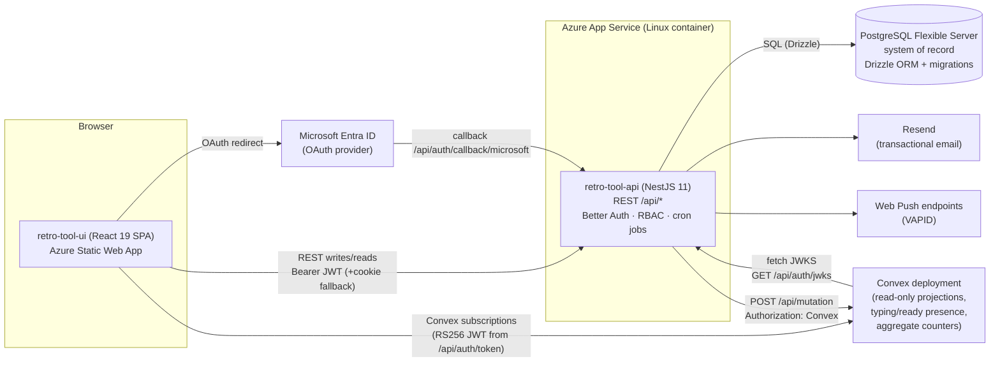
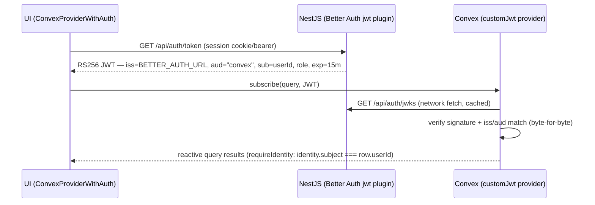
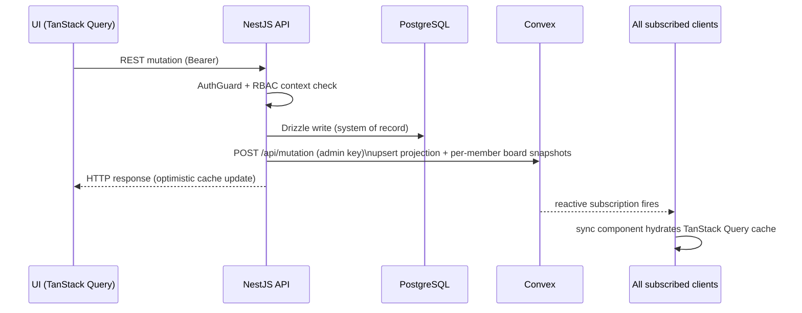
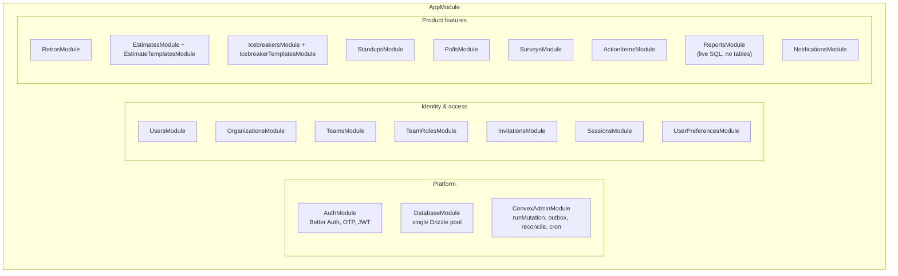

# Retro Tool — Architecture Design Document

> A description of the system **as it exists today** (branch: `staging`). Sources: the code in
> `retro-tool-api/`, `retro-tool-ui/`, `convex-backend/`, `infra/`, and the docs under `docs/`
> (`authorization-rbac.md`, `app-flows.md`, `auth-workflows.md`, `convex-architecture.md`, `api-security.md`,
> `invitations-and-onboarding.md`), plus `AUTH-SECURITY-PLAN.md` and the package READMEs. When this document and
> the code disagree, trust the code.

---

## Table of contents

1. [System overview](#1-system-overview)
2. [Authentication &amp; authorization](#2-authentication--authorization)
3. [Data flow per module](#3-data-flow-per-module)
4. [Database schema](#4-database-schema)
5. [Scale readiness](#5-scale-readiness)

---

## 1. System overview

Retro Tool is a team-collaboration platform for agile ceremonies: **retrospectives**, **story
estimate sessions**, **daily standups**, **icebreakers**, **polls**, and **surveys**, with
organization/team management, action-item tracking, notifications (in-app + push + email), and
reports/analytics.

It is a **pnpm monorepo** with three deployable applications and one shared package:

| Package                       | Role                                                        | Stack                                                                                                                                       |
| ----------------------------- | ----------------------------------------------------------- | ------------------------------------------------------------------------------------------------------------------------------------------- |
| `retro-tool-ui`             | SPA frontend                                                | React 19, TanStack Router (file-based), TanStack Query/Form/Table, TailwindCSS 4, Radix/shadcn, Better Auth React client, Convex React SDK  |
| `retro-tool-api`            | REST backend; <br />**owns all writes**              | NestJS 11, Drizzle ORM, PostgreSQL 16 (17 on Azure), Better Auth (`@thallesp/nestjs-better-auth`), `@nestjs/schedule`, Resend, web-push |
| `convex-backend`            | Realtime<br />**read-only projection** layer          | Convex (self-hosted everywhere it's deployed — Docker locally, Azure App Service for staging/prod; no Convex Cloud usage anywhere)         |
| `packages/shared/contracts` | Shared TypeScript contracts between UI and Convex snapshots | TypeScript                                                                                                                                  |

### The one rule that shapes everything

> **PostgreSQL is the system of record. Convex is a read-only realtime projection.**
> After every mutation, NestJS pushes a snapshot of the affected entity into Convex via the HTTP
> admin API. The UI subscribes to those snapshots instead of polling REST. **No business logic
> lives in Convex mutations — the API owns all writes.**

### Component diagram



### Azure topology — two deployed environments (plus local)

Infrastructure is provisioned by **Azure CLI + Bicep** (`infra/deploy.bicep` → `infra/main.bicep`,
subscription-scoped) from a developer machine. Apps are deployed by GitHub Actions (`ci.yml`,
`deploy-api.yml`, `deploy-ui.yml`, `deploy-convex.yml`, orchestrated for staging by
`release-staging.yml`) — infra is **never** deployed from CI. See
[cloud.md](cloud.md) for the full Azure topology and
[../deployment/release-and-branch-strategy.md](../deployment/release-and-branch-strategy.md) for
what deploys when.

| Environment | Branch      | Resource group           | API                               | UI                     | Convex                                                        |
| ----------- | ----------- | ------------------------ | --------------------------------- | ---------------------- | ------------------------------------------------------------- |
| Production  | `main`    | `retrotool-prod-rg`    | App Service`retrotool-prod-api` | Static Web App         | Self-hosted App Service`retrotool-prod-convex`              |
| Staging     | `staging` | `retrotool-staging-rg` | `retrotool-staging-api`         | Static Web App         | Self-hosted App Service`retrotool-staging-convex`           |
| Local       | —          | Docker Compose           | `localhost:8000`                | Vite`localhost:3000` | Self-hosted container`localhost:3210` (dashboard `:6791`) |

> **`develop` is not a deployed environment.** `infra/main.bicep` accepts `environment=develop` as
> a valid parameter value, but nobody has ever run it — there is no `retrotool-develop-rg`, no
> develop ACR, PostgreSQL server, App Service, Static Web App, or Convex deployment (Cloud or
> self-hosted). All `develop`-branch work happens locally, the same Docker Compose / self-hosted
> Convex workflow as the **Local** row above (`pnpm local:up`, `pnpm dev:api`, `pnpm dev:ui`,
> `pnpm dev:convex`).

Per environment, Bicep creates: **Container Registry** (Standard, admin disabled, AcrPull via
user-assigned managed identity), **PostgreSQL Flexible Server** (Burstable B1ms, 32 GiB, PG 17),
**App Service Plan** (P0v3 Linux) + **App Service** (container, WebSockets on, HTTPS-only, Always
On), and a **Static Web App** (Standard, West Europe). Convex itself runs on its own self-hosted
App Service alongside the core stack for staging and production (see [cloud.md](cloud.md)) rather
than being provisioned by `main.bicep` — no environment uses Convex Cloud. The Resend account
lives outside Azure.

Deployment pipeline:

- **CI** (`ci.yml`): lint + type-check + test on every PR.
- **deploy-api**: Docker build → push to ACR → App Service deploy; computes and pushes app settings
  (`BETTER_AUTH_URL`, `ALLOWED_ORIGINS`, `CONVEX_SYNC_URL`/`CONVEX_SYNC_ADMIN_KEY`, VAPID keys, etc.).
- **deploy-ui**: Vite build with `VITE_API_URL`, `VITE_CONVEX_URL`, per-feature
  `VITE_*_REALTIME_BACKEND` toggles baked in → Static Web App.
- **Convex function deploys are manual** (`pnpm --filter convex-backend deploy` with the right env
  file); one-time per deployment: `convex env set JWT_ISSUER / JWT_AUDIENCE / JWT_JWKS_URL`.

---

## 2. Authentication & authorization

### 2.1 Who uses the app

- **Platform admins** (`super-admin`, `system-admin`) — operate the installation: approve/suspend
  users, manage all orgs, seed templates, manage the Convex admin panel (`/admin/*` routes).
- **Org owners/admins** — run an organization: settings, members, invitations, teams, org-scoped
  templates and team-role catalogs.
- **Team leads** — run a team: members, join requests, facilitate retros/estimate sessions/standups.
- **Team members** — participate: add cards, vote, comment, estimate, submit standups, answer
  surveys/polls, own action items.
- **Anonymous visitors** — only sign-up/sign-in, invitation previews, and the admin-bootstrap check.

### 2.2 Better Auth setup (`retro-tool-api/src/auth/auth.config.ts`)

Better Auth runs **inside NestJS** via `@thallesp/nestjs-better-auth`; `/api/auth/*` is handled by
Better Auth middleware before NestJS routing. Plugins enabled: **`bearer`**, **`admin`**,
**`multiSession`**, **`emailOTP`**, **`passkey`**, **`jwt`**.

| Method                   | Flow                                                                                                                                                                                                                                                                |
| ------------------------ | ------------------------------------------------------------------------------------------------------------------------------------------------------------------------------------------------------------------------------------------------------------------- |
| Email/password           | `POST /api/auth/sign-up/email` / `sign-in/email`. `SignupCleanupMiddleware` clears stale `pending` users on sign-up retry. Verification email via Resend (suppressed if an active invitation exists — accepting it verifies the email).                    |
| Email OTP (passwordless) | Custom proxy controllers`POST /api/otp/send`, `/api/otp/sign-in`, `/api/otp/verify-email`, `/api/otp/reset-password[/send]` → `auth.api.*`. 6-digit code, 5-min expiry, 3 attempts. All `@AllowAnonymous`.                                             |
| Passkey (WebAuthn)       | `passkey()` plugin; sign-in incl. conditional-UI autofill; management under `/profile/security` via `authClient.passkey.*`.                                                                                                                                   |
| Microsoft OAuth          | `GET /api/auth/sign-in/microsoft` → Entra ID → `GET /api/auth/callback/microsoft`. `accountLinking.trustedProviders: ['microsoft']` auto-links by verified email and sets `emailVerified`. Stays **cookie-based** (redirects can't carry a bearer). |
| Multi-session            | `multiSession` plugin; sessions listed/revoked per device.                                                                                                                                                                                                        |
| Password reset           | OTP- or link-based (20-min token); resets invalidate**all** sessions.                                                                                                                                                                                         |

**Session lifecycle:** cookie `better-auth.session_token` ↔ row in `session` (unique `token`,
`expiresAt`); 7-day expiry, 1-day update age, 5-min cookie cache. Sign-out
(`signOutWithCleanup()`) clears the sessionStorage bearer, revokes the session row, expires the
cookie, and clears the query cache.

### 2.3 Bearer-primary, cookie-fallback (CSRF posture)

Per `AUTH-SECURITY-PLAN.md` (status 2026-06), the **bearer token is the primary credential** for
REST and sockets; cookies remain an accepted fallback:

- The UI captures the `set-auth-token` header on auth responses (`lib/auth-client.ts`, stored in
  sessionStorage) and `lib/api.ts` attaches `Authorization: Bearer` whenever a token exists, while
  still sending `credentials: 'include'`.
- Production UI and API are **different origins**, so cookies are `SameSite=None; Secure` — SameSite
  gives no CSRF protection. Mitigations: CORS origin allow-list (fail-fast in prod if empty), Better
  Auth `trustedOrigins`, and the bearer-primary posture. **No CSRF token middleware is installed**;
  CSRF is *reduced, not eliminated*. Full cookie removal (Phase 4) is deferred on one blocker: after
  a full-page OAuth redirect the SPA has no captured session bearer.
- Other hardening: Helmet with a **strict global CSP** (no `unsafe-inline`; Swagger disabled in
  production, relaxed CSP scoped to `/api/docs` in dev/staging), `trust proxy = 1` +
  `x-forwarded-for` handling behind Azure's proxy.

### 2.4 API guard model

The global `AuthGuard` registered by `@thallesp/nestjs-better-auth` is active and **fail-closed**:
every route requires a valid session/bearer unless marked `@AllowAnonymous`. Public routes:
`GET /health*`, `GET /users/admin/exists`, `POST /users/admin/bootstrap` path (anon bootstrap),
`GET /invitations/preview/:token`, and all `/api/otp/*`. `/api/auth/*` never reaches the guard.

### 2.5 RS256 JWT → Convex (JWKS flow)

A **JWKS** (JSON Web Key Set, [RFC 7517](https://www.rfc-editor.org/rfc/rfc7517))
is a standard JSON document — `{ "keys": [...] }` — that publishes one or more
public keys in JWK format so anyone needing to verify a signed token's signature
can fetch the matching public key, without ever holding the private key or a
shared secret. It's why the design here uses **RS256** (asymmetric: a private
signing key + a public verifying key) instead of a shared-secret algorithm like
`HS256` — the API keeps its private key to itself, and any number of verifiers
(today, just Convex) can independently check a token's signature using only the
published public half.

Concretely, in this app: Better Auth's `jwt` plugin (configured in
[auth.config.ts](../../retro-tool-api/src/auth/auth.config.ts) with
`jwks: { keyPairConfig: { alg: 'RS256', modulusLength: 2048 } }`) generates the
RS256 key pair lazily and persists it in the `jwks` Drizzle table (private key
AES-encrypted at rest; schema in
[auth/schema/index.ts](../../retro-tool-api/src/auth/schema/index.ts)). The
plugin auto-serves the public portion, in standard JWK-Set format, at
`GET /api/auth/jwks` — no controller needed. Convex's `customJwt` auth provider
([convex/auth.config.ts](../../convex-backend/convex/auth.config.ts)) is given
`JWT_JWKS_URL` pointing at that endpoint; it fetches and caches the response,
then uses the matching public key (looked up by the token's `kid`) to verify
signature, `iss`, and `aud` on every JWT the UI presents — so Convex calls back
to the API only when its JWKS cache needs refreshing, never per request, and no
shared secret exists between the two services.

The JWKS `keys` array format is inherently rotation-friendly — multiple keys can
be published side by side, each tagged with its own `kid`, so a verifier can keep
accepting tokens signed by an older still-valid key while a newer one comes
online. This app doesn't currently run any automatic key-rotation job (the API's
[jwt-alignment.service.ts](../../retro-tool-api/src/auth/jwt-alignment.service.ts)
only health-checks that the JWKS is reachable, non-empty, and advertises an
algorithm Convex supports); today there's one active key pair, generated once and
reused until manually invalidated.

Convex never manages sessions; it only **verifies** short-lived JWTs the API
issues:



- Keys live in the `jwks` Drizzle table (private key AES-encrypted by the plugin).
- Convex reads `JWT_ISSUER` / `JWT_AUDIENCE` / `JWT_JWKS_URL` via `process.env` **inside functions**
  — set on the Convex deployment, not in `.env` files.
- Server-driven projection writes are **`internalMutation`s**, callable only via the admin-key
  `/api/mutation` path — unreachable from browsers. Public queries/mutations all call
  `requireIdentity(ctx)` and compare `identity.subject` to the row's `userId`.
- Known residuals: team-scoped reads check *authenticated* but not *team membership* (Convex holds
  no membership data), and JWT statelessness means Convex authz lags session revocation by ≤15 min.
  Accepted for read-only projections.

### 2.7 RBAC model

Two parallel dimensions: a **system role** on `user.role` and **context roles** in the membership
tables. (`org-admin`/`team-lead` values in `user.role` are legacy; authority comes from
`organizationMember.role` and `teamMember.tag`.) The same pure helper functions
(`isSuperAdmin`, `isOrgAdmin`, `isTeamLead`, `canPerform{System,Org,Team,Retro}Action`,
`assertPermission`) exist in **both** `retro-tool-api/src/lib/rbac.ts` and
`retro-tool-ui/src/lib/rbac.ts`; the backend builds contexts from the DB via
`CommonService.buildOrgContext(userId, orgId)` / `buildTeamContext(userId, teamId)`.

**System roles** (`super-admin` → `system-admin` → `member`):

| Action                                                   |            super-admin            | system-admin |
| -------------------------------------------------------- | :-------------------------------: | :----------: |
| Promote/demote system-admins; reactivate suspended users |                ✓                |              |
| Suspend users; view all orgs; manage all users           |                ✓                |      ✓      |
| Bootstrap first admin                                    | anyone (anon, first sign-up only) |              |

**Org roles** (`organizationMember.role`: `org-owner` → `org-admin` → `member`). System admins can
do any org action without membership.

| Action                                                      | org-owner | org-admin | member |
| ----------------------------------------------------------- | :-------: | :-------: | :----: |
| Read org details                                            |    ✓    |    ✓    |   ✓   |
| Update settings; invite/remove members; create/delete teams |    ✓    |    ✓    |        |
| Delete org; promote/demote org-admins; transfer ownership   |    ✓    |          |        |

**Team roles** (`teamMember.tag`: `team-lead` → `member`). Org admins+ have team authority without
membership. There is additionally a **functional team-role catalog** (`teamRole` — built-in +
org-custom labels like "QA", assigned via `teamMember.roleId`), which is descriptive, not
permission-bearing.

| Action                                                                 | team-lead | member |
| ---------------------------------------------------------------------- | :-------: | :----: |
| Read team; participate in retros; self-join open teams; leave          |    ✓    |   ✓   |
| Update team settings; add/remove members; approve/reject join requests |    ✓    |        |

**Retro-level:** any team member can create and participate in retros (add cards, vote, comment);
control actions (start, phase transitions, complete, delete, update settings) require being the
**retro creator** or team-lead/org-admin/system-admin authority.

**First-signup bootstrap:** the UI checks `GET /api/users/admin/exists`; after sign-up it calls
`POST /api/users/admin/bootstrap`, which — iff no admin exists — promotes the caller to
`super-admin` + `approved` + `emailVerified` (idempotent; concurrent racers get 400 and remain
pending).

**User status lifecycle** (`user.status`):

```
pending ──approve──► approved ──suspend──► suspended ──reactivate──► approved
   └──reject──► rejected
```

| Status        | Can log in | Notes                                                                                                    |
| ------------- | :--------: | -------------------------------------------------------------------------------------------------------- |
| `pending`   |     No     | Awaiting admin approval; users added directly by an admin (or accepting an invitation) are auto-approved |
| `approved`  |    Yes    | Normal active user                                                                                       |
| `rejected`  |     No     | Application declined                                                                                     |
| `suspended` |     No     | Reversible;`suspendedReason` recorded                                                                  |

Every admin status/role change writes an audit row to `adminActionLog`. Sign-in re-checks status via
`GET /api/users/me` and signs non-approved users straight back out with a status screen.

---

## 3. Data flow per module

### 3.1 The canonical write → project → subscribe path



The sync services (`retros-projection-sync.service.ts`, `estimates-projection-sync.service.ts`,
`notifications-projection-sync.service.ts`, `teams-members-projection-sync.service.ts`, and
equivalents for standups/icebreakers/polls/surveys) each own a private `runMutation(path, args)`
helper and no-op when Convex isn't configured.
`ConvexAdminService.runMutation` in `convex-admin/convex-admin.service.ts` is a separate, admin-only
runner used only for `clearTables` — it is not shared with the sync services. Board snapshots are
computed **per team member** because each user's view differs (carried-forward items, permissions
baked in).

### 3.2 Realtime: Convex only

Convex is the sole realtime transport — the earlier Socket.IO gateways, adapter, and client socket
module have been removed entirely (no `socket.io`/`socket.io-client` dependency, no gateway files,
no `WsAuthService`). Interactive session events (join/leave, cast-vote, reveal, timers) go through
REST mutations that immediately push a projection snapshot to Convex; the UI subscribes to that
snapshot instead of a socket. Per-feature flags (`VITE_RETROS_REALTIME_BACKEND`,
`VITE_ESTIMATES_REALTIME_BACKEND`, `VITE_NOTIFICATIONS_REALTIME_BACKEND`, etc., read in
`lib/realtime-config.ts`) are all hardcoded to `convex`; the shared `RealtimeBackend` type
(`packages/shared/contracts/src/realtime.ts`) still carries a vestigial `'socket-io'` union member,
but no code path implements it. Browser-written ephemeral presence (typing indicators, ready status,
icebreaker reactions) are the only client-driven Convex mutations.

### 3.3 Module-by-module

Every domain is a self-contained NestJS module (`module.ts` / `controller.ts` / `service.ts`,
optional `*-projection-sync.service.ts`, plus `dto/`, `types/index.ts`, `schema/`).
They group into platform, identity/access, and product layers:



Global cross-cutting on `AppModule`: `ThrottlerBehindProxyGuard` (100/60s default),
`LastActiveInterceptor`, `ScheduleModule`, and `HealthController` (`/health*`, excluded from the
`/api` prefix). Shared helpers live in `src/common/` and `src/lib/`; email is a library
(`src/lib/email.ts`), not a module.

| Module (API`src/`)                                       | Write path                                                                                                                                                                                                                              | Realtime / projection                                                                                                                  | Notes                                                                                                                                                                 |
| ---------------------------------------------------------- | --------------------------------------------------------------------------------------------------------------------------------------------------------------------------------------------------------------------------------------- | -------------------------------------------------------------------------------------------------------------------------------------- | --------------------------------------------------------------------------------------------------------------------------------------------------------------------- |
| **auth**                                             | Better Auth middleware →`user`/`session`/`account`/`verification`/`passkey`/`jwks`                                                                                                                                         | n/a                                                                                                                                    | See §2; OTP proxy controllers under`/api/otp/*`                                                                                                                    |
| **users / sessions / team-roles / user-preferences** | REST CRUD → Postgres                                                                                                                                                                                                                   | n/a                                                                                                                                    | Admin approval writes`adminActionLog`; `team-roles` manages the functional role catalog                                                                           |
| **organizations**                                    | `POST/PATCH/DELETE /organizations*` → `organization`, `organizationMember`, `orgInvitation`                                                                                                                                    | n/a (list data via REST)                                                                                                               | Creator becomes`org-owner`; ownership transfer supported                                                                                                            |
| **teams**                                            | `/teams*` → `team`, `teamMember`, `teamJoinRequest`, `teamInvitation`                                                                                                                                                        | n/a                                                                                                                                    | Join requests reviewed by leads/admins; open-team self-join                                                                                                           |
| **retros**                                           | Phase endpoints (`/retros/:id/start                                                                                                                                                                                                     | voting                                                                                                                                 | discussion                                                                                                                                                            |
| **action-items**                                     | `/action-items*` → `actionItem`, `actionItemComment`, `actionItemLike`                                                                                                                                                         | Included in retro board snapshots; aggregate`actionItemsByTeamStatus`                                                                | Carried forward across retros (`isCarriedForward`), assignee + due date                                                                                             |
| **estimates / estimate-templates**                   | Session + round + vote endpoints (join/cast-vote/reveal/clear/update-story/timer/end) →`storyEstimateSession`, `storyEstimateRound`, `storyEstimateParticipant`, `storyEstimateVote`; templates → `estimateTemplate(Value)` | Convex`liveEstimateSessions` / `liveEstimateBoards`                                                                                | Statuses`waiting → voting → revealed → completed`; votes hidden until reveal                                                                                     |
| **standups**                                         | `/standups*` → `standup`, `standupQuestion`, `standupEntry`, `standupSubmission`, `standupAnswer`, `standupComment`, `standupReaction`, `standupSkippedDay`                                                          | Convex`liveStandupEntries` / `liveStandupBoards` (keyed standup+date+user)                                                         | Cadence/schedule days, skipped days                                                                                                                                   |
| **icebreakers / icebreaker-templates**               | `/icebreakers*` → `icebreakerSession(Prompt/Participant)`, templates + prompts                                                                                                                                                     | Convex`liveIcebreakerSessions` / `liveIcebreakerBoards`; ephemeral `liveIcebreakerReactions` (direct client mutations, 15 s TTL) | Seed-based reproducible decks, swipe decisions, can attach to a standup day.**Sessions are ephemeral** — ending or finishing hard-deletes the row (no history) |
| **polls**                                            | `/polls*` → `poll`, `pollOption`, `pollVote`                                                                                                                                                                                   | Convex`livePolls` is a **lightweight signal**: UI invalidates + refetches REST (which applies per-viewer authorization)        | Anonymous option; may attach to a standup entry                                                                                                                       |
| **surveys**                                          | `/surveys*` → `survey`, `surveyQuestion`, `surveyResponse`, `surveyAnswer`                                                                                                                                                   | Convex`liveSurveys` — same invalidate-and-refetch pattern                                                                           | Scopes: team / org / system                                                                                                                                           |
| **notifications**                                    | Created by other services →`notification`; push subs in `pushSubscription`                                                                                                                                                         | Convex`liveNotifications` for bell/list; web-push (VAPID) for browser push                                                           | Read state mirrored to projection (`mark*ReadProjection`)                                                                                                           |
| **invitations**                                      | Unified + org/team invite endpoints →`orgInvitation` / `teamInvitation` (tokenised links, 3-day expiry)                                                                                                                            | In-app notification on membership                                                                                                      | Accepting auto-approves`pending` users and verifies email; "Add Member" is the direct, no-email variant                                                             |
| **reports**                                          | **No tables** — live SQL over existing schemas via `/api/reports/v2/*`                                                                                                                                                         | None (Convex aggregates were retired; the only registered Convex component is`@convex-dev/rate-limiter`)                             | Team metrics, health score, system stats (`getSystemStats` checks the JWT `role` claim)                                                                           |
| **email**                                            | `lib/email.ts` → Resend; every send logged to `emailLog`                                                                                                                                                                           | n/a                                                                                                                                    | Verification, OTP, reset, invitations, reminders, digests                                                                                                             |
| **convex-admin**                                     | `runMutation` runner; super-admin `clearTables`; `convexCronConfig` singleton row                                                                                                                                                 | Scheduled purge of stale projection rows (`convex-admin-cron.service.ts`)                                                            | Admin UI at`/admin/convex` with metrics                                                                                                                             |

**Background jobs** (`@nestjs/schedule`, gated by `ENABLE_CRON_JOBS`): retro reminders (hourly,
emails teams whose `scheduledAt` is within the next hour, once per retro via `reminderSentAt`);
weekly digest (daily at `WEEKLY_DIGEST_SEND_HOUR`, per-user day preference, content from the Reports
service); Convex projection-purge cron.

### 3.4 UI structure (TanStack Router, file-based)

Top-level route groups in `retro-tool-ui/src/routes/`: `auth/` (sign-in/up, forgot/reset password,
verify-email, accept-invite, social-callback), `dashboard`, `organizations/`, `teams/`, `retros/`
(incl. `$retroId` board with Convex sync + presence components), `estimate/`, `standups/`,
`icebreakers/`, `polls/`, `surveys/`, `admin/` (users, organizations, templates, team-roles,
org-setup, convex), `profile/` (incl. security/passkeys), `reports`, `templates`, `me`, `about`,
legal pages. Convex sync components (`retro-convex-sync.tsx`, `estimate-convex-sync.tsx`,
`notification-convex-sync.tsx`, list syncs) subscribe to projection queries and hydrate the TanStack
Query cache, replacing polling.

---

## 4. Database schema

All Drizzle table definitions live per-module in `retro-tool-api/src/<module>/schema/` (retros split
into `retros.schema.ts`, `cards.schema.ts`, `action-items.schema.ts`); migrations in
`retro-tool-api/drizzle/`.

### 4.1 Table inventory (by module)

| Module                     | Tables                                                                                                                                                       | Key columns / constraints                                                                                                                                                                                                                                                                                                                                           |
| -------------------------- | ------------------------------------------------------------------------------------------------------------------------------------------------------------ | ------------------------------------------------------------------------------------------------------------------------------------------------------------------------------------------------------------------------------------------------------------------------------------------------------------------------------------------------------------------- |
| **auth**             | `user`                                                                                                                                                     | `id` PK, `email` unique, `role` enum (default `member`), `status` enum (default `pending`), approval/suspension audit fields (`approvedAt/ById`, `suspendedAt/ById/Reason`), ban fields; indexes on status/role/createdAt                                                                                                                           |
|                            | `session`                                                                                                                                                  | `token` unique, `expiresAt`, `ipAddress`, `userAgent`, `userId` FK cascade; `session_user_id_idx`                                                                                                                                                                                                                                                       |
|                            | `account`                                                                                                                                                  | `providerId`+`accountId` unique (credential + Microsoft OAuth), token/password columns, `userId` FK cascade                                                                                                                                                                                                                                                   |
|                            | `verification`                                                                                                                                             | `identifier` (indexed), `value`, `expiresAt` — OTPs + tokens                                                                                                                                                                                                                                                                                                 |
|                            | `passkey`                                                                                                                                                  | `publicKey`, `credentialID` (indexed), `counter`, `deviceType`, `backedUp`, `userId` FK                                                                                                                                                                                                                                                                 |
|                            | `jwks`                                                                                                                                                     | RS256 key pairs for the`jwt` plugin (`privateKey` AES-encrypted)                                                                                                                                                                                                                                                                                                |
|                            | `adminActionLog`                                                                                                                                           | `adminId`/`targetUserId` FKs, `action` enum, `details`                                                                                                                                                                                                                                                                                                      |
| **organizations**    | `organization`                                                                                                                                             | `slug` unique, `ownerId` FK → user                                                                                                                                                                                                                                                                                                                             |
|                            | `organizationMember`                                                                                                                                       | `(organizationId, userId)` unique, `role` enum `org-owner                                                                                                                                                                                                                                                                                                       |
|                            | `orgInvitation`                                                                                                                                            | `token` unique, `email` (indexed), `role`, `createdById`, `expiresAt`, `acceptedAt`                                                                                                                                                                                                                                                                     |
| **teams**            | `team`                                                                                                                                                     | `(organizationId, name)` unique, emoji, description                                                                                                                                                                                                                                                                                                               |
|                            | `teamMember`                                                                                                                                               | `(teamId, userId)` unique, `tag` enum `team-lead                                                                                                                                                                                                                                                                                                                |
|                            | `teamRole`                                                                                                                                                 | Functional role catalog:`isBuiltIn`, nullable `orgId` (org-custom), `(orgId, name)` unique                                                                                                                                                                                                                                                                    |
|                            | `orgTeamRoleConfig`                                                                                                                                        | Per-org activation override for built-in roles;`(orgId, teamRoleId)` unique                                                                                                                                                                                                                                                                                       |
|                            | `teamJoinRequest`                                                                                                                                          | `status` enum (pending default), `message`, reviewer fields; composite `(teamId,userId,status)` index                                                                                                                                                                                                                                                         |
|                            | `teamInvitation`                                                                                                                                           | `token` unique, `email`, `tag`, `expiresAt`, `acceptedAt`                                                                                                                                                                                                                                                                                                 |
| **retros**           | `template` / `templateColumn`                                                                                                                            | Retro board templates:`isBuiltIn`, nullable `organizationId`; columns with `(templateId, order)` unique                                                                                                                                                                                                                                                       |
|                            | `retrospective`                                                                                                                                            | `teamId` + `templateId` FKs, `status` enum (default `draft`), `isAnonymous`, `maxVotesPerUser` (default 3), `voteType`, timer fields, `scheduledAt`/`reminderSentAt`, lobby fields, discussion pointers (`currentDiscussionCardId`/`ActionItemId`), `createdById` (set null); composite indexes `(teamId,status)`, `(teamId,createdAt)` |
|                            | `retroParticipant`                                                                                                                                         | `(retroId, userId)` unique                                                                                                                                                                                                                                                                                                                                        |
|                            | `card`                                                                                                                                                     | `retroId` cascade, `columnId` FK, `authorId` (set null — anonymity survives deletion), `isDiscussed`; `(retroId, columnId)` index                                                                                                                                                                                                                        |
|                            | `vote`                                                                                                                                                     | `(cardId, userId)` unique                                                                                                                                                                                                                                                                                                                                         |
|                            | `cardComment`                                                                                                                                              | `cardId` cascade, `authorId`                                                                                                                                                                                                                                                                                                                                    |
|                            | `actionItem`                                                                                                                                               | `retroId` cascade, nullable `cardId` (set null), `assigneeId` (set null), `status` enum (default `pending`), `isCarriedForward`, `dueDate`; indexes incl. `(assigneeId,status)`, `(retroId,status)`                                                                                                                                               |
|                            | `actionItemComment`, `actionItemLike`                                                                                                                    | Like has`(actionItemId, userId)` unique                                                                                                                                                                                                                                                                                                                           |
| **estimates**        | `estimateTemplate` / `estimateTemplateValue`                                                                                                             | Card decks (label/value/order/color),`isBuiltIn`, nullable `organizationId`                                                                                                                                                                                                                                                                                     |
|                            | `storyEstimateSession`                                                                                                                                     | `teamId`, `createdById`, `status` enum, `sprintLink`, `currentRoundId`, `currentStory`, timer, `templateId`                                                                                                                                                                                                                                           |
|                            | `storyEstimateRound`                                                                                                                                       | `sessionId`, `roundNumber`, story name/ticket/description/link, `agreedPoints`, `revealedAt`                                                                                                                                                                                                                                                                |
|                            | `storyEstimateParticipant`                                                                                                                                 | `sessionId` + `userId`, `isOnline`                                                                                                                                                                                                                                                                                                                            |
|                            | `storyEstimateVote`                                                                                                                                        | `sessionId`, `roundId`, `voterId`, `points`                                                                                                                                                                                                                                                                                                                 |
| **standups**         | `standup`, `standupQuestion`, `standupSkippedDay`, `standupEntry`, `standupSubmission`, `standupAnswer`, `standupComment`, `standupReaction` | Standup config (cadence, schedule days, start/end time) → dated entries → per-user submissions → per-question answers, plus comments/emoji reactions                                                                                                                                                                                                             |
| **icebreakers**      | `icebreakerTemplate`, `icebreakerPrompt`, `icebreakerSession`, `icebreakerSessionPrompt`, `icebreakerParticipant`                                  | Flavoured prompt decks; sessions have`seed` (reproducible), `selectionMode`, swipe `decision` per prompt, optional `standupId`+`entryDate`. **Sessions are ephemeral** — ended or finished sessions are hard-deleted (cascade to prompts + participants); no history table                                                                         |
| **polls**            | `poll`, `pollOption`, `pollVote`                                                                                                                       | Team-scoped, optional standup link,`isAnonymous`/`isClosed`                                                                                                                                                                                                                                                                                                     |
| **surveys**          | `survey`, `surveyQuestion`, `surveyResponse`, `surveyAnswer`                                                                                         | `scope` enum team/org/system; question `type` + JSON `options`; answers hold text/rating/choice                                                                                                                                                                                                                                                               |
| **notifications**    | `notification`                                                                                                                                             | `userId`, `type` enum, title/message/`link`, `read` flag                                                                                                                                                                                                                                                                                                    |
|                            | `pushSubscription`                                                                                                                                         | `endpoint`, `auth` keys per browser (VAPID web-push)                                                                                                                                                                                                                                                                                                            |
| **user-preferences** | `userNotificationPreference`                                                                                                                               | Per-user flags (email verification reminders, weekly digest settings) +`uiPreferences` JSONB                                                                                                                                                                                                                                                                      |
| **email**            | `emailLog`                                                                                                                                                 | Every outbound email:`type`/`status` enums, recipient, subject, `htmlBody`, `failureReason`                                                                                                                                                                                                                                                                 |
| **convex-admin**     | `convexCronConfig`                                                                                                                                         | Singleton row: purge cron`schedule`, `enabled`, `tablesToClear` JSONB                                                                                                                                                                                                                                                                                         |
| **reports**          | *(none)*                                                                                                                                                   | Live queries over the above + Convex aggregates                                                                                                                                                                                                                                                                                                                     |

### 4.2 ER overview (core entities)

```mermaid
erDiagram
    user ||--o{ session : "has"
    user ||--o{ account : "auth providers"
    user ||--o{ passkey : "WebAuthn"
    user ||--o{ adminActionLog : "target of"
    user ||--o{ organizationMember : ""
    user ||--o{ teamMember : ""
    user ||--o{ notification : ""
    user ||--o{ pushSubscription : ""
    user ||--|| userNotificationPreference : ""

    organization ||--o{ organizationMember : ""
    organization ||--o{ orgInvitation : ""
    organization ||--o{ team : ""
    organization ||--o{ teamRole : "custom roles"
    organization ||--o{ template : "custom retro templates"
    organization ||--o{ estimateTemplate : "custom decks"

    team ||--o{ teamMember : ""
    team ||--o{ teamJoinRequest : ""
    team ||--o{ teamInvitation : ""
    team ||--o{ retrospective : ""
    team ||--o{ storyEstimateSession : ""
    team ||--o{ standup : ""
    team ||--o{ poll : ""
    team ||--o{ survey : "team-scoped"
    teamRole ||--o{ teamMember : "functional role"

    template ||--o{ templateColumn : ""
    template ||--o{ retrospective : ""
    retrospective ||--o{ retroParticipant : ""
    retrospective ||--o{ card : ""
    retrospective ||--o{ actionItem : ""
    templateColumn ||--o{ card : ""
    card ||--o{ vote : ""
    card ||--o{ cardComment : ""
    card |o--o{ actionItem : "spawned from"
    actionItem ||--o{ actionItemComment : ""
    actionItem ||--o{ actionItemLike : ""

    estimateTemplate ||--o{ estimateTemplateValue : ""
    estimateTemplate ||--o{ storyEstimateSession : ""
    storyEstimateSession ||--o{ storyEstimateRound : ""
    storyEstimateSession ||--o{ storyEstimateParticipant : ""
    storyEstimateSession ||--o{ storyEstimateVote : ""
    storyEstimateRound ||--o{ storyEstimateVote : ""

    standup ||--o{ standupQuestion : ""
    standup ||--o{ standupEntry : "per date"
    standupEntry ||--o{ standupSubmission : "per user"
    standupSubmission ||--o{ standupAnswer : ""
    standupSubmission ||--o{ standupComment : ""
    standupSubmission ||--o{ standupReaction : ""
```



### 4.3 Convex projection schema (`convex-backend/convex/schema.ts`)

| Table                                                 | Contents                                                                                                                                                                                  | Written by                               |
| ----------------------------------------------------- | ----------------------------------------------------------------------------------------------------------------------------------------------------------------------------------------- | ---------------------------------------- |
| `liveRetroSessions`                                 | `retroId`, `teamId`, `status` (draft/waiting/active/grouping/voting/discussing/completed), discussion pointers                                                                      | API (internal)                           |
| `liveRetroBoards`                                   | **Per-user** JSON `snapshot` of the full RetroDetail, keyed `(retroId, userId)`                                                                                                 | API (internal)                           |
| `liveEstimateSessions` / `liveEstimateBoards`     | Same pattern for story estimate sessions                                                                                                                                                  | API (internal)                           |
| `liveIcebreakerSessions` / `liveIcebreakerBoards` | Same pattern (statuses waiting/curating/presenting)                                                                                                                                       | API (internal)                           |
| `liveIcebreakerReactions`                           | Ephemeral "great answer" reactions (`celebrate`/`applause`/`fire`) during the presenting phase; rows self-expire after 15 s (`REACTION_TTL_MS`) and are never written to Postgres | client (public mutation`sendReaction`) |
| `liveStandupEntries` / `liveStandupBoards`        | Same pattern, keyed by`(standupId, entryDate[, userId])`                                                                                                                                | API (internal)                           |
| `livePolls`, `liveSurveys`                        | **Lightweight signals** (id, scope, `isClosed`) — UI invalidates and refetches REST, which applies per-viewer authorization                                                      | API (internal)                           |
| `liveNotifications`                                 | Full notification rows incl.`read`, indexed `(userId, read)`                                                                                                                          | API (internal)                           |
| `liveTyping`, `liveReadyStatus`                   | Ephemeral presence, written**by browsers** under `identity.subject`                                                                                                               | client (public mutations)                |
| `livePresence`                                      | Schema-only, no functions yet                                                                                                                                                             | —                                       |

Per-user board rows make authorization trivial: `row.userId === identity.subject`. Components:
`@convex-dev/rate-limiter` (`retroBoardUpsert`/`estimateBoardUpsert` 10/s burst 20,
`notificationUpsert` 50/min) and `@convex-dev/aggregate` (7 counters for reports:
retros completed, cards/votes per team+user, action items by status, estimate sessions per team,
global retro/user counts).

---

## 5. Scale readiness

### What scales today

| Concern                         | Current state                                                                                                                                                                                                                                                                                                                  |
| ------------------------------- | ------------------------------------------------------------------------------------------------------------------------------------------------------------------------------------------------------------------------------------------------------------------------------------------------------------------------------ |
| **Stateless API**         | No in-process realtime state — sessions in Postgres; auth is cookie/bearer per-request — the REST tier can scale horizontally behind App Service.                                                                                                                                                                            |
| **Read fan-out**          | Offloaded to**Convex**: N clients watching a retro cost the API one snapshot push per mutation instead of N pollers; Convex handles the WebSocket fan-out. Self-hosted Convex (staging/production) is pinned to a single worker per environment though — see the "No autoscale" gap in §5's Honest gaps table below.   |
| **Rate limiting**         | Global`@nestjs/throttler` (~100 req/min/IP) via `ThrottlerBehindProxyGuard` keyed on `X-Forwarded-For` (`trust proxy = 1`); stricter Better Auth limits on auth routes (5 sign-ups/5 min, 10 sign-ins/min, 3 resets/5 min); Convex-side per-entity rate limits on projection upserts. Health probes `@SkipThrottle`. |
| **Postgres indexing**     | Deliberate and verified (AUTH-SECURITY-PLAN Phase 5): unique`session.token`, `user.email`, membership composite uniques, hot-path composites like `retrospective(teamId,status)`, `actionItem(assigneeId,status)`, `card(retroId,columnId)`, plus createdAt indexes for list queries.                                |
| **CDN / static delivery** | UI is a static Vite bundle on**Azure Static Web Apps** (globally distributed edge serving; API is the only dynamic origin).                                                                                                                                                                                              |
| **App Service scaling**   | P0v3 Linux plan, Always On; vertical and manual horizontal scaling available through the plan.                                                                                                                                                                                                                                 |
| **Caching**               | Client-side: TanStack Query cache hydrated by Convex snapshots (few repeated REST reads); auth: 5-min session cookie cache; Convex aggregates pre-compute report counters instead of scanning Postgres.                                                                                                                        |
| **Async work**            | Email and push are fire-and-forget from request paths; digests/reminders run on cron (`ENABLE_CRON_JOBS` lets you designate a single job-running instance).                                                                                                                                                                  |

### Honest gaps

| Gap                                         | Detail                                                                                                                                                                                                                                       |
| ------------------------------------------- | -------------------------------------------------------------------------------------------------------------------------------------------------------------------------------------------------------------------------------------------- |
| **No API-level server cache**         | Redis is not provisioned anywhere (not in`docker/docker-compose.local.yml`, not in Azure Bicep) and isn't used for caching or shared throttler storage; throttler counters are per-instance (per-IP limits loosen under horizontal scale). |
| **Single Postgres, no read replicas** | Burstable B1ms; reports run live SQL against the primary. Fine at current scale; a tier bump and/or replicas are the first lever.                                                                                                            |
| **No autoscale rules / multi-region** | Scaling is manual; all compute in one region (Static Web App aside).                                                                                                                                                                         |
| **CSRF partially mitigated**          | Bearer-primary shipped; cookie fallback remains until the OAuth bearer-capture blocker is solved (AUTH-SECURITY-PLAN Phase 4).                                                                                                               |
| **Convex authz granularity**          | Team-membership checks and the ≤15-min JWT revocation lag noted in §2.5; a membership projection is the planned follow-up.                                                                                                                 |
| **Manual Convex deploys**             | Function pushes are CLI-only — a drift risk between code and deployed functions.                                                                                                                                                            |
| **Projection growth**                 | Live tables are purged by a configurable cron (`convexCronConfig`), not TTLs; per-user board snapshots multiply storage by team size.                                                                                                      |

### Future work (from `docs/future-roadmap.md`)

Icebreakers, surveys, polls, and standups have shipped and graduated off the roadmap (see §3.3).
Planned directions that will shape the architecture going forward: **AI-powered retrospectives**
(meeting summaries, sentiment analysis, organizational insights, monthly reports, a facilitation
bot, actionable recommendations); **integrations** (Jira / Azure DevOps / Confluence export, Teams /
Slack / Outlook, Tempo action tracker); **Team Spaces** (rooms for story estimate and retro sessions
with shared tags/teams/permissions); and **enterprise features** (SAML/SSO, public API,
fine-grained permissions and audit logging, compliance exports).
