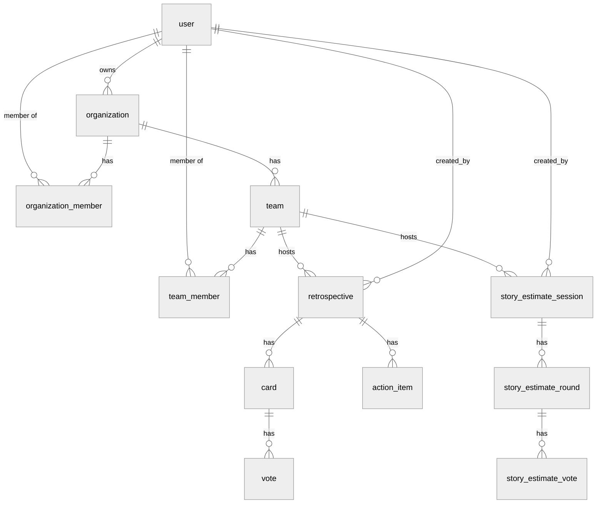

# Database schema

> The authoritative PostgreSQL 16 schema for the Retro Tool NestJS API, defined with Drizzle ORM — every table, key, enum, and relationship, grouped by module.

---

## 1. Overview

The API uses **Drizzle ORM** over **PostgreSQL 16**. Each NestJS module owns its
tables in a colocated `schema/index.ts` (or `schema.ts`) under
`retro-tool-api/src/<module>/`; a few modules split their tables across
`*.schema.ts` files re-exported from `schema/index.ts` (e.g. `retros/schema/`).
Shared `pgEnum` definitions live in one place —
`retro-tool-api/src/common/schema-enums/index.ts` — and derive their values from
the plain-string constant maps in `retro-tool-api/src/common/enums/`.

**PostgreSQL is the system of record.** All durable, authoritative state lives
here. The self-hosted Convex layer holds only read-only realtime *projections*
that NestJS pushes after each mutation — those tables are **not** documented here
(see [../architecture/convex.md](../architecture/convex.md)). Role definitions
referenced below are detailed in [../security/rbac.md](../security/rbac.md).

### Conventions

- **Primary keys** are application-generated strings: Better Auth tables use
  `text('id')`; every other table uses `varchar('id', { length: 255 })` (a few
  singleton/outbox rows use `varchar(..., { length: 36 })`).
- **Timestamps** — `created_at` / `updated_at` are `timestamp` columns defaulted
  in application code via `$defaultFn(() => new Date())` (the Better Auth tables
  set them explicitly instead).
- **Enums** are native Postgres enum types (`pgEnum`).
- A handful of status/mode columns are plain `varchar` with a string default
  rather than a `pgEnum` — these are called out per table.

### Migrations

Generated and applied from the API package (`retro-tool-api/`). Migration SQL
lives in `retro-tool-api/drizzle/`.

```bash
pnpm --dir retro-tool-api db:generate     # generate migration from schema diff
pnpm --dir retro-tool-api db:migrate      # apply pending migrations
pnpm --dir retro-tool-api db:studio       # open Drizzle Studio
```

Environment-targeted variants load the matching `.env.*-local` file:

```bash
pnpm --dir retro-tool-api db:generate:staging   # / :prod
pnpm --dir retro-tool-api db:migrate:staging     # / :prod
```

> Migrations and Convex provisioning against staging/production are driven from
> the `:staging` / `:prod` scripts, not local Docker.

---

## 2. Enums

All `pgEnum` types, defined in `retro-tool-api/src/common/schema-enums/index.ts`.

| Enum type (Postgres) | Values | Used by |
| --- | --- | --- |
| `user_role` | `super-admin`, `system-admin`, `org-admin`, `team-lead`, `member` | `user.role` |
| `user_status` | `pending`, `approved`, `rejected`, `suspended` | `user.status` |
| `admin_action_log_action` | `user_approved`, `user_rejected`, `user_suspended`, `user_reactivated`, `user_role_changed`, `user_deleted`, `password_reset_triggered` | `admin_action_log.action` |
| `org_member_role` | `org-owner`, `org-admin`, `member` | `organization_member.role`, `org_invitation.role` |
| `team_member_tag` | `team-lead`, `member` | `team_member.tag`, `team_invitation.tag` |
| `team_join_request_status` | `pending`, `approved`, `rejected` | `team_join_request.status` |
| `retro_status` | `draft`, `waiting`, `active`, `grouping`, `voting`, `discussing`, `completed` | `retrospective.status` |
| `retro_vote_type` | `multi`, `single` | `retrospective.vote_type` |
| `action_item_status` | `pending`, `in_progress`, `completed` | `action_item.status` |
| `notification_type` | `user_signup`, `team_join_request`, `team_join_approved`, `team_join_rejected`, `org_invite`, `team_invite`, `retro_created`, `retro_lobby_open`, `retro_started`, `retro_completed`, `action_item_assigned`, `action_item_due_soon`, `estimate_session_created`, `icebreaker_session_created`, `standup_created`, `standup_comment_added`, `convex_table_clear` | `notification.type` |
| `estimate_session_status` | `waiting`, `voting`, `revealed`, `completed` | `story_estimate_session.status` |
| `icebreaker_session_status` | `waiting`, `curating`, `presenting`, `completed` | `icebreaker_session.status` |
| `icebreaker_flavour` | `fun`, `professional`, `creative` | `icebreaker_template.flavour`, `icebreaker_session.flavour_filter` |
| `icebreaker_prompt_decision` | `pending`, `kept`, `skipped` | `icebreaker_session_prompt.decision` |
| `standup_cadence` | `daily`, `weekly`, `fortnightly`, `once` | `standup.cadence` |
| `survey_scope` | `team`, `org`, `system` | `survey.scope` |
| `survey_question_type` | `text`, `rating`, `choice` | `survey_question.type` |
| `email_log_type` | `verification`, `account_approved`, `org_invite`, `org_invite_external`, `team_invite`, `team_invite_external`, `retro_report`, `standup_report`, `survey_results`, `poll_results` | `email_log.type` |
| `email_log_status` | `sent`, `bounced`, `failed` | `email_log.status` |

**Not `pgEnum` (plain `varchar` with a string default):**

| Column | Type | Default | Valid values |
| --- | --- | --- | --- |
| `story_estimate_round.status` | `varchar(50)` | `active` | `active`, `revealed`, `closed` (`ESTIMATE_ROUND_STATUSES`) |
| `icebreaker_session.selection_mode` | `varchar(20)` | `ordered` | `ordered`, `random`, `custom` (`ICEBREAKER_SELECTION_MODES`) |
| `standup.schedule_days` | `varchar(50)` | `MON,TUE,WED,THU,FRI` | comma-joined `MON`…`SUN` |
| `projection_outbox.operation` | `varchar(16)` | — | `sync`, `delete` |
| `projection_outbox.status` | `varchar(16)` | `pending` | `pending`, `dispatched`, `failed` |

---

## 3. Tables by domain

Column notation: **PK** primary key · **FK→** foreign key with target ·
**U** unique constraint/index · **NN** not null · `default` where set.
`onDelete` behavior is shown next to each FK.

### 3.1 Auth & Identity

Owned by `retro-tool-api/src/auth/schema/index.ts`. The `users` and `sessions`
modules re-export from here (`users/schema/index.ts`, `sessions/schema/index.ts`).
Several tables are managed by Better Auth and its plugins.

#### `user` — core identity, role, and approval lifecycle

| Column | Type | Constraints |
| --- | --- | --- |
| `id` | text | PK |
| `name` | text | NN |
| `email` | text | NN, U |
| `email_verified` | boolean | NN |
| `image` | text | |
| `role` | `user_role` | NN, default `member` |
| `status` | `user_status` | NN, default `pending` |
| `bio` | text | |
| `last_active_at` | timestamp | |
| `approved_at` | timestamp | |
| `approved_by_id` | text | (soft ref to `user.id`, no FK constraint) |
| `suspended_at` | timestamp | |
| `suspended_by_id` | text | (soft ref, no FK constraint) |
| `suspended_reason` | text | |
| `banned` | boolean | |
| `ban_reason` | text | |
| `ban_expires` | timestamp | |
| `created_at` | timestamp | NN |
| `updated_at` | timestamp | NN |

Indexes: `user_status_idx(status)`, `user_role_idx(role)`, `user_created_at_idx(created_at)`.

#### `admin_action_log` — audit trail of admin actions on users

| Column | Type | Constraints |
| --- | --- | --- |
| `id` | varchar(255) | PK |
| `admin_id` | text | NN, FK→`user.id` |
| `target_user_id` | text | NN, FK→`user.id` (onDelete cascade) |
| `action` | `admin_action_log_action` | NN |
| `details` | text | |
| `created_at` | timestamp | NN, default now |

Indexes: `admin_id`, `target_user_id`, `created_at`.

#### `session` — Better Auth sessions

| Column | Type | Constraints |
| --- | --- | --- |
| `id` | text | PK |
| `expires_at` | timestamp | NN |
| `token` | text | NN, U |
| `created_at` | timestamp | NN |
| `updated_at` | timestamp | NN |
| `ip_address` | text | |
| `user_agent` | text | |
| `user_id` | text | NN, FK→`user.id` (onDelete cascade) |

Indexes: `session_user_id_idx(user_id)`, `session_user_updated_at_idx(user_id, updated_at)`.

#### `account` — Better Auth linked accounts / OAuth providers

| Column | Type | Constraints |
| --- | --- | --- |
| `id` | text | PK |
| `account_id` | text | NN |
| `provider_id` | text | NN |
| `user_id` | text | NN, FK→`user.id` (onDelete cascade) |
| `access_token` | text | |
| `refresh_token` | text | |
| `id_token` | text | |
| `access_token_expires_at` | timestamp | |
| `refresh_token_expires_at` | timestamp | |
| `scope` | text | |
| `password` | text | (hashed credential secret) |
| `created_at` | timestamp | NN |
| `updated_at` | timestamp | NN |

Indexes: `account_user_id_idx(user_id)`, U `account_provider_account_unique(provider_id, account_id)`.

#### `verification` — Better Auth verification tokens (email, OTP, reset)

| Column | Type | Constraints |
| --- | --- | --- |
| `id` | text | PK |
| `identifier` | text | NN |
| `value` | text | NN |
| `expires_at` | timestamp | NN |
| `created_at` | timestamp | |
| `updated_at` | timestamp | |

Index: `verification_identifier_idx(identifier)`.

#### `passkey` — WebAuthn credentials (`@better-auth/passkey`)

| Column | Type | Constraints |
| --- | --- | --- |
| `id` | text | PK |
| `name` | text | |
| `public_key` | text | NN |
| `user_id` | text | NN, FK→`user.id` (onDelete cascade) |
| `credential_id` | text | NN |
| `counter` | integer | NN |
| `device_type` | text | NN |
| `backed_up` | boolean | NN |
| `transports` | text | |
| `aaguid` | text | |
| `created_at` | timestamp | |

Indexes: `passkey_user_id_idx(user_id)`, `passkey_credential_id_idx(credential_id)`.

#### `jwks` — RS256 key pairs for the Better Auth `jwt` plugin

`private_key` is stored AES-encrypted by the plugin.

| Column | Type | Constraints |
| --- | --- | --- |
| `id` | text | PK |
| `public_key` | text | NN |
| `private_key` | text | NN |
| `created_at` | timestamp | NN |
| `expires_at` | timestamp | |

#### `user_notification_preference` — per-user notification + UI settings

`retro-tool-api/src/user-preferences/schema/index.ts`. Despite the name, also
stores a flexible `ui_preferences` JSON blob (Team Spaces views etc.).

| Column | Type | Constraints |
| --- | --- | --- |
| `id` | varchar(255) | PK |
| `user_id` | varchar(255) | NN, U, FK→`user.id` (onDelete cascade) |
| `email_verification_reminders` | boolean | NN, default `true` |
| `ui_preferences` | jsonb | NN, default `{}` |
| `created_at` | timestamp | NN, default now |
| `updated_at` | timestamp | NN, default now |

### 3.2 Organizations & Teams

`retro-tool-api/src/organizations/schema/index.ts` and
`retro-tool-api/src/teams/schema/index.ts`.

#### `organization`

| Column | Type | Constraints |
| --- | --- | --- |
| `id` | varchar(255) | PK |
| `name` | varchar(255) | NN |
| `slug` | varchar(255) | NN, U |
| `logo` | varchar(2048) | |
| `owner_id` | varchar(255) | NN, FK→`user.id` |
| `created_at` | timestamp | NN, default now |
| `updated_at` | timestamp | NN, default now |

Indexes: `owner_id`, `created_at`.

#### `organization_member` — user ↔ org membership + org role

| Column | Type | Constraints |
| --- | --- | --- |
| `id` | varchar(255) | PK |
| `organization_id` | varchar(255) | NN, FK→`organization.id` (onDelete cascade) |
| `user_id` | varchar(255) | NN, FK→`user.id` (onDelete cascade) |
| `role` | `org_member_role` | NN, default `member` |
| `created_at` | timestamp | NN, default now |

Indexes: `org_id`, `user_id`, U `organization_member_org_user_unique(organization_id, user_id)`, `created_at`.

#### `org_invitation` — pending org invites (token-based)

| Column | Type | Constraints |
| --- | --- | --- |
| `id` | varchar(255) | PK |
| `token` | varchar(255) | NN, U |
| `email` | varchar(255) | NN |
| `organization_id` | varchar(255) | NN, FK→`organization.id` (onDelete cascade) |
| `role` | `org_member_role` | NN, default `member` |
| `created_by_id` | varchar(255) | NN, FK→`user.id` (onDelete cascade) |
| `expires_at` | timestamp | NN |
| `accepted_at` | timestamp | |
| `created_at` | timestamp | NN, default now |

Indexes: `org_id`, `email`, `created_by_id`.

#### `team_role` — team-role catalog (built-in + org-custom)

| Column | Type | Constraints |
| --- | --- | --- |
| `id` | varchar(255) | PK |
| `name` | varchar(255) | NN |
| `is_built_in` | boolean | NN, default `false` |
| `org_id` | varchar(255) | FK→`organization.id` (onDelete cascade); null for global built-ins |
| `is_active` | boolean | NN, default `true` |
| `sort_order` | integer | NN, default `0` |
| `created_at` | timestamp | NN, default now |
| `updated_at` | timestamp | NN, default now |

Indexes: `team_role_org_id_idx(org_id)`, U `team_role_org_name_unique(org_id, name)`.

#### `org_team_role_config` — per-org activation override for a team role

| Column | Type | Constraints |
| --- | --- | --- |
| `id` | varchar(255) | PK |
| `org_id` | varchar(255) | NN, FK→`organization.id` (onDelete cascade) |
| `team_role_id` | varchar(255) | NN, FK→`team_role.id` (onDelete cascade) |
| `is_active` | boolean | NN, default `true` |
| `created_at` | timestamp | NN, default now |

Constraints: U `(org_id, team_role_id)`. Indexes: `org_id`, `team_role_id`.

#### `team`

| Column | Type | Constraints |
| --- | --- | --- |
| `id` | varchar(255) | PK |
| `name` | varchar(255) | NN |
| `description` | text | |
| `emoji` | varchar(100) | default `👥` |
| `organization_id` | varchar(255) | NN, FK→`organization.id` (onDelete cascade) |
| `created_at` | timestamp | NN, default now |
| `updated_at` | timestamp | NN, default now |

Indexes: `organization_id`, `created_at`, U `team_org_name_unique(organization_id, name)`.

#### `team_member` — user ↔ team membership, tag + role

| Column | Type | Constraints |
| --- | --- | --- |
| `id` | varchar(255) | PK |
| `team_id` | varchar(255) | NN, FK→`team.id` (onDelete cascade) |
| `user_id` | varchar(255) | NN, FK→`user.id` (onDelete cascade) |
| `role_id` | varchar(255) | FK→`team_role.id` (onDelete set null) |
| `tag` | `team_member_tag` | NN, default `member` |
| `created_at` | timestamp | NN, default now |

Indexes: `team_id`, `user_id`, `role_id`, `tag`, U `team_member_team_user_unique(team_id, user_id)`.

#### `team_join_request` — request to join a team, with review outcome

| Column | Type | Constraints |
| --- | --- | --- |
| `id` | varchar(255) | PK |
| `team_id` | varchar(255) | NN, FK→`team.id` (onDelete cascade) |
| `user_id` | varchar(255) | NN, FK→`user.id` (onDelete cascade) |
| `status` | `team_join_request_status` | NN, default `pending` |
| `message` | text | |
| `reviewed_by_id` | varchar(255) | FK→`user.id` |
| `reviewed_at` | timestamp | |
| `review_note` | text | |
| `created_at` | timestamp | NN, default now |
| `updated_at` | timestamp | NN, default now |

Indexes: `team_id`, `user_id`, `status`, `(team_id, user_id, status)`.

#### `team_invitation` — pending team invites (token-based)

| Column | Type | Constraints |
| --- | --- | --- |
| `id` | varchar(255) | PK |
| `token` | varchar(255) | NN, U |
| `email` | varchar(255) | NN |
| `team_id` | varchar(255) | NN, FK→`team.id` (onDelete cascade) |
| `tag` | `team_member_tag` | NN, default `member` |
| `created_by_id` | varchar(255) | NN, FK→`user.id` (onDelete cascade) |
| `expires_at` | timestamp | NN |
| `accepted_at` | timestamp | |
| `created_at` | timestamp | NN, default now |

Indexes: `team_id`, `email`, `created_by_id`.

### 3.3 Retros

`retro-tool-api/src/retros/schema/` (`retros.schema.ts`, `cards.schema.ts`,
`action-items.schema.ts`).

#### `template` — retro board template

| Column | Type | Constraints |
| --- | --- | --- |
| `id` | varchar(255) | PK |
| `name` | varchar(255) | NN |
| `description` | text | |
| `is_built_in` | boolean | NN, default `false` |
| `organization_id` | varchar(255) | FK→`organization.id` (onDelete cascade); null for global built-ins |
| `created_at` | timestamp | NN, default now |
| `updated_at` | timestamp | NN, default now |

Index: `template_organization_id_idx(organization_id)`.

#### `template_column` — columns within a retro template

| Column | Type | Constraints |
| --- | --- | --- |
| `id` | varchar(255) | PK |
| `template_id` | varchar(255) | NN, FK→`template.id` (onDelete cascade) |
| `name` | varchar(255) | NN |
| `emoji` | varchar(100) | |
| `prompt` | text | |
| `order` | integer | NN, default `0` |

Indexes: `template_id`, U `template_column_template_order_unique(template_id, order)`.

#### `retrospective` — a retro session

| Column | Type | Constraints |
| --- | --- | --- |
| `id` | varchar(255) | PK |
| `name` | varchar(255) | NN |
| `team_id` | varchar(255) | NN, FK→`team.id` (onDelete cascade) |
| `template_id` | varchar(255) | NN, FK→`template.id` |
| `status` | `retro_status` | NN, default `draft` |
| `is_anonymous` | boolean | NN, default `true` |
| `max_votes_per_user` | integer | NN, default `3` |
| `vote_type` | `retro_vote_type` | NN, default `multi` |
| `timer_duration` | integer | |
| `timer_started_at` | timestamp | |
| `timer_ends_at` | timestamp | |
| `created_by_id` | varchar(255) | FK→`user.id` (onDelete set null) |
| `created_at` | timestamp | NN, default now |
| `updated_at` | timestamp | NN, default now |
| `completed_at` | timestamp | |
| `scheduled_at` | timestamp | |
| `reminder_sent_at` | timestamp | |
| `lobby_started_at` | timestamp | |
| `lobby_auto_starts_at` | timestamp | |
| `current_discussion_card_id` | varchar(255) | (soft ref to `card.id`, no FK) |
| `current_discussion_action_item_id` | varchar(255) | (soft ref to `action_item.id`, no FK) |

Indexes: `team_id`, `template_id`, `status`, `created_by_id`, `(team_id, status)`, `(team_id, created_at)`, `created_at`, `(team_id, status, completed_at)`.

#### `retro_participant` — users who joined a retro

| Column | Type | Constraints |
| --- | --- | --- |
| `id` | varchar(255) | PK |
| `retro_id` | varchar(255) | NN, FK→`retrospective.id` (onDelete cascade) |
| `user_id` | varchar(255) | NN, FK→`user.id` (onDelete cascade) |
| `joined_at` | timestamp | NN, default now |

Constraints: U `retro_participant_retro_user_unique(retro_id, user_id)`. Indexes: `retro_id`, `user_id`.

#### `card` — a card on the retro board

| Column | Type | Constraints |
| --- | --- | --- |
| `id` | varchar(255) | PK |
| `retro_id` | varchar(255) | NN, FK→`retrospective.id` (onDelete cascade) |
| `column_id` | varchar(255) | NN, FK→`template_column.id` |
| `author_id` | varchar(255) | FK→`user.id` (onDelete set null) |
| `content` | text | NN |
| `is_discussed` | boolean | NN, default `false` |
| `discussed_at` | timestamp | |
| `created_at` | timestamp | NN, default now |
| `updated_at` | timestamp | NN, default now |

Indexes: `retro_id`, `column_id`, `author_id`, `(retro_id, column_id)`, `created_at`, `(retro_id, author_id)`.

#### `vote` — a vote on a card

| Column | Type | Constraints |
| --- | --- | --- |
| `id` | varchar(255) | PK |
| `card_id` | varchar(255) | NN, FK→`card.id` (onDelete cascade) |
| `user_id` | varchar(255) | NN, FK→`user.id` (onDelete cascade) |
| `created_at` | timestamp | NN, default now |

Indexes: `card_id`, `user_id`, U `vote_card_user_unique(card_id, user_id)`.

#### `card_comment` — comment on a card

| Column | Type | Constraints |
| --- | --- | --- |
| `id` | varchar(255) | PK |
| `card_id` | varchar(255) | NN, FK→`card.id` (onDelete cascade) |
| `author_id` | varchar(255) | NN, FK→`user.id` (onDelete cascade) |
| `content` | text | NN |
| `created_at` | timestamp | NN, default now |
| `updated_at` | timestamp | NN, default now |

Indexes: `card_id`, `author_id`.

#### `action_item` — follow-up action from a retro

| Column | Type | Constraints |
| --- | --- | --- |
| `id` | varchar(255) | PK |
| `retro_id` | varchar(255) | NN, FK→`retrospective.id` (onDelete cascade) |
| `card_id` | varchar(255) | FK→`card.id` (onDelete set null) |
| `title` | varchar(255) | NN |
| `description` | text | |
| `assignee_id` | varchar(255) | FK→`user.id` (onDelete set null) |
| `status` | `action_item_status` | NN, default `pending` |
| `is_carried_forward` | boolean | NN, default `false` |
| `due_date` | timestamp | |
| `created_at` | timestamp | NN, default now |
| `updated_at` | timestamp | NN, default now |

Indexes: `retro_id`, `card_id`, `assignee_id`, `status`, `(retro_id, status)`, `(assignee_id, status)`, `created_at`, `due_date`.

#### `action_item_comment`

| Column | Type | Constraints |
| --- | --- | --- |
| `id` | varchar(255) | PK |
| `action_item_id` | varchar(255) | NN, FK→`action_item.id` (onDelete cascade) |
| `author_id` | varchar(255) | NN, FK→`user.id` (onDelete cascade) |
| `content` | text | NN |
| `created_at` | timestamp | NN, default now |
| `updated_at` | timestamp | NN, default now |

Indexes: `action_item_id`, `author_id`.

#### `action_item_like`

| Column | Type | Constraints |
| --- | --- | --- |
| `id` | varchar(255) | PK |
| `action_item_id` | varchar(255) | NN, FK→`action_item.id` (onDelete cascade) |
| `user_id` | varchar(255) | NN, FK→`user.id` (onDelete cascade) |
| `created_at` | timestamp | NN, default now |

Indexes: `action_item_id`, `user_id`, U `action_item_like_item_user_unique(action_item_id, user_id)`.

### 3.4 Estimates (story estimates)

`retro-tool-api/src/estimates/schema/index.ts`.

#### `estimate_template` — story-estimate card deck template

| Column | Type | Constraints |
| --- | --- | --- |
| `id` | varchar(255) | PK |
| `name` | varchar(255) | NN |
| `description` | text | |
| `is_built_in` | boolean | NN, default `false` |
| `organization_id` | varchar(255) | FK→`organization.id` (onDelete cascade); null for global built-ins |
| `color` | varchar(7) | |
| `created_at` | timestamp | NN, default now |
| `updated_at` | timestamp | NN, default now |

Index: `estimate_template_org_id_idx(organization_id)`.

#### `estimate_template_value` — a card value within a template

| Column | Type | Constraints |
| --- | --- | --- |
| `id` | varchar(255) | PK |
| `template_id` | varchar(255) | NN, FK→`estimate_template.id` (onDelete cascade) |
| `label` | varchar(20) | NN |
| `value` | varchar(20) | NN |
| `order` | integer | NN, default `0` |
| `color` | varchar(7) | |
| `description` | text | |

Indexes: `template_id`, U `estimate_template_value_template_order_unique(template_id, order)`.

#### `story_estimate_session`

| Column | Type | Constraints |
| --- | --- | --- |
| `id` | varchar(255) | PK |
| `name` | varchar(255) | NN |
| `team_id` | varchar(255) | NN, FK→`team.id` (onDelete cascade) |
| `created_by_id` | varchar(255) | NN, FK→`user.id` (onDelete cascade) |
| `status` | `estimate_session_status` | NN, default `waiting` |
| `sprint_link` | varchar(2048) | |
| `current_round_id` | varchar(255) | (soft ref to `story_estimate_round.id`) |
| `current_story` | text | |
| `timer_duration` | integer | |
| `timer_ends_at` | timestamp | |
| `template_id` | varchar(255) | FK→`estimate_template.id` (onDelete set null) |
| `created_at` | timestamp | NN, default now |
| `updated_at` | timestamp | NN, default now |

Indexes: `team_id`, `created_by_id`, `status`, `template_id`, `(team_id, status)`, `updated_at`.

#### `story_estimate_round`

| Column | Type | Constraints |
| --- | --- | --- |
| `id` | varchar(255) | PK |
| `session_id` | varchar(255) | NN, FK→`story_estimate_session.id` (onDelete cascade) |
| `round_number` | integer | NN |
| `story_name` | varchar(255) | NN |
| `ticket_number` | varchar(100) | NN |
| `story_description` | text | |
| `story_link` | varchar(2048) | |
| `status` | varchar(50) | NN, default `active` (not a pgEnum) |
| `agreed_points` | varchar(20) | |
| `revealed_at` | timestamp | |
| `created_at` | timestamp | NN, default now |
| `updated_at` | timestamp | NN, default now |

Indexes: `session_id`, `(session_id, status)`, U `story_estimate_round_session_number_unique(session_id, round_number)`.

#### `story_estimate_participant`

| Column | Type | Constraints |
| --- | --- | --- |
| `id` | varchar(255) | PK |
| `session_id` | varchar(255) | NN, FK→`story_estimate_session.id` (onDelete cascade) |
| `user_id` | varchar(255) | NN, FK→`user.id` (onDelete cascade) |
| `is_online` | boolean | NN, default `false` |
| `joined_at` | timestamp | NN, default now |

Indexes: `session_id`, `user_id`, U `story_estimate_participant_session_user_unique(session_id, user_id)`.

#### `story_estimate_vote`

| Column | Type | Constraints |
| --- | --- | --- |
| `id` | varchar(255) | PK |
| `session_id` | varchar(255) | NN, FK→`story_estimate_session.id` (onDelete cascade) |
| `round_id` | varchar(255) | FK→`story_estimate_round.id` (onDelete set null) |
| `voter_id` | varchar(255) | NN, FK→`user.id` (onDelete cascade) |
| `points` | varchar(20) | NN |
| `voted_at` | timestamp | NN, default now |

Indexes: `session_id`, `round_id`, `voter_id`, U `story_estimate_vote_round_voter_unique(round_id, voter_id)`, `(session_id, voter_id)`.

### 3.5 Notifications & Email

`retro-tool-api/src/notifications/schema/index.ts` and
`retro-tool-api/src/email/schema/index.ts`.

#### `notification` — in-app notification

| Column | Type | Constraints |
| --- | --- | --- |
| `id` | varchar(255) | PK |
| `user_id` | varchar(255) | NN, FK→`user.id` (onDelete cascade) |
| `type` | `notification_type` | NN |
| `title` | varchar(255) | NN |
| `message` | text | NN |
| `link` | varchar(2048) | |
| `read` | boolean | NN, default `false` |
| `created_at` | timestamp | NN, default now |

Indexes: `user_id`, `(user_id, read)`, `(user_id, created_at)`, `created_at`.

#### `push_subscription` — web-push (VAPID) subscription

| Column | Type | Constraints |
| --- | --- | --- |
| `id` | varchar(255) | PK |
| `user_id` | varchar(255) | NN, FK→`user.id` (onDelete cascade) |
| `endpoint` | text | NN |
| `p256dh` | text | NN |
| `auth` | text | NN |
| `created_at` | timestamp | NN, default now |

Indexes: `user_id`, U `push_subscription_endpoint_unique(endpoint)`.

#### `email_log` — record of every transactional email

| Column | Type | Constraints |
| --- | --- | --- |
| `id` | varchar(255) | PK |
| `user_id` | varchar(255) | NN, FK→`user.id` (onDelete cascade) |
| `type` | `email_log_type` | NN |
| `recipient_email` | varchar(255) | NN |
| `subject` | varchar(255) | NN |
| `html_body` | text | NN |
| `status` | `email_log_status` | NN, default `sent` |
| `sent_at` | timestamp | |
| `failure_reason` | text | |
| `created_at` | timestamp | NN, default now |

Indexes: `user_id`, `type`, `status`, `(user_id, type)`, `created_at`.

### 3.6 Icebreakers

`retro-tool-api/src/icebreakers/schema/index.ts`.

#### `icebreaker_template`

| Column | Type | Constraints |
| --- | --- | --- |
| `id` | varchar(255) | PK |
| `name` | varchar(255) | NN |
| `description` | text | |
| `flavour` | `icebreaker_flavour` | NN, default `fun` |
| `is_built_in` | boolean | NN, default `false` |
| `organization_id` | varchar(255) | FK→`organization.id` (onDelete cascade); null for built-ins |
| `color` | varchar(7) | |
| `created_at` | timestamp | NN, default now |
| `updated_at` | timestamp | NN, default now |

Indexes: `org_id`, `flavour`.

#### `icebreaker_prompt` — prompt within a template

| Column | Type | Constraints |
| --- | --- | --- |
| `id` | varchar(255) | PK |
| `template_id` | varchar(255) | NN, FK→`icebreaker_template.id` (onDelete cascade) |
| `text` | text | NN |
| `order` | integer | NN, default `0` |
| `color` | varchar(7) | |

Indexes: `template_id`, U `icebreaker_prompt_template_order_unique(template_id, order)`.

#### `icebreaker_session`

| Column | Type | Constraints |
| --- | --- | --- |
| `id` | varchar(255) | PK |
| `name` | varchar(255) | NN |
| `team_id` | varchar(255) | NN, FK→`team.id` (onDelete cascade) |
| `created_by_id` | varchar(255) | NN, FK→`user.id` (onDelete cascade) |
| `status` | `icebreaker_session_status` | NN, default `waiting` |
| `template_id` | varchar(255) | FK→`icebreaker_template.id` (onDelete set null) |
| `standup_id` | varchar(255) | FK→`standup.id` (onDelete set null) |
| `entry_date` | date | |
| `current_prompt_id` | varchar(255) | (soft ref to `icebreaker_session_prompt.id`) |
| `selection_mode` | varchar(20) | NN, default `ordered` (not a pgEnum) |
| `seed` | integer | NN |
| `flavour_filter` | `icebreaker_flavour` | |
| `timer_duration` | integer | |
| `timer_ends_at` | timestamp | |
| `created_at` | timestamp | NN, default now |
| `updated_at` | timestamp | NN, default now |

Indexes: `team_id`, `created_by_id`, `status`, `template_id`, `(team_id, status)`, `(standup_id, entry_date)`, `updated_at`.

#### `icebreaker_session_prompt` — the materialised seed-ordered deck

| Column | Type | Constraints |
| --- | --- | --- |
| `id` | varchar(255) | PK |
| `session_id` | varchar(255) | NN, FK→`icebreaker_session.id` (onDelete cascade) |
| `prompt_id` | varchar(255) | FK→`icebreaker_prompt.id` (onDelete set null) |
| `text` | text | NN |
| `deck_order` | integer | NN |
| `decision` | `icebreaker_prompt_decision` | NN, default `pending` |
| `presented_at` | timestamp | |
| `created_at` | timestamp | NN, default now |
| `updated_at` | timestamp | NN, default now |

Indexes: `session_id`, `(session_id, decision)`, U `icebreaker_session_prompt_session_order_unique(session_id, deck_order)`.

#### `icebreaker_participant`

| Column | Type | Constraints |
| --- | --- | --- |
| `id` | varchar(255) | PK |
| `session_id` | varchar(255) | NN, FK→`icebreaker_session.id` (onDelete cascade) |
| `user_id` | varchar(255) | NN, FK→`user.id` (onDelete cascade) |
| `is_online` | boolean | NN, default `false` |
| `joined_at` | timestamp | NN, default now |

Indexes: `session_id`, `user_id`, U `icebreaker_participant_session_user_unique(session_id, user_id)`.

### 3.7 Polls

`retro-tool-api/src/polls/schema/index.ts`.

#### `poll` — team-scoped poll, optionally attached to a standup day

| Column | Type | Constraints |
| --- | --- | --- |
| `id` | varchar(255) | PK |
| `question` | varchar(500) | NN |
| `team_id` | varchar(255) | NN, FK→`team.id` (onDelete cascade) |
| `standup_id` | varchar(255) | FK→`standup.id` (onDelete cascade) |
| `entry_date` | date | |
| `is_anonymous` | boolean | NN, default `false` |
| `is_closed` | boolean | NN, default `false` |
| `created_by_id` | varchar(255) | FK→`user.id` (onDelete set null) |
| `created_at` | timestamp | NN, default now |
| `updated_at` | timestamp | NN, default now |

Indexes: `team_id`, `standup_id`, `(standup_id, entry_date)`, `created_by_id`.

#### `poll_option`

| Column | Type | Constraints |
| --- | --- | --- |
| `id` | varchar(255) | PK |
| `poll_id` | varchar(255) | NN, FK→`poll.id` (onDelete cascade) |
| `label` | varchar(255) | NN |
| `emoji` | varchar(50) | |
| `order` | integer | NN, default `0` |

Index: `poll_id`.

#### `poll_vote`

| Column | Type | Constraints |
| --- | --- | --- |
| `id` | varchar(255) | PK |
| `poll_id` | varchar(255) | NN, FK→`poll.id` (onDelete cascade) |
| `option_id` | varchar(255) | NN, FK→`poll_option.id` (onDelete cascade) |
| `user_id` | varchar(255) | NN, FK→`user.id` (onDelete cascade) |
| `created_at` | timestamp | NN, default now |

Indexes: `poll_id`, `option_id`, U `poll_vote_poll_user_unique(poll_id, user_id)` (one vote per user per poll).

### 3.8 Standups

`retro-tool-api/src/standups/schema/index.ts`.

#### `standup` — per-team standup configuration

| Column | Type | Constraints |
| --- | --- | --- |
| `id` | varchar(255) | PK |
| `name` | varchar(255) | NN |
| `team_id` | varchar(255) | NN, FK→`team.id` (onDelete cascade) |
| `cadence` | `standup_cadence` | NN, default `daily` |
| `schedule_days` | varchar(50) | NN, default `MON,TUE,WED,THU,FRI` |
| `start_time` | varchar(5) | (`HH:MM` local) |
| `end_time` | varchar(5) | (`HH:MM` local) |
| `is_active` | boolean | NN, default `true` |
| `created_by_id` | varchar(255) | FK→`user.id` (onDelete set null) |
| `created_at` | timestamp | NN, default now |
| `updated_at` | timestamp | NN, default now |

Indexes: `team_id`, `created_by_id`, `(team_id, is_active)`.

#### `standup_question`

| Column | Type | Constraints |
| --- | --- | --- |
| `id` | varchar(255) | PK |
| `standup_id` | varchar(255) | NN, FK→`standup.id` (onDelete cascade) |
| `prompt` | varchar(500) | NN |
| `color` | varchar(7) | |
| `order` | integer | NN, default `0` |
| `is_required` | boolean | NN, default `true` |
| `created_at` | timestamp | NN, default now |

Index: `standup_id`.

#### `standup_skipped_day` — per-date exceptions (holidays etc.)

| Column | Type | Constraints |
| --- | --- | --- |
| `id` | varchar(255) | PK |
| `standup_id` | varchar(255) | NN, FK→`standup.id` (onDelete cascade) |
| `skip_date` | date | NN |
| `created_by_id` | varchar(255) | FK→`user.id` (onDelete set null) |
| `created_at` | timestamp | NN, default now |

Indexes: `standup_id`, U `standup_skipped_day_standup_date_unique(standup_id, skip_date)`.

#### `standup_entry` — the daily room, lazily created per date

| Column | Type | Constraints |
| --- | --- | --- |
| `id` | varchar(255) | PK |
| `standup_id` | varchar(255) | NN, FK→`standup.id` (onDelete cascade) |
| `entry_date` | date | NN |
| `created_at` | timestamp | NN, default now |

Indexes: `standup_id`, U `standup_entry_standup_date_unique(standup_id, entry_date)`.

#### `standup_submission` — one user's submission for a room

| Column | Type | Constraints |
| --- | --- | --- |
| `id` | varchar(255) | PK |
| `entry_id` | varchar(255) | NN, FK→`standup_entry.id` (onDelete cascade) |
| `user_id` | varchar(255) | NN, FK→`user.id` (onDelete cascade) |
| `created_at` | timestamp | NN, default now |
| `updated_at` | timestamp | NN, default now |

Indexes: `entry_id`, `user_id`, U `standup_submission_entry_user_unique(entry_id, user_id)`.

#### `standup_answer` — answer to one question in a submission

| Column | Type | Constraints |
| --- | --- | --- |
| `id` | varchar(255) | PK |
| `submission_id` | varchar(255) | NN, FK→`standup_submission.id` (onDelete cascade) |
| `question_id` | varchar(255) | NN, FK→`standup_question.id` (onDelete cascade) |
| `content` | text | NN |

Indexes: `submission_id`, U `standup_answer_submission_question_unique(submission_id, question_id)`.

#### `standup_comment`

| Column | Type | Constraints |
| --- | --- | --- |
| `id` | varchar(255) | PK |
| `submission_id` | varchar(255) | NN, FK→`standup_submission.id` (onDelete cascade) |
| `author_id` | varchar(255) | NN, FK→`user.id` (onDelete cascade) |
| `content` | text | NN |
| `created_at` | timestamp | NN, default now |
| `updated_at` | timestamp | NN, default now |

Indexes: `submission_id`, `author_id`.

#### `standup_reaction`

| Column | Type | Constraints |
| --- | --- | --- |
| `id` | varchar(255) | PK |
| `submission_id` | varchar(255) | NN, FK→`standup_submission.id` (onDelete cascade) |
| `user_id` | varchar(255) | NN, FK→`user.id` (onDelete cascade) |
| `emoji` | varchar(50) | NN |
| `created_at` | timestamp | NN, default now |

Indexes: `submission_id`, U `standup_reaction_submission_user_emoji_unique(submission_id, user_id, emoji)`.

### 3.9 Surveys

`retro-tool-api/src/surveys/schema/index.ts`.

#### `survey` — team-, org-, or system-scoped questionnaire

| Column | Type | Constraints |
| --- | --- | --- |
| `id` | varchar(255) | PK |
| `title` | varchar(255) | NN |
| `description` | text | |
| `scope` | `survey_scope` | NN, default `team` |
| `team_id` | varchar(255) | FK→`team.id` (onDelete cascade) |
| `organization_id` | varchar(255) | FK→`organization.id` (onDelete cascade) |
| `is_anonymous` | boolean | NN, default `true` |
| `is_closed` | boolean | NN, default `false` |
| `closes_at` | timestamp | |
| `created_by_id` | varchar(255) | FK→`user.id` (onDelete set null) |
| `created_at` | timestamp | NN, default now |
| `updated_at` | timestamp | NN, default now |

Indexes: `team_id`, `org_id`, `scope`, `created_by_id`, `is_closed`.

#### `survey_question`

| Column | Type | Constraints |
| --- | --- | --- |
| `id` | varchar(255) | PK |
| `survey_id` | varchar(255) | NN, FK→`survey.id` (onDelete cascade) |
| `type` | `survey_question_type` | NN |
| `prompt` | varchar(500) | NN |
| `options` | text | (JSON-encoded `string[]` for choice questions) |
| `order` | integer | NN, default `0` |
| `is_required` | boolean | NN, default `true` |

Index: `survey_id`.

#### `survey_response` — one user's response to a survey

| Column | Type | Constraints |
| --- | --- | --- |
| `id` | varchar(255) | PK |
| `survey_id` | varchar(255) | NN, FK→`survey.id` (onDelete cascade) |
| `user_id` | varchar(255) | NN, FK→`user.id` (onDelete cascade); never exposed for anonymous surveys |
| `created_at` | timestamp | NN, default now |

Indexes: `survey_id`, U `survey_response_survey_user_unique(survey_id, user_id)`.

#### `survey_answer` — answer to one question in a response

| Column | Type | Constraints |
| --- | --- | --- |
| `id` | varchar(255) | PK |
| `response_id` | varchar(255) | NN, FK→`survey_response.id` (onDelete cascade) |
| `question_id` | varchar(255) | NN, FK→`survey_question.id` (onDelete cascade) |
| `text_value` | text | |
| `rating_value` | integer | |
| `choice_value` | varchar(255) | |

Indexes: `response_id`, `question_id`, U `survey_answer_response_question_unique(response_id, question_id)`.

### 3.10 Convex admin (projection control)

`retro-tool-api/src/convex-admin/schema/index.ts`. These tables live in Postgres
and control the projection-sync machinery; they are not Convex tables.

#### `convex_cron_config` — singleton config for the table-clear cron

Only one row exists, `id = 'singleton'`.

| Column | Type | Constraints |
| --- | --- | --- |
| `id` | varchar(36) | PK, default `singleton` |
| `schedule` | varchar(100) | NN, default `0 0 * * 0` |
| `enabled` | boolean | NN, default `false` |
| `tables_to_clear` | jsonb (`string[]`) | NN, default `[]` |
| `updated_at` | timestamp | NN, default now |
| `updated_by_user_id` | varchar(255) | FK→`user.id` (onDelete set null) |

#### `projection_outbox` — transactional projection outbox

Each business mutation enqueues a sync intent in the same transaction as the
durable write; a dispatcher delivers it to Convex and marks it dispatched.

| Column | Type | Constraints |
| --- | --- | --- |
| `id` | varchar(36) | PK |
| `projection` | varchar(64) | NN |
| `operation` | varchar(16) | NN (`sync` / `delete`) |
| `entity_key` | varchar(512) | NN |
| `payload` | jsonb | |
| `dedupe_key` | varchar(512) | NN |
| `status` | varchar(16) | NN, default `pending` (`pending` / `dispatched` / `failed`) |
| `attempts` | integer | NN, default `0` |
| `last_error` | text | |
| `created_at` | timestamp | NN, default now |
| `dispatched_at` | timestamp | |

Indexes: `(status, created_at)`, `dedupe_key`, `projection`.

#### `projection_outbox_control` — singleton dispatcher pause switch

Only one row exists, `id = 'singleton'`.

| Column | Type | Constraints |
| --- | --- | --- |
| `id` | varchar(36) | PK, default `singleton` |
| `paused` | boolean | NN, default `false` |
| `updated_at` | timestamp | NN, default now |
| `updated_by_user_id` | varchar(255) | FK→`user.id` (onDelete set null) |

---

## 4. Relationships

### Core identity & membership cluster

`user` is the hub. Organizations are owned by a user and contain members and
teams; teams contain members. Retros and estimate sessions belong to a team and
are created by a user.



### Cascade behavior

The deletion strategy is deliberate about what disappears with a parent versus
what is orphaned:

- **`onDelete: 'cascade'`** — the dominant rule. Deleting an `organization`
  removes its members, teams, invitations, org-scoped templates, and
  role-config rows; deleting a `team` removes its members, retros, estimate/
  icebreaker/standup sessions, polls, and surveys; deleting a `retrospective`
  removes its participants, cards, votes, comments, and action items. Deleting a
  `user` removes their sessions, accounts, passkeys, memberships, participations,
  votes, comments, likes, reactions, notifications, push subscriptions, and email
  logs.
- **`onDelete: 'set null'`** — preserves history when the referenced actor or
  optional parent goes away. `card.author_id`, `action_item.assignee_id`,
  `action_item.card_id`, `retrospective.created_by_id`, `poll.created_by_id`,
  `survey.created_by_id`, `standup.created_by_id`, `team_member.role_id`, and the
  various `*template_id` / `standup_id` references all null out rather than
  cascade, so the owning record survives with a broken link.
- **No FK constraint (soft references)** — a few columns intentionally hold an id
  without a database-level foreign key: `user.approved_by_id` /
  `user.suspended_by_id`, `retrospective.current_discussion_card_id` /
  `current_discussion_action_item_id`, `story_estimate_session.current_round_id`,
  and `icebreaker_session.current_prompt_id`. These are "current pointer" or
  audit fields the application manages directly.

### Cross-module attachment points

- **Standups** are an attachment hub: `poll` and `icebreaker_session` both carry
  an optional `standup_id` + `entry_date` so they can surface inside a standup's
  daily room. Polls cascade on standup deletion; icebreaker sessions set null
  (kept in icebreaker history).
- **Templates** (`template`, `estimate_template`, `icebreaker_template`) are
  either global built-ins (`organization_id` null, `is_built_in = true`) or
  org-custom (`organization_id` set, cascade on org deletion).
- **Surveys** are polymorphic by `scope` (`team` / `org` / `system`), with
  nullable `team_id` and `organization_id` populated according to scope.
