# Convex Self-Hosting on Azure: Architecture and Deployment Plan

> Status: proposed architecture
> Scope: local Docker development and one Azure staging deployment
> Research date: 2026-07-17
> Decision owner: engineering/platform
>
> **Update (2026-07-28):** Socket.IO has since been removed entirely from the codebase — no
> gateway files, no `socket.io`/`socket.io-client` dependency, no `WsAuthService`. Every
> "Socket.IO fallback" mention below describes a transport that no longer exists. The only
> realtime fallback actually in code is TanStack Query REST polling, which every feature already
> falls back to whenever Convex is unconfigured (`VITE_CONVEX_URL` unset). Read "Socket.IO/REST
> fallback" throughout this plan as "REST-polling fallback" — a maintenance-window runtime switch
> would have to be (re)built around that, not Socket.IO.

## Executive decision

Self-host Convex in **one dedicated Azure staging Linux Web App for Containers**. Keep development on local Docker Compose. Do not create any additional Azure Convex deployments from this plan.

Each Convex Web App should:

- run the official Convex backend image mirrored into Azure Container Registry and pinned by immutable digest;
- run exactly one App Service instance with Always On enabled;
- accept HTTPS and WebSocket traffic on App Service port 443, routed to container port 3210 through `WEBSITES_PORT=3210`;
- mount a dedicated Azure Files share at `/convex/data`;
- connect over TLS and private networking to a separate Convex database and role on the existing staging Azure Database for PostgreSQL Flexible Server;
- use stable staging `INSTANCE_NAME` and `INSTANCE_SECRET` values;
- keep secrets in Key Vault and use a managed identity for ACR and Key Vault access;
- deploy Convex functions through a dedicated, protected GitHub Actions workflow.

Keep the NestJS API and Convex in separate Web Apps. Prefer a small dedicated staging App Service plan so realtime load cannot starve the API; share the existing plan only after contention tests show acceptable headroom.

Do not expose the Convex dashboard or ports 3211 and 6791. This repository defines no Convex `httpAction`, so App Service's one-public-container-port limit is acceptable today. Adding HTTP Actions later is an architecture change: App Service cannot route both 3210 and 3211 from a single custom container without an additional proxy/host.

This design deliberately accepts that the open-source Convex backend is a **single-instance service**. Do not enable App Service scale-out, autoscale, zone-redundant multi-instance operation, or an active deployment slot against the same database and file share until Convex documents and the team validates a clustered topology.

## Direct answer: can Convex run on App Service?

Yes. Azure App Service supports Linux custom containers, WebSockets, custom container ports, health checks, VNet integration, managed identities, Key Vault references, and Azure Files mounts. Those capabilities cover the current Convex workload.

The fit has four important limits:

1. App Service routes only one HTTP port from a custom container. Use 3210; the current code does not need the HTTP Actions listener on 3211.
2. Writes outside `/home` or a custom Azure Storage mount are ephemeral. Mount Azure Files explicitly at `/convex/data`.
3. A deployment slot is a running second backend. No Convex slot may share the live staging Convex database, `INSTANCE_NAME`, `INSTANCE_SECRET`, or file share.
4. Self-hosted Convex does not provide the managed cloud service's scaling and operational guarantees. Operate one replica, scale vertically, rehearse restore, and retain Convex Cloud during stabilization.

## Architecture principles

- PostgreSQL through NestJS remains the authoritative system of record.
- Convex remains a rebuildable realtime projection layer, not a second business database.
- Azure has one Convex deployment: staging. Local Docker is the only development instance.
- The Convex runtime, Convex function deployment, API projection target, and UI subscription URL are separate deployment concerns.
- Version changes are staged, backed up, observable, and reversible through restore rather than assumed image rollback.
- Public access is limited to the browser-facing Convex API/WebSocket endpoint.

## Repository scan

### Current data flow

```text
Browser -- REST/HTTP --> NestJS API -- durable writes --> PostgreSQL
NestJS  -- mutation ---> Convex ------ subscriptions --> browsers
```

The repository's architecture rule is correct for this migration: application writes and RBAC decisions stay in NestJS/PostgreSQL. Convex functions store snapshots and presence-like state pushed by API projection services.

Reports are not a reason to retain Convex Cloud. Reports v2 read PostgreSQL through the NestJS reports module; the earlier Convex aggregate/report projection is retired.

### Convex schema inventory

The schema currently has 15 projection/state tables:

- session/board projections: `liveRetroSessions`, `liveRetroBoards`, `liveEstimateSessions`, `liveEstimateBoards`, `liveIcebreakerSessions`, `liveIcebreakerBoards`, `liveStandupEntries`, and `liveStandupBoards`;
- product projections: `livePolls`, `liveSurveys`, and `liveNotifications`;
- ephemeral collaboration/security projections: `livePresence`, `liveTyping`, `liveReadyStatus`, and `liveTeamMembers`.

API projection-sync services cover estimates, retros, icebreakers, standups, polls, surveys, notifications, and team memberships. The writes are generally best-effort so a Convex outage does not roll back the PostgreSQL transaction.

Only `liveTeamMembers` currently has a complete mark-and-sweep reconciliation path through `syncAllMemberships`, including a nightly self-heal. The other services can refresh or delete individual active objects but cannot rebuild the entire target in one auditable operation. That is the main application blocker to a safe staging deployment.

Best-effort pushes are also a blocker to a transparent Convex restart: mutations accepted by PostgreSQL while Convex is stopped can be lost from the projection. Add a transactional `projection_outbox` table and ordered, idempotent dispatcher so deployment automation can pause delivery, keep accepting authoritative writes, then replay and reconcile after Convex returns.

### Realtime fallback inventory

| Feature       | Primary when enabled | Existing fallback                        |
| ------------- | -------------------- | ---------------------------------------- |
| Retros        | Convex subscription  | REST polling when Convex is unconfigured |
| Estimates     | Convex subscription  | REST polling (always-on 15s backstop)    |
| Icebreakers   | Convex subscription  | REST polling when Convex is unconfigured |
| Standups      | Convex subscription  | REST polling when Convex is unconfigured |
| Notifications | Convex subscription  | REST polling when Convex is unconfigured |
| Polls         | Convex subscription  | REST polling when Convex is unconfigured |
| Surveys       | Convex subscription  | REST polling when Convex is unconfigured |
| Reports       | PostgreSQL/API       | Not dependent on Convex                  |

The UI environment schema has five backend switches: retros, estimates, icebreakers, standups, and
notifications. Polls and surveys infer their behavior from whether a Convex URL is configured. **No
feature has a Socket.IO fallback anymore** — the per-feature `VITE_*_REALTIME_BACKEND=socket-io`
value is still accepted by the env schema but has no live code path behind it (see the update note
at the top of this document); the real fallback for every feature is TanStack Query REST polling,
which (outside estimates' always-on backstop) only re-activates when `isConvexConfigured()` is
false, i.e. `VITE_CONVEX_URL` unset.

### Environment findings

- Local uses the self-hosted backend through `CONVEX_SELF_HOSTED_URL` and `CONVEX_SELF_HOSTED_ADMIN_KEY`.
- The staging configuration currently points the API and UI at Convex Cloud.
- The API uses `CONVEX_SYNC_URL` and `CONVEX_SYNC_ADMIN_KEY`.
- The UI compiles `VITE_CONVEX_URL` into the static bundle; it is not a runtime switch.
- Convex JWT verification depends on function-runtime variables `JWT_ISSUER`, `JWT_AUDIENCE`, and `JWT_JWKS_URL`. The container-level `CONVEX_BETTER_AUTH_URL` is not a substitute for these values.

Do not copy real URLs, database connection strings, instance secrets, or admin keys from local environment files into source control or workflow logs.

### Local Docker findings

[`docker/docker-compose.local.yml`](../../docker/docker-compose.local.yml) is useful but not yet a cloud-faithful durability test:

- it uses `ghcr.io/get-convex/convex-backend:latest` and the dashboard `:latest` tag;
- it does not mount `/convex/data`;
- it has no `/version` health check;
- it does not set the official image's `SIGINT` stop signal and grace period;
- it retains PostgreSQL while container-local function modules can be lost during recreation.

Before switching staging, pin the local image to the same tested version/digest family, mount a named volume at `/convex/data`, add a `/version` health check, and add graceful shutdown settings. Keep the dashboard local-only.

### Existing Azure infrastructure findings

[`infra/main.bicep`](../../infra/main.bicep) currently provisions ACR, a user-assigned identity, PostgreSQL Flexible Server, one Linux App Service plan/API Web App, and a Static Web App. It does not provision:

- a Convex Web App or App Service plan;
- a Convex database/least-privilege role;
- Key Vault and secret role assignments;
- Azure Files storage/mount/backup;
- VNet integration, private endpoints, or private DNS;
- Convex-specific monitoring, alerts, or deployment workflow.

The current staging PostgreSQL defaults are Burstable B1ms, 32 GiB, seven-day retention, public networking, no HA, and a broad Azure-services firewall rule. Retain the low-cost compute only if combined API/Convex load tests pass; add private networking and an intentional backup retention setting, and scale vertically when measured thresholds require it.

### Existing CI/CD findings

- [`.github/workflows/deploy-api.yml`](../.github/workflows/deploy-api.yml) deploys the API image and configures the Convex projection URL/key, but does not deploy Convex infrastructure or functions.
- [`.github/workflows/deploy-ui.yml`](../.github/workflows/deploy-ui.yml) supplies estimates, retros, and notifications flags. It omits the icebreaker and standup flags, so their cloud builds can silently use defaults.
- There is no `deploy-convex.yml`, immutable Convex image policy, coordinated staging release job, reconciliation gate, or Convex backup/upgrade workflow.
- [`retro-tool-api/src/health.controller.ts`](../../retro-tool-api/src/health.controller.ts) currently returns HTTP 200 from `GET /health/ready` even when its body says `not_ready`. It is not a safe deployment-slot gate until dependency failure returns HTTP 503.
- `ENABLE_CRON_JOBS` is parsed in configuration but does not gate the `@Cron` reconciliation or dynamically registered Convex cleanup job. An API candidate slot would therefore execute scheduled work unless the code is fixed.
- [`retro-tool-api/src/ensure-convex-database.ts`](../../retro-tool-api/src/ensure-convex-database.ts) creates a database through an administrative API connection. It does not create a least-privilege Convex owner role, and the normal API deployment does not provide a private bootstrap execution path.

Create the Convex database and role with an idempotent, VNet-connected infrastructure/bootstrap job. Do not make ordinary API startup or application migrations responsible for database-server administration.

### Version finding

The repo declares Convex SDK `^1.18.0`, which permits drift and is far behind current upstream releases. Do not independently pick the newest SDK and newest backend image. Select an exact SDK version and exact backend image digest as a tested pair, validate it locally, and record both in source control before staging deployment.

## Hosting option assessment

| Option                       | Assessment                                                                                                                                                                                             |
| ---------------------------- | ------------------------------------------------------------------------------------------------------------------------------------------------------------------------------------------------------ |
| Separate App Service Web App | **Selected.** Fits the existing platform, supports WebSockets/VNet/Key Vault/Azure Files, and minimizes new Azure operational surface.                                                                 |
| Azure Container Apps         | Valid alternative and available in South Africa North. It has strong container-native probes/revisions, but adds a new hosting control plane when App Service already satisfies the one-port workload. |
| AKS                          | Technically capable but unjustified for this single-instance Convex backend. Revisit only if the organization already operates Kubernetes or Convex publishes a supported clustered topology.          |
| Azure Container Instances    | Too weak operationally for the desired health, deployment, and lifecycle controls.                                                                                                                     |
| Convex Cloud                 | Lowest operational burden and the safest rollback target; keep temporarily during migration stabilization.                                                                                             |

## Target architecture

The following diagram is the desired end state for the **single Azure staging deployment**. Start with the default Azure Static Web Apps and App Service hostnames and their platform-managed HTTPS certificates. Custom domains, Azure DNS, and a centralized edge/WAF are optional future changes that require their own routing, cookie/CORS, and WebSocket validation; they are not required for this migration.

```mermaid
flowchart TB
  PEOPLE["Retro Tool users"]
  BROWSER["Browser<br/>React SPA and service worker"]
  DNS["Azure public DNS<br/>default azurestaticapps.net and<br/>azurewebsites.net hostnames"]
  EDGE["Platform-managed HTTPS endpoints<br/>TLS at Static Web Apps and App Service"]

  PEOPLE --> BROWSER
  BROWSER -->|"HTTPS and WSS"| EDGE
  DNS -.->|"name resolution"| EDGE

  subgraph AZURE["Azure subscription - staging resource group"]
    direction TB

    subgraph PUBLIC["Public application services"]
      UI["Azure Static Web Apps<br/>React 19 and TanStack Router"]
      API["Linux App Service<br/>NestJS REST API"]
      CONVEX["Dedicated Linux custom-container Web App<br/>Convex backend - one fixed worker<br/>443 to container port 3210"]
    end

    subgraph DELIVERY["Supply chain and secret boundary"]
      ACR["Azure Container Registry<br/>immutable API and Convex digests"]
      KV["Azure Key Vault<br/>DB credentials, instance secret,<br/>admin key, VAPID and provider secrets"]
      API_ID["API managed identity"]
      CONVEX_ID["Convex managed identity"]
      DEPLOY_ID["GitHub deployment identity<br/>federated OIDC and least privilege"]
      ARM["Azure Resource Manager<br/>Bicep control plane"]
    end

    subgraph NETWORK["Private data plane - regional VNet"]
      INTEGRATION["Dedicated App Service<br/>VNet integration subnet"]
      PDNS["Azure Private DNS zones"]

      subgraph POSTGRES["Azure Database for PostgreSQL Flexible Server 17"]
        APP_DB[("retro_tool_db<br/>authoritative business data<br/>application DB role")]
        OUTBOX[("projection_outbox<br/>durable ordered retry queue<br/>same transaction as business writes")]
        CONVEX_DB[("retrotool_convex_staging<br/>realtime projections and metadata<br/>separate Convex DB role")]
      end

      FILES[("Storage account and Azure Files<br/>mounted at /convex/data<br/>modules, files and search state")]
      PRIVATE_ENDPOINTS["Private endpoints<br/>PostgreSQL, Storage, Key Vault<br/>and ACR as applicable"]
    end

    subgraph OPERATIONS["Operations and recovery"]
      INSIGHTS["Target: Application Insights<br/>API traces and dependencies"]
      LOGS["Log Analytics workspace"]
      MONITOR["Azure Monitor<br/>dashboards, alerts and synthetic probes"]
      PITR["PostgreSQL service-managed<br/>PITR and backup retention"]
      FILES_BACKUP["Recovery Services vault<br/>Azure Files backup and restore"]
      EXPORTS[("Protected Convex export archive<br/>release restore points")]
    end
  end

  subgraph EXTERNAL["Approved external providers"]
    RESEND["Resend email API"]
    ENTRA["Microsoft Entra ID<br/>OAuth 2.0 identity provider"]
    PUSH["Browser Web Push endpoints<br/>vendor push services"]
    MAIL["Email recipients"]
  end

  subgraph CICD["Source and automation"]
    GITHUB["GitHub repository and Actions<br/>staging branch and protected staging settings"]
  end

  EDGE -->|"UI hostname - HTTPS"| UI
  EDGE -->|"API hostname - REST, auth and reports"| API
  EDGE -->|"realtime hostname - Convex subscriptions WSS"| CONVEX
  UI -->|"versioned SPA bundle"| BROWSER

  API -->|"authoritative SQL reads and writes"| APP_DB
  API -->|"projection event in the same SQL transaction"| OUTBOX
  OUTBOX -->|"ordered, retryable API dispatcher<br/>HTTPS with protected admin credentials"| CONVEX
  CONVEX -->|"projection and internal SQL"| CONVEX_DB
  CONVEX <-->|"persistent filesystem I/O"| FILES

  API --> INTEGRATION
  CONVEX --> INTEGRATION
  API -->|"resolve private FQDNs"| PDNS
  CONVEX -->|"resolve private FQDNs"| PDNS
  PDNS -->|"private endpoint addresses"| PRIVATE_ENDPOINTS
  INTEGRATION -->|"TLS data traffic"| PRIVATE_ENDPOINTS
  PRIVATE_ENDPOINTS --> APP_DB
  PRIVATE_ENDPOINTS --> CONVEX_DB
  PRIVATE_ENDPOINTS --> FILES
  PRIVATE_ENDPOINTS --> KV
  PRIVATE_ENDPOINTS --> ACR

  API_ID -->|"AcrPull"| ACR
  API_ID -->|"Key Vault references"| KV
  CONVEX_ID -->|"AcrPull"| ACR
  CONVEX_ID -->|"Key Vault references"| KV
  ACR -->|"pull API digest"| API
  ACR -->|"pull Convex digest"| CONVEX
  KV -->|"resolved secret references"| API
  KV -->|"resolved secret references"| CONVEX
  API -.-> API_ID
  CONVEX -.-> CONVEX_ID

  API -->|"transactional email"| RESEND
  RESEND --> MAIL
  API <-->|"Better Auth OAuth authorize, callback<br/>and server-side token exchange"| ENTRA
  ENTRA -->|"interactive sign-in redirect"| BROWSER
  BROWSER -->|"GET /api/auth/token"| API
  API -->|"short-lived RS256 JWT"| BROWSER
  BROWSER -->|"Convex WSS with JWT"| CONVEX
  CONVEX -->|"GET /api/auth/jwks"| API
  API -->|"VAPID-authenticated notifications"| PUSH
  PUSH -->|"push event"| BROWSER

  GITHUB -->|"OIDC - no long-lived Azure credentials"| DEPLOY_ID
  DEPLOY_ID -->|"Bicep deployment and release control"| ARM
  ARM -->|"provision and configure"| UI
  ARM -->|"provision and configure"| API
  ARM -->|"provision and configure"| CONVEX
  ARM -->|"provision private data plane"| PRIVATE_ENDPOINTS
  GITHUB -->|"build, scan and publish immutable digests"| ACR
  GITHUB -->|"protected Convex function deployment"| CONVEX

  UI --> LOGS
  API --> INSIGHTS
  API --> LOGS
  CONVEX --> LOGS
  APP_DB --> MONITOR
  CONVEX_DB --> MONITOR
  FILES --> MONITOR
  INSIGHTS --> MONITOR
  LOGS --> MONITOR
  MONITOR -.->|"availability, authenticated query and WSS probes"| EDGE

  APP_DB <-->|"automated PITR and tested restore"| PITR
  CONVEX_DB <-->|"automated PITR and tested restore"| PITR
  FILES <-->|"scheduled backup and tested restore"| FILES_BACKUP
  PITR --> MONITOR
  FILES_BACKUP --> MONITOR
  CONVEX -->|"pre-upgrade logical export"| EXPORTS
  EXPORTS -.->|"disaster restore or isolated import"| CONVEX
```



The browser calls the API and Convex endpoints directly; Static Web Apps serves the compiled SPA and its build-time origin configuration. The public arrows describe browser traffic; VNet integration is an outbound path from App Service and does not by itself make either Web App private. If inbound App Service private endpoints or a centralized edge are later required, validate Convex WebSocket behavior before removing public ingress. Application Insights is target-state observability in this plan, not a claim that it is already provisioned by the repository.

There is no cross-worker realtime fan-out in the current API — Socket.IO, which would have needed
one, has been removed entirely; the only fallback transport (REST polling) is stateless per-request
and has no fan-out problem. Keep the API at one active staging worker regardless, since the
projection outbox's advisory-locked cron still assumes a single serving instance; any later API
scale-out needs a separately designed and load-tested coordination mechanism.

Only these two execution targets exist:

| Target            | Resources                                                                      |
| ----------------- | ------------------------------------------------------------------------------ |
| Local development | Docker Compose backend + dashboard + local PostgreSQL                          |
| Azure staging     | One Convex Web App, plan capacity, database/role, file share, secrets, and URL |

## App Service resource design

### Web App and plan

Provision one separate staging Linux `Microsoft.Web/sites` resource for Convex.

Recommended initial settings:

| Setting                 | Azure staging                                                   |
| ----------------------- | --------------------------------------------------------------- |
| Instances               | 1 fixed                                                         |
| Plan                    | Small dedicated Linux plan; share only after contention testing |
| Always On               | Enabled                                                         |
| HTTPS only              | Enabled                                                         |
| Minimum TLS             | 1.2 or later                                                    |
| WebSockets              | Enabled                                                         |
| Health path             | `/version`                                                      |
| Container port          | `WEBSITES_PORT=3210`                                            |
| Scale out               | Disabled                                                        |
| Convex deployment slots | None against live state                                         |

Choose the lowest App Service tier that supports Always On, WebSockets, VNet integration, required storage mounts, and measured staging load. Measure CPU, memory, connections, query latency, PostgreSQL I/O, and WebSocket stability. Vertical scaling causes a restart and must use the maintenance runbook.

App Service's generic warm-up ping and its configured Health Check serve different purposes. Configure `WEBSITE_WARMUP_PATH=/version`, acceptable warm-up status 200, a realistic `WEBSITES_CONTAINER_START_TIME_LIMIT`, and the App Service Health Check path `/version`. Alert independently with an external synthetic WebSocket/authenticated query because `/version` proves process availability, not end-to-end correctness.

### Port and origin policy

- Public: HTTPS/WSS on 443, routed to backend port 3210.
- Closed: Convex HTTP Actions port 3211.
- Closed: dashboard port 6791.
- Set `CONVEX_CLOUD_ORIGIN` to the public Convex API URL.
- The image may retain an internal/default `CONVEX_SITE_ORIGIN`, but no public DNS or App Service routing should target port 3211.
- If a future code search finds `httpAction` or an application begins using `VITE_CONVEX_SITE_URL`, stop and redesign routing before deployment.

### Stable runtime configuration

Store non-secret values as App Service settings and secrets as Key Vault references.

| Variable/setting               | Purpose                                                  | Secret |
| ------------------------------ | -------------------------------------------------------- | ------ |
| `WEBSITES_PORT=3210`           | App Service ingress target                               | No     |
| `WEBSITE_WARMUP_PATH=/version` | Startup readiness                                        | No     |
| `INSTANCE_NAME`                | Stable database/instance identity                        | No     |
| `INSTANCE_SECRET`              | Backend/admin-key root secret                            | Yes    |
| `POSTGRES_URL`                 | Server connection without database name/query parameters | Yes    |
| `DO_NOT_REQUIRE_SSL`           | Must remain unset/false in Azure                         | No     |
| `CONVEX_CLOUD_ORIGIN`          | Browser-visible API origin                               | No     |
| `DISABLE_BEACON`               | Disable upstream telemetry if policy requires            | No     |
| `RUST_LOG`                     | Controlled staging log level                             | No     |

The authentication values `JWT_ISSUER`, `JWT_AUDIENCE`, and `JWT_JWKS_URL` are **Convex function environment variables**. Set them with the self-hosted Convex CLI after the backend is ready; do not assume App Service container settings automatically populate `convex/auth.config.ts`.

### Instance naming and admin key lifecycle

Use the stable name `retrotool-convex-staging`. Convex converts hyphens to underscores to select the PostgreSQL database, so precreate `retrotool_convex_staging`.

The admin key is a signed token derived from the stable `INSTANCE_SECRET`. It is
**not deterministic** — `generate_admin_key.sh` mints a new, different token on
every run, and each is independently valid (the backend accepts any token signed
by its `INSTANCE_SECRET`; issuing a new one does not revoke earlier ones). So you
cannot re-derive a specific key: **generate it once during bootstrap, persist
that exact value in Key Vault / the protected GitHub environment, and re-read it
thereafter** (never regenerate expecting the same string). Because the secret,
not the key, is the stable root, restarting/recreating the container with an
unchanged `INSTANCE_SECRET` keeps a stored key valid — no new key is required.
Mask it immediately and never print it.

Rotate deliberately (rotation means changing `INSTANCE_SECRET`, which is the only
thing that invalidates previously issued keys):

1. schedule a maintenance window;
2. create a new `INSTANCE_SECRET`;
3. generate a fresh admin key from it without logging either value;
4. atomically update Key Vault references and protected workflow secret;
5. restart Convex, then update the API's `CONVEX_SYNC_ADMIN_KEY`;
6. deploy/query smoke tests and revoke the old values.

Never put an admin key in the UI. It grants administrative deployment/mutation access.

## PostgreSQL design

### Reuse the server, not the application database

A dedicated Convex **database server is not initially required** because the application does not use Convex as the durable system of record. Reuse the staging PostgreSQL Flexible Server, but create:

- a separate Convex database selected by `INSTANCE_NAME`;
- a separate login/owner role;
- privileges limited to that database;
- a separate Key Vault connection secret;
- independent connection/CPU/I/O monitoring.

Convex's official PostgreSQL guidance has three constraints that must be encoded in tests:

1. PostgreSQL 17 is the currently documented tested version.
2. The backend and database must be in the same region/close network path.
3. `POSTGRES_URL` must omit the database name and query parameters. Convex derives the database name from `INSTANCE_NAME`.

Use SSL verification and private DNS. VNet-integrate both Convex and the API, add a PostgreSQL private endpoint/private access design, and remove the broad `0.0.0.0` firewall exception once all operational paths are private.

### When to move Convex to a dedicated server

Move to a separate Flexible Server when measurement or policy shows one of these conditions:

- PostgreSQL CPU, IOPS, storage latency, or connection pressure causes API/Convex contention;
- API and Convex maintenance/upgrade windows need independent control;
- different backup, HA, encryption, retention, or compliance boundaries are required;
- the Convex workload stops being a reconstructable projection;
- expected scale makes a failure in one workload materially threaten the other.

Until then, server reuse reduces cost without mixing schemas, ownership, or credentials.

### Availability and backups

The current Burstable tier cannot use zone-redundant PostgreSQL HA. For staging, begin with the existing tier only if load tests pass. Move to a measured General Purpose SKU if CPU credits, I/O, connections, or latency breach the defined staging thresholds. Choose intentionally between:

- no HA plus a documented projection-layer outage tolerance and PITR restore; or
- zonal/zone-redundant HA if the product's availability objective requires automatic database failover.

Set PITR retention between 14 and 35 days based on policy. PostgreSQL HA protects infrastructure availability but not logical deletion; PITR and logical Convex exports are still required.

## Filesystem, backup, and disaster recovery

PostgreSQL does not eliminate Convex filesystem needs. The official backend uses filesystem storage for deployed modules, snapshot imports/exports, files, and search artifacts unless its five S3-compatible buckets are configured.

### Azure Files

- Create one staging storage account/share dedicated to Convex.
- Mount the share directly at `/convex/data`; App Service permits custom mounts outside `/home`.
- Use a Key Vault-referenced storage credential and private endpoint/service endpoint with App Service VNet integration.
- Enable storage soft delete and Azure Backup for the share.
- Alert on capacity, availability, latency, throttling, and backup failure.
- Verify that a container restart, image change, plan resize, and platform instance move preserve deployed functions and search behavior.

App Service backup does not include custom-mounted Azure Storage. Back up the file share separately.

Azure Blob Storage is not automatically a supported replacement for Convex's S3 interface. Do not point the S3 variables at Blob Storage without a proven compatible gateway. If Azure Files latency becomes unacceptable, evaluate a supported S3-compatible service as a separate design and migrate through Convex export/import.

### Recovery layers

Use all three layers:

1. PostgreSQL Flexible Server PITR for database state.
2. Azure Files backup/restore for `/convex/data`.
3. `npx convex export` before every backend upgrade and on an agreed schedule, stored encrypted outside the runtime share.

Because projections are reconstructable, use an initial staging target of RPO <= 24 hours and RTO <= 2 hours. If Convex later stores non-reconstructable files or business state, tighten the objectives and revisit the server/HA design.

Quarterly, restore into isolated resources, deploy the pinned backend/functions, restore function environment values, run full projection reconciliation, and pass an authenticated WebSocket smoke test.

## Infrastructure-as-code changes

Refactor [`infra/main.bicep`](../../infra/main.bicep) into reviewable modules while keeping [`infra/deploy.bicep`](../../infra/deploy.bicep) as the staging entry point.

Recommended modules:

- `networking.bicep`: VNet, App Service integration subnet, private endpoints, private DNS;
- `key-vault.bicep`: vault, runtime/deployment identities, least-privilege role assignments;
- `postgres.bicep`: staging SKU/backup settings and outputs used by the bootstrap job;
- `convex-storage.bicep`: storage account, file share, backup policy, private connectivity;
- `convex-app-service.bicep`: Linux plan/Web App, ACR identity, settings, custom mount, health check, diagnostics;
- `monitoring.bicep`: Log Analytics/Application Insights destinations, action group, alerts, workbook.

Cloud Convex modules must deploy only when the normalized target is `staging`. `develop`, `main`, and any other branch must not create Convex Azure resources through this plan.

Use staging-specific stateful resource names and a stable `INSTANCE_NAME`. Add Bicep guards/validation that reject:

- `latest` image tags;
- replica/worker counts other than one;
- public dashboard/3211 routes;
- missing Azure Files mount;
- any target other than staging.

Database/role creation is data-plane work and may not fit ARM/Bicep. Run an idempotent SQL bootstrap from a VNet-connected, short-lived job/runner using an administrative credential, then discard its access. The generated Convex role must never access `retro_tool_db`.

## Deployment architecture

### Immutable compatibility manifest

Add a small source-controlled manifest containing:

- upstream Convex backend tag;
- upstream image digest;
- mirrored ACR repository/digest;
- exact `convex` npm package version;
- date and staging test evidence.

Remove `latest` and the SDK caret range from deployment paths. A scheduled workflow may detect new releases and open an update PR, but must never change the deployed backend without the normal staging-branch tests and release gates.

### Dedicated Convex workflow

Create `.github/workflows/deploy-convex.yml` for pushes to the `staging` branch and manual recovery dispatches only. Use GitHub OIDC plus protected staging settings; the normal path is fully automated. Do not create or infer cloud targets from `develop` or `main`.

Separate jobs by purpose:

1. **Validate**
   - validate the compatibility manifest and image signature/digest;
   - type-check/test `convex-backend`;
   - validate Bicep and run `what-if`;
   - fail if secrets or admin-key-like values appear in output.
2. **Mirror**
   - import/copy the approved GHCR digest into ACR;
   - scan the image according to the project's container security policy;
   - record the digest, never a mutable tag, as the release artifact.
3. **Provision**
   - deploy/update Bicep without changing API/UI endpoints;
   - bootstrap/verify the Convex database and role from a private runner/job;
   - verify the Azure Files mount and Key Vault references.
4. **Start backend**
   - point the Convex Web App at the immutable ACR digest;
   - wait for `/version`;
   - verify exactly one App Service worker is active.
5. **Configure/deploy functions**
   - obtain the admin key from the protected secret boundary;
   - run `convex env set` for JWT issuer, audience, and JWKS URL;
   - run `convex deploy` using `CONVEX_SELF_HOSTED_URL` and `CONVEX_SELF_HOSTED_ADMIN_KEY`;
   - query a non-sensitive function to prove the deployment.
6. **Reconcile**
   - run the full PostgreSQL-to-Convex projection rebuild;
   - fail on partial errors or unexpected counts.
7. **Smoke**
   - execute signed-out rejection, signed-in subscription, projection mutation, reconnect, and cross-team authorization tests;
   - publish only non-secret version, resource, duration, and count information.

Use one staging concurrency lock so only one workflow can mutate the Convex runtime, functions, outbox dispatcher, or staging release state. All health, backup, reconciliation, and rollback gates run automatically.

### API and UI workflows

Keep API, UI, and Convex deployment workflows reusable, but invoke them from one staging release workflow.

Fix the current UI workflow so all five realtime backend flags are explicitly validated and passed into the Vite build. Archive the built Static Web App artifact because reverting `VITE_CONVEX_URL` requires redeployment; changing an Azure setting after build does not rewrite the JavaScript bundle.

The API workflow must retrieve staging's Convex URL/admin key through protected settings and restart only after the target passes readiness. Never surface the admin key in a deployment summary.

Recommended normal release order:

1. backward-compatible Convex functions;
2. API;
3. UI.

For a backend image upgrade, take a logical export first and use the upgrade runbook below.

### Fully automated release, failover, and rollback flow

The pipeline runs directly from the `staging` branch without a second cloud stage. It builds each artifact once, serializes all changes with one staging lock, and makes health/rollback decisions from machine-readable gates. The following target flow covers the whole application:

```mermaid
flowchart TD
  CHANGE["Merge or push to staging branch"]
  CI["CI quality gates<br/>type-check, lint, tests, Bicep validation,<br/>secret scan and dependency policy"]
  BUILD["Reproducible build<br/>API image, exact Convex digest,<br/>UI artifact, SBOM and signatures"]
  ACR["Push or import immutable digests to ACR<br/>archive the versioned staging UI artifact"]
  LOCK["Acquire the staging concurrency lock<br/>record release and restore-point IDs"]
  EXPAND["Run backward-compatible expand migration once<br/>never from both App Service slots"]

  CONVEX_CHANGE{"Convex backend<br/>image digest changed?"}
  FUNCTIONS["Deploy backward-compatible Convex functions online<br/>verify authenticated query and projection write"]
  FALLBACK_READY{"Runtime fallback is implemented<br/>and parity tests pass?"}
  MAINT["Declare a bounded maintenance window<br/>Convex service will be briefly unavailable"]
  FALLBACK["Switch clients to the REST-polling fallback<br/>wait for Convex sessions to drain<br/>keep one active API worker"]
  OUTBOX_PAUSE["Pause Convex outbox dispatch only<br/>API writes continue and commit projection events<br/>record the ordered release checkpoint"]
  SNAPSHOT["Verify PostgreSQL PITR and Azure Files backup<br/>create protected Convex logical export"]
  STOP["Stop the sole staging Convex Web App<br/>never start a second slot or worker on live state"]
  UPGRADE["Set the exact ACR digest and start one worker<br/>wait for /version and migration-complete logs"]
  RESTORE_FUNCTIONS["Apply function environment and deploy functions"]
  REPLAY["Resume ordered idempotent outbox replay<br/>wait for zero lag, then reconcile and verify drift"]
  CONVEX_GATE{"Convex authenticated query,<br/>WSS reconnect, authorization and counts pass?"}

  API_SLOT["Deploy API digest to prewarmed candidate slot<br/>after P0 fixes: ENABLE_CRON_JOBS=false<br/>as a sticky slot setting"]
  API_GATE{"Warm /health/ready plus REST, auth, DB<br/>and dependency tests pass?<br/>not_ready must return HTTP 503"}
  SWAP["Explicit scripted App Service slot swap<br/>Linux custom containers do not support auto-swap"]
  SINGLETON["Verify active staging slot only<br/>ENABLE_CRON_JOBS=true, Postgres lock held<br/>and all scheduled operations are idempotent"]
  UI_PREVIEW["Deploy versioned UI artifact to SWA preview<br/>run browser smoke and configuration checks"]
  UI_RELEASE["Deploy the same artifact to staging SWA<br/>retain the previous artifact for redeploy"]
  CANARY{"Staging canaries and SLO gates pass?<br/>REST, reports, Convex WSS,<br/>email stub, Web Push stub and reconciliation"}
  RETURN_CONVEX["Progressively return runtime flags to Convex<br/>watch reconnect rate, errors and latency"]
  COMPLETE["Release complete<br/>retain restore points and defer contract migration"]

  AUTO_ROLLBACK["Automated application rollback<br/>swap API slot back, redeploy prior UI artifact,<br/>keep clients on the REST-polling fallback"]
  FALLBACK_ACTIVE{"Is application fallback active?"}
  BINARY_ACTIVE{"Was a Convex backend<br/>image upgrade started?"}
  CONVEX_RECOVERY{"Did the Convex image upgrade<br/>change persistent state?"}
  OLD_IMAGE["Restart the previously verified digest<br/>only when schema compatibility is proven"]
  RESTORE["Keep fallback active<br/>restore DB, Azure Files or export into isolated state,<br/>then start the known compatible digest and reconcile"]
  VERIFY_ROLLBACK{"Rollback canaries and<br/>data-integrity checks pass?"}
  ESCALATE["Keep fallback or maintenance mode active<br/>page on-call and block further releases"]

  CHANGE --> CI --> BUILD --> ACR --> LOCK --> EXPAND --> CONVEX_CHANGE

  CONVEX_CHANGE -->|"no - functions only"| FUNCTIONS --> API_SLOT
  CONVEX_CHANGE -->|"yes"| FALLBACK_READY
  FALLBACK_READY -->|"yes"| FALLBACK --> OUTBOX_PAUSE
  FALLBACK_READY -->|"no"| MAINT --> OUTBOX_PAUSE
  OUTBOX_PAUSE --> SNAPSHOT --> STOP --> UPGRADE --> RESTORE_FUNCTIONS --> REPLAY --> CONVEX_GATE
  CONVEX_GATE -->|"yes"| API_SLOT
  CONVEX_GATE -->|"no"| AUTO_ROLLBACK

  API_SLOT --> API_GATE
  API_GATE -->|"yes"| SWAP --> SINGLETON --> UI_PREVIEW --> UI_RELEASE --> CANARY
  API_GATE -->|"no"| AUTO_ROLLBACK
  CANARY -->|"yes"| FALLBACK_ACTIVE
  FALLBACK_ACTIVE -->|"yes"| RETURN_CONVEX --> COMPLETE
  FALLBACK_ACTIVE -->|"no"| COMPLETE
  CANARY -->|"no"| AUTO_ROLLBACK

  AUTO_ROLLBACK --> BINARY_ACTIVE
  BINARY_ACTIVE -->|"no"| VERIFY_ROLLBACK
  BINARY_ACTIVE -->|"yes"| CONVEX_RECOVERY
  CONVEX_RECOVERY -->|"no"| OLD_IMAGE --> VERIFY_ROLLBACK
  CONVEX_RECOVERY -->|"yes or unknown"| RESTORE --> VERIFY_ROLLBACK
  VERIFY_ROLLBACK -->|"yes"| COMPLETE
  VERIFY_ROLLBACK -->|"no"| ESCALATE
```



This design is **close to zero user-visible downtime**, not a claim of zero Convex downtime:

- API releases use a prewarmed candidate slot and an explicit scripted swap. Linux custom-container App Service does not support auto-swap. Before using readiness as the swap gate, make `/health/ready` return HTTP 503 whenever a dependency is not ready; its current HTTP 200 `not_ready` response is insufficient. The current code also only parses `ENABLE_CRON_JOBS` and does not use it to suppress `@Cron` or dynamically registered jobs. Before adding a slot, make the setting gate every scheduled job, mark it sticky (`false` in candidate/rollback and `true` only in the active staging slot), add PostgreSQL advisory/distributed locks and idempotency keys to every job, and assert that exactly one scheduler owns each execution after every swap. WebSocket clients must tolerate a reconnect.
- UI releases deploy the workflow-built staging artifact and retain the immediately previous artifact. A URL or realtime-backend change is a new UI artifact because the current `VITE_*` settings are compiled into the bundle.
- Backward-compatible Convex function-only releases can remain online, subject to automated staging health gates.
- A Convex **backend image** upgrade cannot be made zero-downtime with this topology. The backend is one fixed worker, and no slot or second worker may attach to the live Convex database and file share. Automation minimizes the stop/start window and verifies recovery, while a tested application fallback preserves feature availability.
- The proposed automatic fallback is not present today. It requires runtime-controlled realtime flags and REST-polling feature parity (Socket.IO is no longer an option — see the update note at the top of this document). With no cross-worker fan-out, keep exactly one active API worker during fallback; this avoids added infrastructure cost but does not provide API worker HA. Until the fallback passes fault-injection tests, the image-upgrade branch must use the bounded maintenance path.
- Replace best-effort projection pushes with a transactional PostgreSQL outbox before automated image upgrades. Each authoritative mutation writes its ordered, versioned projection event in the same transaction. The deployment pauses only dispatch, not API writes; after Convex restarts it replays pending events idempotently, reaches zero lag, runs full reconciliation, and verifies drift before clients return to Convex.
- An older container digest is not automatically a safe Convex rollback after persistent migrations. The pipeline may restart it only when compatibility is proven; otherwise it restores a coordinated PostgreSQL/Azure Files/export recovery point into isolated state, verifies it, and then cuts traffic back.
- Use expand/migrate/contract database changes. Run expand before the release; delay destructive contract work until the new release has completed its stabilization window and can no longer be rolled back.

### Why not App Service deployment slots

Do not use a normal slot swap for stateful Convex upgrades. A slot has its own hostname and runs concurrently during warm-up; if it points at live staging state it creates two active Convex backends. If it points at isolated state, a slot swap also swaps configuration in ways that are easy to misapply to database/file-share identities.

Apply staging Convex image changes stop-first to the single Web App, with backup/outbox safeguards and verification through `/version`, migration-complete logs, and synthetic tests. Do not simulate high availability with Convex slots.

## Projection rebuild contract

Before the first staging switch, add one super-admin/CLI-only operation that reconstructs every required Convex projection from PostgreSQL into an empty target.

Requirements:

- membership/security projection is written and verified first;
- active retros, estimates, icebreakers, standups, polls, and surveys are covered;
- the notification window required by the UI contract is covered;
- presence, typing, ready state, and rate-limit buckets start empty;
- records absent from PostgreSQL are deleted through mark-and-sweep;
- work is idempotent, bounded in batches, retryable, and safe to run twice;
- output reports scanned, inserted/updated, deleted, skipped, failed, and duration per projection;
- a stable reconciliation run ID appears in structured logs;
- any partial failure prevents deployment.

Prefer PostgreSQL reconstruction over copying Convex Cloud data. It proves the stated source-of-truth architecture and avoids migrating stale ephemeral state. Use a Cloud export only after an explicit audit finds data that PostgreSQL cannot reconstruct.

Add drift checks that compare safe aggregate counts/identifiers between PostgreSQL and Convex. Do not log card text, survey responses, tokens, or other sensitive payloads.

## Staging migration and validation runbook

### Application readiness

- Replace best-effort projection pushes with the transactional outbox; prove ordered/idempotent replay, dead-letter handling, lag metrics, pause/resume controls, and per-entity version checks.
- Implement and test full reconciliation against an empty local Convex deployment.
- Make `ENABLE_CRON_JOBS` gate every static and dynamic scheduled job, then add PostgreSQL advisory/distributed locks and idempotency keys before enabling an API deployment slot.
- Make local Docker cloud-faithful for image pinning, `/convex/data`, health, and graceful stop.
- Select and pin a tested SDK/backend compatibility pair.
- Confirm by schema/function audit that Convex contains no authoritative-only data.
- Fix the UI workflow's missing icebreaker/standup feature flags.
- Define staging RPO/RTO, maintenance behavior, on-call owner, rollback authority, and stabilization period.

### First staging deployment

1. Provision the staging App Service, private data path, database/role, Azure Files, Key Vault, and monitoring.
2. Generate and store the staging admin key without logging it.
3. Deploy functions and JWT function environment values.
4. Reconcile staging PostgreSQL into the empty target.
5. Retain the current staging Convex Cloud settings and UI artifact as a temporary recovery option.
6. Update staging API/UI settings to the self-hosted URL and run automated authenticated, authorization, reconnect, and projection tests.
7. Load test representative concurrent WebSockets and mutations.
8. With test traffic generating writes through the fallback path, pause outbox dispatch, stop/update Convex, resume/replay to zero lag, reconcile, and prove no projection event was lost or reordered.
9. Restart the Web App, update to a test digest, and resize the plan to prove persistence across lifecycle events.
10. Restore PostgreSQL, Azure Files, and a logical export into isolated staging recovery resources.
11. Prewarm and explicitly swap the API candidate slot; prove the candidate never runs cron and each active job has one lock owner and an idempotent result.
12. Observe self-hosted staging through at least one normal peak-usage period.

Capture p50/p95/p99 latency, error rate, WebSocket disconnects, CPU, memory, restarts, PostgreSQL CPU/I/O/connections, Azure Files latency, outbox lag, and reconciliation drift.

### Automated staging rollback

Rollback triggers include sustained subscription failures, authorization leakage/denials, unexplained drift, database saturation, repeated backend restarts, filesystem/module loss, or a failed reconciliation.

1. Keep clients on the tested REST-polling fallback while the workflow assesses Convex state.
2. Swap the API slot back and redeploy the immediately previous staging UI artifact when the application release caused the failure.
3. Restart the prior Convex digest only when persistent-state compatibility is proven; otherwise restore coordinated isolated state and verify it before reconnecting clients.
4. During the initial stabilization period only, the workflow may restore the retained staging Convex Cloud settings/artifact if self-hosted recovery exceeds the staging RTO.
5. Preserve failed self-hosted resources and logs for diagnosis.

Remove the old staging Convex Cloud settings only after 30 stable days, two successful backend upgrades, and one full restore drill.

## Upgrade runbook

Convex documents two supported patterns:

- in-place upgrade after taking `npx convex export`, while watching migration logs until the documented `MigrationComplete` state;
- traffic-stopped export/import into a fresh state when in-place migration is unsafe.

For this App Service design:

1. review upstream release/migration notes and update the compatibility manifest in a PR;
2. test the exact digest locally and pass the staging workflow's static/security gates;
3. switch clients to the tested fallback when available and pause only the projection outbox dispatcher;
4. take a staging Convex export and verify PostgreSQL/Azure Files backup health;
5. stop and update the single staging Convex Web App;
6. wait for `/version` and migration-complete logs;
7. deploy compatible functions, resume ordered outbox replay, wait for zero lag, reconcile, and run synthetic tests;
8. return clients to Convex only after database, filesystem, authorization, and subscription checks pass.

Keeping the old image is useful but is not a sufficient rollback. An in-place database migration may make an older binary incompatible. The recovery plan is restore/export-import plus the known compatible image and function environment.

## Security controls

- Use GitHub OIDC for Azure deployment; do not keep long-lived Azure client secrets.
- Give the runtime managed identity only ACR Pull and Key Vault secret-read permissions it needs.
- Separate the runtime identity from the deployment/bootstrap identity.
- Store the PostgreSQL password, `INSTANCE_SECRET`, admin key, and storage credential in Key Vault and protected staging settings.
- Use private endpoints/private DNS for PostgreSQL, storage, and Key Vault where supported; VNet integration controls outbound access but does not make the public Convex endpoint private.
- Keep HTTPS only and TLS 1.2+ on the default Azure-managed hostnames. Do not add a custom-domain or centralized edge/WAF cost to the initial migration. Treat either as a later architecture change and verify cookie/CORS configuration and WebSocket pass-through before adoption.
- Restrict the SCM/Kudu site and deployment endpoints with access controls/private networking appropriate to the operational model.
- Do not deploy the dashboard publicly. For diagnostics, run it locally against a securely tunneled/protected backend or create a temporary access-controlled operator path.
- Verify `JWT_ISSUER` exactly matches the API issuer, `JWT_AUDIENCE=convex`, and the JWKS URL is reachable through the configured network.
- Rotate staging secrets deliberately and audit Key Vault access.
- Do not log JWTs, admin keys, database URLs, storage keys, card content, survey answers, or full projection payloads.

## Observability and operations

Create dashboards and actionable alerts for:

- App Service availability, health-check failure, restarts, worker changes, CPU, memory, filesystem/mount errors, and container start duration;
- HTTP 5xx/429, request latency, WebSocket connect/disconnect spikes, and external synthetic subscription failure;
- Convex migration logs, function deployment errors, scheduled-job lag, mutation/query latency, and rejected admin calls;
- PostgreSQL CPU, memory, IOPS/latency, storage, connections, failed connections, locks, HA status, and backup/PITR failures;
- Azure Files capacity, latency, throttling, availability, and backup failure;
- projection mutation failures, stale projection age, reconciliation failure, and count drift;
- JWT/JWKS resolution or validation failures.

Route only actionable alerts to the established on-call channel. At minimum, page for staging backend unavailability, repeated restart, database unavailable/storage-critical, failed backups, authorization-wide failure, and failed reconciliation during a release.

Use structured correlation/run IDs from the API outbox dispatcher through the Convex mutation response. Define staging log retention and privacy controls before deployment.

## Cost and capacity posture

The chosen design adds to staging:

- one Convex Web App and App Service plan capacity;
- one Azure Files share/storage account;
- Key Vault, private endpoint/DNS, logs, metrics, alerts, and backup consumption;
- added PostgreSQL compute/I/O/storage on the existing server.

The biggest predictable cost is always-on App Service compute. Start with the smallest staging tier that satisfies the required features and measured load, share plan capacity only after contention testing, and scale vertically on evidence. Do not enable scale-to-zero because Convex subscriptions require an available backend.

Reassess hosting after measuring real usage. If managed Convex Cloud is materially cheaper than the engineering/on-call/backup cost, self-hosting may not be the best business choice even though App Service is technically viable.

## Acceptance criteria

The first automated staging deployment is allowed only when all items pass:

- Bicep `what-if` contains only staging-scoped intended changes and no API/UI replacement.
- The Web App runs exactly one worker, Always On, pinned image digest, and a healthy `/version`.
- Only 443 -> container 3210 is publicly reachable; ports 3211 and 6791 have no route.
- The Azure Files mount survives restart, image update, worker move/plan resize, and has a verified backup.
- PostgreSQL uses a separate Convex database/owner; the role cannot read or write `retro_tool_db`.
- The staging database tier/network/backup posture meets the defined staging target.
- Signed-out access is rejected; signed-in queries enforce two-team isolation and system-admin behavior.
- Every realtime feature updates two browsers without refresh and reconnects after interruption/token refresh.
- API projection writes succeed with the active admin key and fail with an invalid key.
- Full reconciliation against an empty target produces expected results, deletes stale records, is idempotent, and reports partial failure.
- Local and Azure staging use the exact SDK/backend compatibility pair recorded in source control.
- CI builds once from the `staging` branch, deploys the exact API/Convex digests and UI artifact, serializes staging releases, and automatically stops or rolls back on failed gates.
- API `/health/ready` returns HTTP 503 whenever its dependency status is `not_ready`, and the candidate-slot gate proves this behavior before a swap.
- `ENABLE_CRON_JOBS=false` is proven to prevent every scheduled job in the API candidate slot; active staging jobs use PostgreSQL advisory/distributed locks and idempotency keys, and an automated assertion proves single ownership after the explicit swap.
- A Convex image upgrade never runs two backends against live state. Either the tested runtime fallback passes fault-injection tests or the pipeline enforces a declared maintenance window.
- Authoritative mutations and versioned projection events commit atomically; a pause/restart/replay fault test reaches zero outbox lag and a clean reconciliation without lost or out-of-order projection state.
- PostgreSQL PITR, Azure Files restore, and Convex export/import have been exercised.
- Load tests meet the agreed latency/error budget with at least 50% CPU/memory headroom at expected peak.
- The Cloud rollback artifact/settings have been rehearsed.
- Runbooks identify owner, maintenance window, RPO/RTO, escalation, secret rotation, backup verification, upgrade, restore, and rollback.

## Repository implementation backlog

| Priority | Change                                                                                                                                            | Primary files                                                                                                                           |
| -------- | ------------------------------------------------------------------------------------------------------------------------------------------------- | --------------------------------------------------------------------------------------------------------------------------------------- |
| P0       | Full idempotent projection reconciliation and tests                                                                                               | module-local `retro-tool-api/src/**/*-projection-sync.service.ts`, new protected command/controller/job                                 |
| P0       | Replace best-effort projection pushes with a transactional, ordered, idempotent outbox plus pause/replay/drift gates                              | API mutation services, projection-sync services, new Drizzle schema/migration and dispatcher                                            |
| P0       | Pin Convex SDK/backend compatibility manifest                                                                                                     | `convex-backend/package.json`, lockfile, new manifest                                                                                   |
| P0       | Make local Convex persistent/healthy/graceful                                                                                                     | `docker/docker-compose.local.yml`                                                                                                       |
| P0       | Provision App Service, storage, secrets, networking, monitoring                                                                                   | `infra/deploy.bicep`, `infra/main.bicep`, new Bicep modules/parameters                                                                  |
| P0       | Add protected Convex deployment/backup workflow                                                                                                   | new `.github/workflows/deploy-convex.yml`                                                                                               |
| P0       | Add orchestrated immutable staging deployment, health gates, explicit API slot swap, singleton cron assertion, and automatic application rollback | new `.github/workflows/release-staging.yml`, `.github/workflows/deploy-api.yml`                                                         |
| P0       | Return HTTP 503 from `/health/ready` on dependency failure and require it in the slot gate                                                        | `retro-tool-api/src/health.controller.ts`, API deployment smoke tests                                                                   |
| P0       | Make `ENABLE_CRON_JOBS` gate every static/dynamic job; add PostgreSQL locks and idempotency before creating an API slot                           | `retro-tool-api/src/config/configuration.ts`, `retro-tool-api/src/convex-admin/convex-admin-cron.service.ts`, all future scheduled jobs |
| P0       | Pass all five realtime flags in UI workflow                                                                                                       | `.github/workflows/deploy-ui.yml`                                                                                                       |
| P1       | Add runtime-controlled realtime fallback and verify single-worker REST-polling parity before claiming close-to-zero image upgrades                | `retro-tool-ui/src/env.ts`, `retro-tool-ui/src/lib/realtime-config.ts`, API controllers                                                 |
| P1       | Create least-privilege database/role bootstrap                                                                                                    | replace/extend `retro-tool-api/src/ensure-convex-database.ts` or an infra-owned job                                                     |
| P1       | Synthetic authenticated WebSocket and drift checks                                                                                                | deployment smoke-test scripts                                                                                                           |
| P1       | App Service/PostgreSQL/storage dashboards and alerts                                                                                              | Bicep monitoring module                                                                                                                 |
| P1       | Operator backup, upgrade, restore, rotation, rollback runbooks                                                                                    | `docs/`                                                                                                                                 |
| P2       | Remove old staging Cloud secrets/settings after stabilization gates and the restore drill pass                                                    | GitHub staging settings, Azure settings, provider dashboard                                                                             |

## Key risks and mitigations

| Risk                                                  | Mitigation                                                                                                         |
| ----------------------------------------------------- | ------------------------------------------------------------------------------------------------------------------ |
| One Convex worker causes maintenance/restart downtime | Accept/document it, use Always On and fast health-gated restart, keep Cloud rollback; do not pretend slots are HA. |
| App Service exposes one container HTTP port           | Use 3210 because no HTTP Actions exist; make any future `httpAction` an architecture gate.                         |
| Container-local modules/search disappear              | Mount and back up `/convex/data`; test worker replacement and restore.                                             |
| Azure Files latency affects runtime behavior          | Load test in-region; alert; evaluate an explicitly compatible S3 provider only with export/import migration.       |
| API and Convex contend on PostgreSQL                  | Separate DB/roles, upgrade from Burstable, monitor, move Convex to a dedicated server on measured trigger.         |
| In-place backend migration prevents image rollback    | Export first, deploy only the pinned digest, wait for migration completion, rehearse restore/import.               |
| Fresh target has incomplete projections               | Gate deployment on full reconciliation and drift checks, membership first.                                         |
| Static UI embeds old/new URL                          | Archive both staging UI artifacts and make URL change/rollback an explicit release step.                           |
| Admin key/instance secret leaks                       | Key Vault, protected workflows, masking, separate identities, deliberate rotation, no UI exposure.                 |
| Self-hosting support/scale differs from Convex Cloud  | Load test, define capacity ceiling/on-call ownership, retain Cloud through stabilization, revisit business case.   |

## Recommended delivery sequence

1. Pin/test the Convex compatibility pair and harden local Docker.
2. Implement the transactional projection outbox, pause/replay controls, complete reconciliation, and drift verification.
3. Add App Service/private-data-plane/Key Vault/Azure Files/monitoring Bicep.
4. Add immutable image mirroring and protected Convex deployment/backup workflows.
5. Make `ENABLE_CRON_JOBS` effective, add PostgreSQL job locks/idempotency, then add the orchestrated release workflow, prewarmed API slot, explicit swap, singleton cron guard, machine-readable SLO gates, and automatic application rollback.
6. Fix UI flag propagation and archive rollback artifacts. Implement runtime flags and validate the single-worker REST-polling fallback before enabling the automated Convex fallback branch.
7. Deploy the staging target, then complete functional, load, lifecycle, fault-injection, and recovery tests.
8. Switch staging traffic through the automated workflow and monitor through peak usage.
9. Complete the stabilization period, two upgrades, and restore drill before removing the old staging Cloud settings.

## Primary sources

Convex:

- [Self-hosting overview](https://docs.convex.dev/self-hosting)
- [Official self-hosted README and ports/persistence/admin-key workflow](https://github.com/get-convex/convex-backend/blob/main/self-hosted/README.md)
- [Official Docker Compose reference](https://github.com/get-convex/convex-backend/blob/main/self-hosted/docker/docker-compose.yml)
- [Hosting/routing origins on your own infrastructure](https://github.com/get-convex/convex-backend/blob/main/self-hosted/advanced/hosting_on_own_infra.md)
- [PostgreSQL/MySQL requirements and instance-name database selection](https://github.com/get-convex/convex-backend/blob/main/self-hosted/advanced/postgres_or_mysql.md)
- [Filesystem/S3-compatible storage and provider migration](https://github.com/get-convex/convex-backend/blob/main/self-hosted/advanced/s3_storage.md)
- [Official self-hosted upgrade procedures](https://github.com/get-convex/convex-backend/blob/main/self-hosted/advanced/upgrading.md)
- [Admin-key generation script](https://github.com/get-convex/convex-backend/blob/main/self-hosted/generate_admin_key.sh)

Azure:

- [Configure a custom container in Azure App Service](https://learn.microsoft.com/azure/app-service/configure-custom-container)
- [Azure App Service Linux FAQ, including custom ports and WebSockets](https://learn.microsoft.com/troubleshoot/azure/app-service/faqs-app-service-linux-new)
- [Mount Azure Storage in App Service](https://learn.microsoft.com/azure/app-service/configure-connect-to-azure-storage)
- [App Service Health Check](https://learn.microsoft.com/azure/app-service/monitor-instances-health-check)
- [App Service settings for warm-up/start limits](https://learn.microsoft.com/azure/app-service/reference-app-settings)
- [App Service deployment slots, prewarming, rollback, sticky settings, and the Linux-container auto-swap limitation](https://learn.microsoft.com/azure/app-service/deploy-staging-slots)
- [GitHub Actions deployment to App Service with OIDC and slots](https://learn.microsoft.com/azure/app-service/deploy-github-actions)
- [App Service VNet integration](https://learn.microsoft.com/azure/app-service/overview-vnet-integration)
- [App Service Key Vault references](https://learn.microsoft.com/azure/app-service/app-service-key-vault-references)
- [PostgreSQL Flexible Server high availability](https://learn.microsoft.com/azure/postgresql/flexible-server/concepts-high-availability)
- [PostgreSQL Flexible Server backup and restore](https://learn.microsoft.com/azure/postgresql/backup-restore/concepts-backup-restore)
