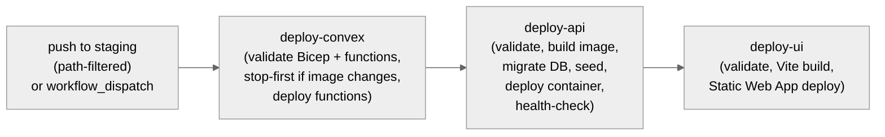

# Release & branch strategy

> How branches map to environments, how conventional commits drive automated versioning, and how GitHub Actions wire those together to deploy staging automatically while requiring a manual trigger for production.

---

## Branch model

Three long-lived branches each map 1:1 to an Azure environment.

| Branch | Environment | Resource group | Deploy trigger |
|---|---|---|---|
| `main` | Production | `retrotool-prod-rg` | **Manual** — `workflow_dispatch` only (no automated prod deploy exists) |
| `staging` | Staging | `retrotool-staging-rg` | Automatic on push (path-filtered) or `workflow_dispatch` via `release-staging.yml` |
| `develop` | Develop | `retrotool-develop-rg` | No automated deploy workflow exists |
| *(local)* | — | Docker Compose | `pnpm local:up` / `pnpm local:dev` |

> Infrastructure is provisioned separately with Azure CLI + Bicep and is **never** deployed by CI. See [./azure-provisioning.md](./azure-provisioning.md).

### Intended promotion flow

```
feature-branch → PR → develop → PR → staging → PR → main
                  |               |               |
                  CI gate         CI gate         CI gate
                                  |
                                  staging auto-deploy fires
```

1. Open a PR targeting the appropriate branch.
2. CI (`ci.yml`) must pass on the PR (lint + type-check + test + build + `pnpm audit --prod`).
3. Merge to `develop` for integration testing against the develop environment (deploy is manual there).
4. Promote to `staging` — the `release-staging.yml` workflow fires automatically on merge.
5. When staging is validated, promote to `main`. On `main`, release-please maintains the release PR; merging that PR bumps versions and creates the tag. Deploying to production requires a separate manual `workflow_dispatch`.

---

## Versioning & releases

### release-please (lockstep monorepo)

Versioning is automated by [release-please](https://github.com/googleapis/release-please), configured in [`release-please-config.json`](../../release-please-config.json) and driven by the [`release-please.yml`](../../.github/workflows/release-please.yml) workflow.

On every push to `main`, release-please parses the conventional-commit history and maintains a rolling "release PR" titled `chore: release v${version}`. Merging that PR:

1. Bumps every `package.json` `version` field in lockstep (via the `linked-versions` plugin — see below).
2. Updates `CHANGELOG.md`.
3. Creates a git tag `vX.Y.Z`.
4. Creates the GitHub Release.

### Packages tracked (five)

| Package path | Component name | Tag behaviour |
|---|---|---|
| `.` | `retro-tool` | `include-component-in-tag: false` — root tag is bare `vX.Y.Z` |
| `retro-tool-api` | `retro-tool-api` | Tagged `retro-tool-api-vX.Y.Z` |
| `retro-tool-ui` | `retro-tool-ui` | Tagged `retro-tool-ui-vX.Y.Z` |
| `convex-backend` | `convex-backend` | Tagged `convex-backend-vX.Y.Z` |
| `packages/shared/contracts` | `contracts` | Tagged `contracts-vX.Y.Z` |

### Lockstep via linked-versions

The `linked-versions` plugin groups all five components under the group name `retro-tool`. Every package version moves together — a `fix:` commit in any package bumps every package's patch version simultaneously.

**Current version (all packages):** `1.0.0`

### Conventional commit → version bump

| Commit type | Bump |
|---|---|
| `fix:` | patch (`1.0.0` → `1.0.1`) |
| `feat:` | minor (`1.0.0` → `1.1.0`) |
| `feat!:` or `BREAKING CHANGE:` footer | major (`1.0.0` → `2.0.0`) |
| `chore:`, `docs:`, `refactor:`, `test:`, `ci:`, `style:` | none (changelog entry only) |

---

## Conventional Commits

All commits to release-target branches must follow the [Conventional Commits](https://www.conventionalcommits.org/) specification. The commit-msg hook (commitlint) enforces this locally.

Breaking changes use either the `!` shorthand or a `BREAKING CHANGE:` footer:

```
feat!: remove legacy Socket.IO retro fallback

BREAKING CHANGE: VITE_RETROS_REALTIME_BACKEND=socket-io is no longer supported
```

Full conventions, commit-type rules, and the no-`wip`-on-main rule are in [../guidelines/coding-guidelines.md](../guidelines/coding-guidelines.md) (§9 Versioning & releases).

**Commit trailer rule (non-negotiable):** never add a `Co-Authored-By: Claude` or any AI co-author trailer. Commits are authored solely under the repo owner's git identity. See [`CLAUDE.md`](../../CLAUDE.md).

---

## Deployment triggers

### Workflow summary

| Workflow | Trigger | What it does |
|---|---|---|
| `ci.yml` | PR targeting `develop`, `staging`, or `main`; also `workflow_dispatch` | `pnpm audit --prod --audit-level high`, lint, type-check, test, build for all packages. Concurrency: cancel-in-progress per branch. |
| `release-please.yml` | Push to `main` | Maintains the rolling release PR; on merge bumps all `package.json` versions, updates `CHANGELOG.md`, creates `vX.Y.Z` tag, creates GitHub Release. **Does not deploy anything.** |
| `release-staging.yml` | Push to `staging` (path-filtered) or `workflow_dispatch` | Chains the three deploy workflows in order: `deploy-convex` → `deploy-api` → `deploy-ui`. |
| `deploy-convex.yml` | `workflow_call` (from `release-staging`) or `workflow_dispatch` | Validates Bicep + Convex functions, deploys self-hosted Convex App Service to **staging**, deploys Convex functions. Stop-first upgrade if image is changing (exports a backup first). |
| `deploy-api.yml` | `workflow_call` or `workflow_dispatch` | Validates + type-checks API, builds + pushes Docker image to ACR (tagged `staging-<sha>`, `staging-latest`, `staging-v<version>`), runs DB migrations, runs idempotent seeds, deploys container to App Service, health-checks. Targets **staging** environment. |
| `deploy-ui.yml` | `workflow_call` or `workflow_dispatch` | Validates + type-checks UI, builds Vite with baked-in `VITE_*` env vars, deploys to Azure Static Web App. Targets **staging** environment. |

### Staging deploy chain (`release-staging.yml`)



- Concurrency group `staging-release`, `cancel-in-progress: false` — queued deploys run in order, never cancelled mid-deploy.
- Authentication uses OIDC (`id-token: write`) — no stored Azure credentials; federated identity credentials are configured per GitHub environment.
- Secrets are inherited from the `staging` GitHub environment.

### Path filter (staging auto-deploy)

`release-staging.yml` only fires if the push touches:

```
convex-backend/**
infra/**
packages/shared/contracts/**
retro-tool-api/**
retro-tool-ui/**
.github/workflows/deploy-api.yml
.github/workflows/deploy-convex.yml
.github/workflows/deploy-ui.yml
.github/workflows/release-staging.yml
```

Documentation-only commits to `staging` do not trigger a deploy.

### Production deploy — manual only

There is no automated production deployment workflow. The three reusable deploy workflows (`deploy-api.yml`, `deploy-ui.yml`, `deploy-convex.yml`) each hardcode `environment: staging` in their `set-env` job — they always target the staging GitHub environment, regardless of the calling branch.

There is no `release-production.yml` equivalent to `release-staging.yml`.

**To deploy production today:** trigger each workflow individually via `workflow_dispatch` from the Actions tab, after overriding the relevant GitHub environment variables/secrets for the `prod` environment — or run the equivalent CLI steps manually.

This is a known gap: the deploy workflows are staging-only. A production release pipeline does not yet exist in `.github/workflows/`.

### API image tagging

`deploy-api.yml` tags the Docker image three ways on each build:

| Tag | Example | Purpose |
|---|---|---|
| `<env>-<sha8>` | `staging-a1b2c3d4` | Unique per commit — used as the actual deploy tag |
| `<env>-latest` | `staging-latest` | Floating pointer for quick reference |
| `<env>-v<version>` | `staging-v1.0.0` | Human-readable release tag; enables `v1.1.0 → v1.0.3` rollbacks |

The `<version>` is read from `retro-tool-api/package.json` at build time, so after a release-please bump the version tag is accurate.

---

## Related docs

| Doc | What it covers |
|---|---|
| [./azure-provisioning.md](./azure-provisioning.md) | Bicep provisioning walkthrough, environment→branch mapping, GitHub environment setup, OIDC federated credentials |
| [../architecture/overview.md](../architecture/overview.md) | Azure topology table (env → branch → resource group → service names) |
| [../workflows/running-the-app.md](../workflows/running-the-app.md) | Running locally, against staging, and against production |
| [../guidelines/coding-guidelines.md](../guidelines/coding-guidelines.md) | §9 Versioning & releases — conventional commit rules, commitlint config, no-wip-on-main |
| [`../../.github/workflows/release-please.yml`](../../.github/workflows/release-please.yml) | Release-please workflow source |
| [`../../.github/workflows/release-staging.yml`](../../.github/workflows/release-staging.yml) | Staging deploy chain source |
| [`../../release-please-config.json`](../../release-please-config.json) | Packages, components, linked-versions config |
