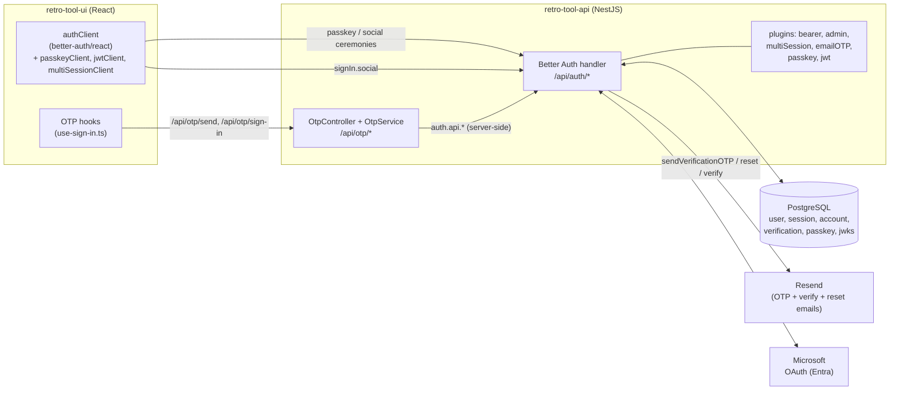
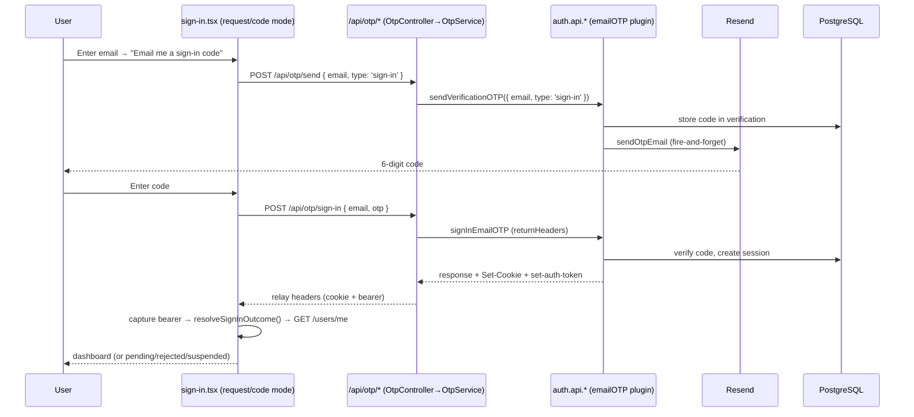
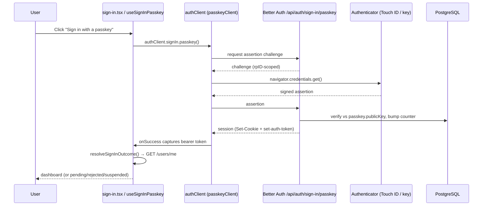
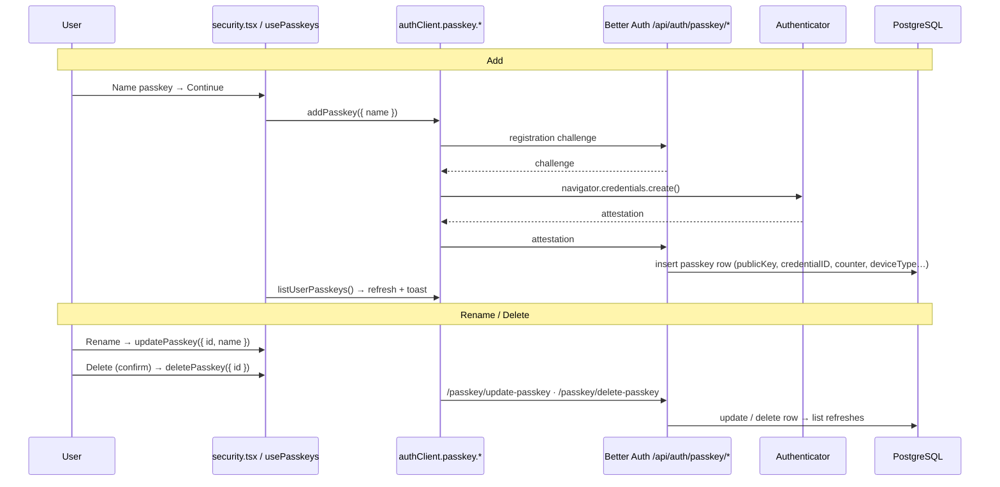
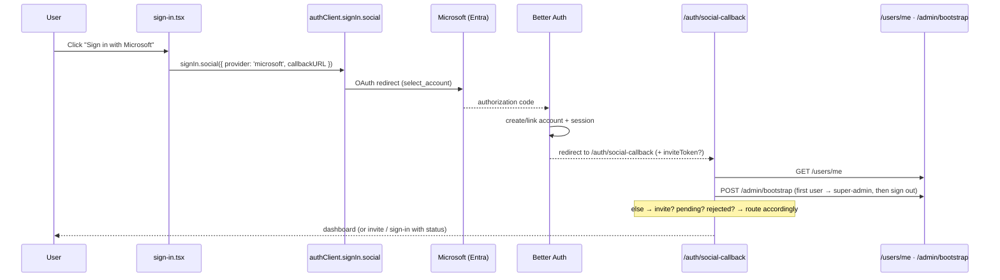
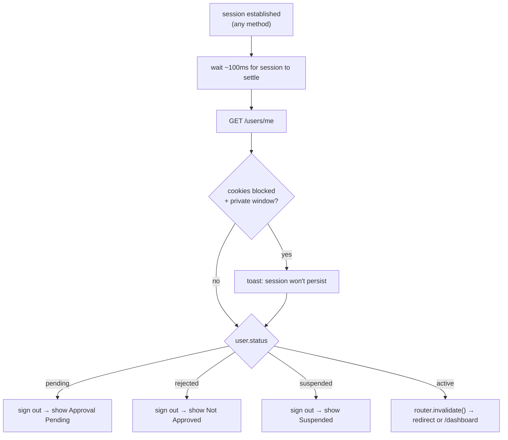

# Authentication

> The complete authentication reference for Retro-Tool: every sign-in method (email/password, email-OTP, passkeys, Microsoft OAuth), the cookie + bearer + JWT credential model, and the file-level flow map of what gets hit on every auth path.

This document merges the passwordless feature reference with the per-file request traces of every auth flow. For the Convex↔NestJS JWT path see [convex-nestjs-auth.md](./convex-nestjs-auth.md); for hardening (rate limits, CORS, CSRF posture) see [backend-api.md](./backend-api.md); for the same flows at a product/behaviour level see [app-flows.md](../workflows/app-flows.md) §1; for roles & permissions see [authorization-rbac.md](./authorization-rbac.md). When behaviour docs and the code references here disagree, trust the code references.

---

## Contents

- [Stack](#stack)
- [Key files that recur across flows](#key-files-that-recur-across-flows)
- [Credential model (cookie + bearer + JWT)](#credential-model-cookie--bearer--jwt)
- [Architecture overview](#architecture-overview)
- [Flows](#flows)
  - [1. Email / password sign-up](#1-email--password-sign-up)
  - [2. Email / password sign-in](#2-email--password-sign-in)
  - [3. Email-OTP passwordless sign-in](#3-email-otp-passwordless-sign-in)
  - [4. Passkey (WebAuthn) — sign-in &amp; management](#4-passkey-webauthn--sign-in--management)
  - [5. Microsoft OAuth](#5-microsoft-oauth)
  - [6. Email verification](#6-email-verification)
  - [7. Password reset (OTP + token-link)](#7-password-reset-otp--token-link)
  - [8. Session validation on every request](#8-session-validation-on-every-request)
  - [9. Convex realtime auth (no WebSocket gateways)](#9-convex-realtime-auth-no-websocket-gateways)
  - [10. Sign-out](#10-sign-out)
  - [11. RBAC &amp; approval lifecycle](#11-rbac--approval-lifecycle)
- [Shared post-sign-in status gate](#shared-post-sign-in-status-gate)
- [Passkey relying-party binding (rpID / origin)](#passkey-relying-party-binding-rpid--origin)
- [Configuration reference](#configuration-reference)
- [Rate limits](#rate-limits)
- [Cross-references](#cross-references)

---

## Stack

- **API:** NestJS + Better Auth via `@thallesp/nestjs-better-auth`, plugins:
  `bearer`, `admin`, `multiSession`, `emailOTP`, `passkey`, `jwt`. PostgreSQL via
  Drizzle. Microsoft OAuth.
- **UI:** React 19 + TanStack Router; Better Auth React client.
- **Realtime:** Convex only — Socket.IO was removed entirely (no gateways, no `WsAuthService`).
  Convex auth is detailed in [convex.md](../architecture/convex.md).

**PostgreSQL is the system of record.** Better Auth (mounted in the NestJS API via
`@thallesp/nestjs-better-auth`) owns the auth tables (`user`, `session`, `account`, `verification`,
`passkey`, `jwks`). The UI talks to Better Auth two ways: directly through the `authClient` for passkey
and social ceremonies, and indirectly through our own `/api/otp/*` controller for email codes (so every
send/verify stays server-side for rate-limiting and logging).

## Key files that recur across flows

| File                                                                                                                                            | Role                                                                                                                                                                     |
| ----------------------------------------------------------------------------------------------------------------------------------------------- | ------------------------------------------------------------------------------------------------------------------------------------------------------------------------ |
| [auth.config.ts](../../retro-tool-api/src/auth/auth.config.ts)                                                                                   | The Better Auth instance: all plugins, email/OTP/reset hooks, social providers, session & cookie config, rate limits. The heart of every flow.                           |
| [auth.module.ts](../../retro-tool-api/src/auth/auth.module.ts)                                                                                   | Registers Better Auth (`forRootAsync`) → **global `AuthGuard` is active** (fail-closed); mounts `SignupCleanupMiddleware`.                                  |
| [auth.controller.ts](../../retro-tool-api/src/auth/auth.controller.ts)                                                                           | Thin stubs; Better Auth middleware handles`/api/auth/*` before NestJS routing.                                                                                         |
| [otp/otp.controller.ts](../../retro-tool-api/src/auth/otp/otp.controller.ts) + [otp.service.ts](../../retro-tool-api/src/auth/otp/otp.service.ts) | Our`/api/otp/*` endpoints that proxy to `auth.api.*` (all `@AllowAnonymous`).                                                                                      |
| [auth/schema/index.ts](../../retro-tool-api/src/auth/schema/index.ts)                                                                            | Drizzle tables:`user`, `session`, `account`, `verification`, `passkey`, `jwks`, `adminActionLog`.                                                          |
| [configuration.ts](../../retro-tool-api/src/config/configuration.ts)                                                                             | Env parsing: auth secret/url, JWT issuer/audience, rpId/rpName, Microsoft, Convex.                                                                                       |
| [main.ts](../../retro-tool-api/src/main.ts)                                                                                                      | Global`api` prefix (health excluded), CORS, Helmet/CSP, cookie parser, OAuth state-cookie-lost fallback, `x-forwarded-for` backfill.                                 |
| [lib/auth-client.ts](../../retro-tool-ui/src/lib/auth-client.ts)                                                                                 | Better Auth React client; bearer-token capture/storage (private-window fallback);`passkeyClient()`, `jwtClient()`, `multiSessionClient()`; `signOutWithCleanup`. |
| [lib/api.ts](../../retro-tool-ui/src/lib/api.ts)                                                                                                 | `apiFetch` — sends `credentials:'include'` + `Authorization: Bearer` (fallback).                                                                                  |
| [lib/api-endpoints.ts](../../retro-tool-ui/src/lib/api-endpoints.ts)                                                                             | Endpoint constants (`OTP_ENDPOINTS`, `USERS_ENDPOINTS`, …).                                                                                                         |
| [routes/auth/hooks/](../../retro-tool-ui/src/routes/auth/hooks/)                                                                                 | `use-sign-in`, `use-sign-up`, `use-forgot-password`, `use-reset-password`.                                                                                       |

**Auth route data flow (shared):** every browser auth call goes
`route component → hook → authClient.* or api.post(OTP_ENDPOINTS.*) → /api/auth/* or /api/otp/* → Better Auth → Postgres`. Successful auth returns a session cookie
(+ `set-auth-token` header captured for the private-window bearer fallback).

---

## Credential model (cookie + bearer + JWT)

Every sign-in method — password, passkey, OTP, and OAuth — establishes the same session and yields the
same credentials:

- **Bearer token** — the **primary** API credential. Better Auth returns it in the `set-auth-token`
  response header; the `authClient` `onSuccess` hook (or a manual header read on the OTP path) stores it
  in `sessionStorage`. Every subsequent API request attaches it as `Authorization: Bearer …`.
- **Session cookie** — kept as a **fallback** during the cookie→bearer rollout (`credentials: 'include'`). In production the UI and API are on different subdomains, so the cookie is
  `SameSite=None; Secure`. Cookie is `better-auth.session_token` → row in `session` (unique `token`,
  `expiresAt` check); 7-day expiry, 1-day update age, 5-min cookie cache.
- **RS256 JWT** — issued on demand by the `jwt` plugin (`GET /api/auth/token`, JWKS at
  `GET /api/auth/jwks`) to authenticate the Convex realtime client. See
  [convex-nestjs-auth.md](./convex-nestjs-auth.md).

  **What's a JWKS?** A **JSON Web Key Set** (RFC 7517) is a standard JSON document —
  `{ "keys": [...] }` — for publishing public keys so third parties can verify a
  signed JWT without ever holding a shared secret. Here, the `jwt` plugin generates
  an RS256 key pair on first use and stores it in the `jwks` table (private key
  AES-encrypted at rest by the plugin); the public half is served, unauthenticated,
  at `GET /api/auth/jwks`. Convex fetches and caches that endpoint to verify the
  RS256 JWTs the UI attaches to every Convex call — no shared secret crosses to
  Convex, and Convex never calls the API per request to check a session.

Private-window handling: cookies are blocked in incognito, but the app runs fully on the bearer token, so
sign-in still works — the UI just warns that the session won't persist after the window closes.

---

## Architecture overview

Key rule from the plugin design: **the UI never calls the emailOTP plugin routes directly.** It calls
our `/api/otp/*` controller, which delegates to the injected `auth.api.*` methods. Passkey and social,
by contrast, *must* run their browser ceremony through the `authClient`, so those go direct to
`/api/auth/*`.

The three passwordless methods at a glance:

| Method                       | Sign-in trigger                                                    | Server route(s)                                                             | Where managed                                               |
| ---------------------------- | ------------------------------------------------------------------ | --------------------------------------------------------------------------- | ----------------------------------------------------------- |
| **Passkey (WebAuthn)** | `authClient.signIn.passkey()` (button + Conditional-UI autofill) | `/api/auth/sign-in/passkey`, `/api/auth/passkey/*` (Better Auth plugin) | `/profile/security` — list / add / rename / delete       |
| **Email OTP**          | `/api/otp/send` → `/api/otp/sign-in` (our NestJS controller)  | `/api/otp/*` → `auth.api.*` (emailOTP plugin)                          | n/a — no stored credential; a fresh code each time         |
| **Microsoft OAuth**    | `authClient.signIn.social({ provider: 'microsoft' })`            | `/api/auth/sign-in/social` + `/auth/social-callback`                    | Microsoft account (external); auto-linked by verified email |

All methods converge on the **same session** (Better Auth `session`/`account` rows) and the **same
post-sign-in status gate** (`/users/me` → pending / rejected / suspended handling).

---

## Flows

### 1. Email / password sign-up

1. [sign-up.tsx](../../retro-tool-ui/src/routes/auth/sign-up.tsx) → [hooks/use-sign-up.ts](../../retro-tool-ui/src/routes/auth/hooks/use-sign-up.ts) → `authClient.signUp.email()`
2. `POST /api/auth/sign-up/email` — **`SignupCleanupMiddleware`** ([auth-signup.middleware.ts](../../retro-tool-api/src/auth/auth-signup.middleware.ts)) first clears any stale `pending` user for a retry.
3. Better Auth creates rows in `user` (`status='pending'`, `role='member'`, `emailVerified=false`), `account`, `session`.
4. **Verification email**: `emailVerification.sendVerificationEmail` / `emailOTP.sendVerificationOTP` in [auth.config.ts](../../retro-tool-api/src/auth/auth.config.ts) → [lib/email.ts](../../retro-tool-api/src/lib/email.ts) (Resend). Suppressed if an active org/team invitation exists (`hasActiveInvitation`).
5. **First-user bootstrap**: use-sign-up.ts calls `POST /api/users/admin/bootstrap`; if no admin exists yet, the first user becomes `super-admin` + `approved` + `emailVerified`.

Tables: `user`, `account`, `session`, `verification`. Outcome: `pending` (awaits approval) unless first user.

### 2. Email / password sign-in

1. [sign-in.tsx](../../retro-tool-ui/src/routes/auth/sign-in.tsx) → [hooks/use-sign-in.ts](../../retro-tool-ui/src/routes/auth/hooks/use-sign-in.ts) `useSignIn` → `authClient.signIn.email()`
2. `POST /api/auth/sign-in/email` → Better Auth verifies password, creates `session`, sets cookie + `set-auth-token`.
3. **`resolveSignInOutcome()`** (use-sign-in.ts): waits for cookie, decides cookie vs bearer fallback (`testCookiesWorking`/`detectPrivateWindow`), then `GET /api/users/me`.
4. Status routing: `pending`/`rejected`/`suspended` → sign out + show status screen; `approved` → invalidate query cache → `/dashboard` (or `redirect`).

Tables: `session`, `user`. The shared success handler is reused by OTP and passkey sign-in (see [Shared post-sign-in status gate](#shared-post-sign-in-status-gate)).

### 3. Email-OTP passwordless sign-in

"Email me a sign-in code" — a 6-digit code emailed to the user, valid 5 minutes, 3 attempts (`emailOTP({ otpLength: 6, expiresIn: 300, allowedAttempts: 3 })`). The sign-in page's passwordless mode collects the
email (`request` mode), sends a code, then verifies it (`code` mode).

Unlike passkey/social, **the UI does not call the Better Auth plugin routes** — it calls our
`/api/otp/*` controller, which proxies to `auth.api.*`. This keeps every send/verify on the server for
rate-limiting, logging, and clean error mapping (`OtpService.rethrow` → 400 / 429).

File trace:

1. sign-in.tsx (`mode: 'request' → 'code'`) → use-sign-in.ts `useSendSignInOtp` / `useSignInOtp`.
2. `POST /api/otp/send` `{ email, type:'sign-in' }` → [otp.controller.ts](../../retro-tool-api/src/auth/otp/otp.controller.ts) → [otp.service.ts](../../retro-tool-api/src/auth/otp/otp.service.ts) `auth.api.sendVerificationOTP()` → `sendVerificationOTP` hook → email (6-digit, 5-min, 3 tries).
3. `POST /api/otp/sign-in` `{ email, otp }` → `auth.api.signInEmailOTP()`. The controller propagates `set-cookie` + `set-auth-token` to the response; the UI captures the bearer token, then runs the same `resolveSignInOutcome()` status flow as §2.

Implementation notes:

- `useSignInOtp` uses a **direct `fetch`** (not the shared `api` helper) so it can read the
  `set-auth-token` header and store the bearer — the shared helper discards response headers.
- The controller forwards the caller's request headers so Better Auth records client IP + user-agent on
  the new session row, and relays `Set-Cookie` + `set-auth-token` back to the client.
- OTP endpoints ([api-endpoints.ts](../../retro-tool-ui/src/lib/api-endpoints.ts)): `/api/otp/send`,
  `/api/otp/sign-in`, `/api/otp/verify-email`, `/api/otp/reset-password/send`, `/api/otp/reset-password`.

Tables: `verification` (OTP), `session`, `user`. Config: `emailOTP` plugin in auth.config.ts.

### 4. Passkey (WebAuthn) — sign-in & management

Passkeys use the `passkey()` server plugin (`@better-auth/passkey`) + `passkeyClient()` on the UI. The
WebAuthn ceremony (`navigator.credentials`) **must** run in the browser, so registration and assertion go
through the `authClient`; the server issues challenges, verifies attestation/assertion, and owns the
`passkey` table.

**Sign-in file trace:** sign-in.tsx passkey button (gated on `window.PublicKeyCredential`) → use-sign-in.ts `useSignInPasskey` → `authClient.signIn.passkey()` → `POST /api/auth/sign-in/passkey` (+ browser WebAuthn ceremony) → same status flow as §2. Conditional-UI autofill calls `authClient.signIn.passkey({ autoFill:true })` on mount.

**Management file trace:** [profile/security.tsx](../../retro-tool-ui/src/routes/profile/security.tsx) → [hooks/use-passkeys.ts](../../retro-tool-ui/src/routes/profile/hooks/use-passkeys.ts) → `authClient.passkey.{listUserPasskeys,addPasskey,updatePasskey,deletePasskey}` → `/api/auth/passkey/*`.

Config: `passkey()` plugin in auth.config.ts (`rpID`/`rpName`/`origin` from [configuration.ts](../../retro-tool-api/src/config/configuration.ts)). Table: `passkey`.

#### Sign-in

Triggered from the sign-in page's **"Sign in with a passkey"** button (`useSignInPasskey`), and — on
supporting browsers — from Conditional-UI autofill.

**Conditional-UI autofill** — on mount, if `PublicKeyCredential.isConditionalMediationAvailable()` is
true, the page calls `authClient.signIn.passkey({ autoFill: true })` and the email input carries
`autoComplete="email webauthn"`, so saved passkeys surface in the browser's autofill dropdown. Failures
(including dismissal) are non-fatal — the explicit button still works. Autofill is suppressed when the
email is pre-filled from an invitation link.

#### Registration & management (`/profile/security`)

The **Passkeys** card lists the user's passkeys and supports add / rename / delete via the `usePasskeys`
hook (TanStack Query list + mutations). The badge reads **Enabled** when ≥1 passkey exists, else
**Disabled**.

Client actions: `authClient.passkey.{addPasskey, listUserPasskeys, updatePasskey, deletePasskey}`.
When `window.PublicKeyCredential` is undefined (unsupported browser), both the sign-in button and the
security card render a graceful unsupported state instead of throwing.

#### `passkey` table

Owned by the plugin ([schema/index.ts](../../retro-tool-api/src/auth/schema/index.ts)): `id` PK, `name?`,
`publicKey`, `userId` FK → `user.id` (cascade delete), `credentialID`, `counter`, `deviceType`,
`backedUp`, `transports?`, `aaguid?`, `createdAt?`. Indexed on `userId` and `credentialID`. Cross-account
isolation is enforced by the FK + credential verification: a passkey registered by user A cannot
authenticate user B.

### 5. Microsoft OAuth

Configured under `socialProviders.microsoft` (tenant `common`, `prompt: 'select_account'`) — only
mounted when `MICROSOFT_CLIENT_ID` / `MICROSOFT_CLIENT_SECRET` are set. Accounts sharing a **verified
email** are auto-linked (`accountLinking.trustedProviders: ['microsoft']`).

File trace:

1. sign-in.tsx / sign-up.tsx → `authClient.signIn.social({ provider:'microsoft', callbackURL })` → `GET /api/auth/sign-in/microsoft` → Microsoft.
2. `GET /api/auth/callback/microsoft` → Better Auth exchanges the code, creates/links `account` + `user` + `session`. `accountLinking.trustedProviders:['microsoft']` auto-links by verified email (sets `emailVerified`).
3. [social-callback.tsx](../../retro-tool-ui/src/routes/auth/social-callback.tsx): `GET /api/users/me` → bootstrap attempt → invitation redirect (`/auth/accept-invite`) or status routing as §2.
4. **State-cookie-lost fallback**: [main.ts](../../retro-tool-api/src/main.ts) redirects API-root OAuth errors back to `/auth/sign-in?error=…`.

The `social-callback` route handles the first-user bootstrap (auto `super-admin`, then a clean
re-sign-in), invitation redirect, and pending/rejected status routing — see
[social-callback.tsx](../../retro-tool-ui/src/routes/auth/social-callback.tsx).

Tables: `account`, `user`, `session`, `verification`. OAuth stays **cookie-based** (redirects can't carry a bearer); the UI mints a bearer post-landing.

### 6. Email verification

[verify-email.tsx](../../retro-tool-ui/src/routes/auth/verify-email.tsx) → `POST /api/otp/verify-email` `{ email, otp }` → otp.service.ts `auth.api.verifyEmailOTP()` → sets `user.emailVerified=true`. Resend via `POST /api/otp/send` `{ type:'email-verification' }`. Config: `emailVerification` + `emailOTP.overrideDefaultEmailVerification` in auth.config.ts (with `sendVerificationOnSignUp: true`). Suppressed when an active invitation exists (accepting it verifies the email — `hasActiveInvitation`).

Tables: `verification`, `user`.

### 7. Password reset (OTP + token-link)

Two coexisting reset paths back onto the same emailOTP plugin and `emailAndPassword` config:

1. [forgot-password.tsx](../../retro-tool-ui/src/routes/auth/forgot-password.tsx) → [hooks/use-forgot-password.ts](../../retro-tool-ui/src/routes/auth/hooks/use-forgot-password.ts) → `POST /api/otp/reset-password/send` `{ email }`.
2. [reset-password.tsx](../../retro-tool-ui/src/routes/auth/reset-password.tsx) → [hooks/use-reset-password.ts](../../retro-tool-ui/src/routes/auth/hooks/use-reset-password.ts) → `POST /api/otp/reset-password` `{ email, otp, password }`.
3. otp.service.ts proxies to `auth.api.*`; Better Auth updates the password hash and **invalidates all existing sessions**.

- **OTP reset** — `/api/otp/reset-password/send` emails a code; `/api/otp/reset-password` takes
  `{ email, otp, password }` and sets the new password. Backed by `useForgotPassword` /
  `useResetPassword` / `useResendResetOtp`.
- **Token-link reset** — `emailAndPassword.sendResetPassword` emails a 20-minute token link
  (`/auth/reset-password?token=…`), also configured in auth.config.ts.

The OTP email copy is keyed by `type` in [lib/email.ts](../../retro-tool-api/src/lib/email.ts)
(`OtpEmailType = 'sign-in' | 'email-verification' | 'forget-password'`): distinct subject/heading per
purpose. Sends are fire-and-forget (plugin guidance: don't await, to avoid timing attacks).

Tables: `verification`, `user`, `session` (all revoked).

### 8. Session validation on every request

- **API:** the global `AuthGuard` (registered by `@thallesp/nestjs-better-auth` in [auth.module.ts](../../retro-tool-api/src/auth/auth.module.ts), **not disabled**) is **fail-closed** — every route requires a valid session/bearer **unless** marked `@AllowAnonymous`. `/api/auth/*` is handled by Better Auth middleware before the guard.
- **Public routes** (`@AllowAnonymous`): `GET /health*`, `GET /users/admin/exists`, `GET /invitations/preview/:token`, and all `/api/otp/*`.
- **UI:** [lib/api.ts](../../retro-tool-ui/src/lib/api.ts) `apiFetch` sends `credentials:'include'` and adds `Authorization: Bearer` when `shouldUseBearerToken()` (private-window fallback). Token comes from the `set-auth-token` header captured by [lib/auth-client.ts](../../retro-tool-ui/src/lib/auth-client.ts).
- **Validation:** session cookie `better-auth.session_token` → row in `session` (unique `token`, `expiresAt` check). 7-day expiry, 1-day update age, 5-min cookie cache.

### 9. Convex realtime auth (no WebSocket gateways)

Socket.IO has been removed entirely — no gateway files (`retros.gateway.ts`,
`estimates.gateway.ts`, `notifications.gateway.ts` no longer exist), no `WsAuthService`, no client
`lib/socket.ts`. Convex is the sole realtime transport, and it authenticates independently of the
session cookie/bearer model above: the API issues a short-lived RS256 JWT at
`GET /api/auth/token` (Better Auth's `jwt` plugin), the UI attaches it via
`ConvexProviderWithAuth`, and Convex verifies it against the API's JWKS endpoint. See
[convex-nestjs-auth.md](./convex-nestjs-auth.md) for the full issue/verify design and
[architecture/convex.md §7](../architecture/convex.md#7-authentication-current) for the
UI/authorization details.

### 10. Sign-out

`signOutWithCleanup(queryClient)` in [lib/auth-client.ts](../../retro-tool-ui/src/lib/auth-client.ts)
takes the caller's TanStack `QueryClient` (passed via `useQueryClient()`) and: clears the
sessionStorage bearer token → `authClient.signOut()` → `POST /api/auth/sign-out` revokes the
`session` row + expires the cookie → `queryClient.clear()` (evicts all cached queries, avoiding
stale-cache leakage across the sign-out/sign-in boundary). UI then returns to `/auth/sign-in`.

### 11. RBAC & approval lifecycle

User status: `pending → approved | rejected | suspended`. Sign-in (§2) checks it
on every login via `GET /api/users/me`. Admins approve/reject/suspend through the
users module (`PATCH /api/users/{id}/status`, suspend/reactivate endpoints),
writing `approvedAt`/`approvedById`/`suspendedReason` on `user` and an audit row
in `adminActionLog`. Roles (`super-admin → system-admin → member`, plus org/team
roles) and the full permission matrices live in [authorization-rbac.md](./authorization-rbac.md).

---

## Shared post-sign-in status gate

Password, passkey, and OTP sign-in all funnel through **one success path** (`resolveSignInOutcome` +
`useSignInSuccessHandler` in [use-sign-in.ts](../../retro-tool-ui/src/routes/auth/hooks/use-sign-in.ts)), so
every method behaves identically:

The bearer token is kept regardless of whether cookies work, so the app authenticates by header on every
subsequent request.

---

## Passkey relying-party binding (rpID / origin)

Passkeys are bound to the **UI domain, not the API domain** (they deploy separately):

- `origin = frontend.url` (e.g. `https://app.example.com`), `rpID = hostname of frontend.url`.
- Derived in [configuration.ts](../../retro-tool-api/src/config/configuration.ts) (`auth.rpId` defaults from
  `FRONTEND_URL`; `auth.rpName` defaults `'Retro-Tool'`) and passed into `passkey({ rpID, rpName, origin })` in [auth.config.ts](../../retro-tool-api/src/auth/auth.config.ts).
- `rpID` is the registrable domain — **no scheme/port**. A passkey registered on `localhost` will **not**
  work on the deployed domain, and vice-versa.

---

## Configuration reference

| Config (`configuration.ts`)             | Env var                                                  | Purpose                                                  |
| ----------------------------------------- | -------------------------------------------------------- | -------------------------------------------------------- |
| `auth.rpId`                             | `WEBAUTHN_RP_ID` (defaults from `FRONTEND_URL` host) | WebAuthn relying-party ID (registrable UI hostname)      |
| `auth.rpName`                           | `WEBAUTHN_RP_NAME` (default `Retro-Tool`)            | Human-readable RP name shown in the authenticator prompt |
| `frontend.url`                          | `FRONTEND_URL`                                         | Passkey`origin`; reset/verify email links              |
| `auth.secret`                           | `BETTER_AUTH_SECRET`                                   | Session signing                                          |
| `auth.url`                              | `BETTER_AUTH_URL`                                      | API base + JWT issuer default                            |
| `auth.jwtIssuer` / `auth.jwtAudience` | `BETTER_AUTH_JWT_ISSUER` / `_AUDIENCE`               | Convex customJwt verification                            |
| `auth.microsoft.clientId` / `Secret`  | `MICROSOFT_CLIENT_ID` / `_SECRET`                    | Microsoft OAuth (omitted → provider disabled)           |
| `email.resendApiKey`                    | `RESEND_API_KEY`                                       | OTP / verify / reset email delivery                      |

emailOTP: `otpLength: 6`, `expiresIn: 300`s, `allowedAttempts: 3`. jwt: RS256, 2048-bit, 15-min
expiry.

---

## Rate limits

Per-IP, in-memory (uses forwarded headers behind the Azure reverse proxy). Auth-relevant rules
from `rateLimit.customRules` in [auth.config.ts](../../retro-tool-api/src/auth/auth.config.ts):

| Route                                 | Window | Max |
| ------------------------------------- | ------ | --- |
| `/email-otp/send-verification-otp`  | 300s   | 5   |
| `/sign-in/email-otp`                | 60s    | 10  |
| `/email-otp/verify-email`           | 60s    | 10  |
| `/email-otp/request-password-reset` | 300s   | 3   |
| `/email-otp/reset-password`         | 300s   | 10  |
| `/sign-in/email`                    | 60s    | 10  |
| `/sign-up/email`                    | 300s   | 5   |
| `/forgot-password`                  | 300s   | 3   |

These are defense-in-depth on top of the emailOTP `allowedAttempts: 3`. Global default: 100 req / 60s.

---

## Cross-references

- **Behaviour-level walkthroughs:** [app-flows.md](../workflows/app-flows.md) §1–2.
- **Roles & permissions:** [authorization-rbac.md](./authorization-rbac.md).
- **API hardening (Helmet, rate limits, CSRF posture):** [backend-api.md](./backend-api.md).
- **Convex JWT auth:** [convex-nestjs-auth.md](./convex-nestjs-auth.md), [convex.md](../architecture/convex.md) §7.
