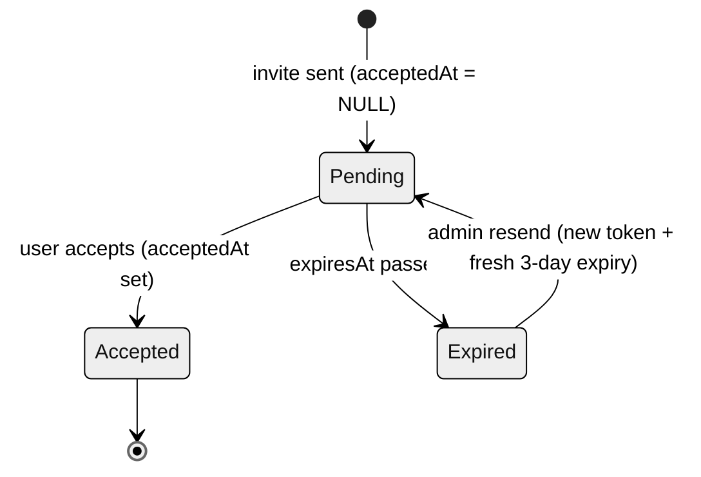

# Invitations & Onboarding

How users are brought into the platform — invitation emails, direct member adds, the accept-invite
journey (including the sign-in/OAuth invite modes), and the account requirements applied along the way.

## Overview

Two distinct flows let administrators bring users into the platform:

| Action | What it does | Who receives |
|---|---|---|
| **Invite** | Sends an email with a tokenised accept link | Anyone — registered or not |
| **Add Member** | Directly adds an existing user (no email) | Registered users only |

Both actions send an **in-app notification** to the target user when they result in a new membership.

Administrators can also **manage pending invitations** (list / search / revoke / resend) from the
Members section of an org or team page.

---

## Invite flow (email-based)

### Organisation invite

**Trigger:** Admin clicks **Invite** in the Members section of an organisation page.

1. Admin enters an email address and selects a role.
2. The UI calls `GET /api/organizations/:id/check-invite-email?email=` and displays:
   - *"Account found — invitation email will be sent"* — email belongs to a registered user.
   - *"No account — invitation email will be sent to register"* — email is not yet registered.
3. On submit, `POST /api/organizations/:id/invite` creates an `org_invitation` record (3-day expiry) and sends an email with an accept link:
   ```
   {appUrl}/auth/accept-invite?token={token}&email={invitedEmail}
   ```
4. If a pending (unaccepted) invite for the same email already exists on that org, it is deleted and replaced with a fresh one (re-invite).
5. The email template differs for registered vs. unregistered recipients (`buildOrgInviteHtml` vs. `buildOrgExternalInviteHtml`).

### Team invite

**Trigger:** Admin/team-lead clicks **Invite** in the Members section of a team page.

1. Admin enters an email address and selects a tag (member / team-lead).
2. The UI calls the team's `check-invite-email` endpoint for the pre-check display (also reports whether the user is already a team member via `isMember`).
3. On submit, `POST /api/teams/:id/invite` creates a `team_invitation` record (3-day expiry) and sends an email:
   ```
   {appUrl}/auth/accept-invite?token={token}&email={invitedEmail}
   ```
4. If a pending (unaccepted) invite for the same email already exists on that team, it is deleted and replaced with a fresh one (re-invite).
5. Accepting a team invite **also enrols the user in the parent organisation** if they are not already a member.

### Managing pending invitations

Both org and team Members sections list outstanding (unaccepted) invitations with search + pagination, and let an admin revoke or resend each one:

- **List** — `GET /api/{organizations|teams}/:id/invitations?page=&limit=&search=` returns paginated pending invites with the inviter's name/email.
- **Revoke** — `DELETE /api/{organizations|teams}/:id/invitations/:invitationId` deletes the pending invite.
- **Resend** — `POST /api/{organizations|teams}/:id/invitations/:invitationId/resend` issues a **fresh token and a new 3-day expiry**, then re-sends the email.

All three require system-admin or the relevant org/team admin permission.

---

## Accept-invite page (`/auth/accept-invite`)

The page reads `token` from the query string. The API resolves whether it belongs to an org or a team — the URL does not carry a `type` parameter. The optional `email` query string is forwarded to sign-in / sign-up so the email field can be pre-filled.

Preview data comes from the **unified** `GET /api/invitations/preview/:token` endpoint, which returns `{ type, orgName, teamName?, role, invitedEmail, expired, accepted, isExistingUser, orgId, teamId? }`.

### Not logged in

The preview response includes `isExistingUser: boolean` so the page can steer the invitee down the correct path and avoid the "wrong password" dead-end:

| Server says | Primary CTA | Secondary CTA | Banner copy |
|---|---|---|---|
| `isExistingUser: false` (no account yet) | **Create Account & Accept** → `/auth/sign-up?inviteToken={token}&email={invitedEmail}` | **I already have an account** → `/auth/sign-in?...` | *"You're new here — no account exists yet for `email`. Create your account using this email — it will be pre-filled and locked so the invite can be matched."* |
| `isExistingUser: true` (account exists) | **Sign In & Accept** → `/auth/sign-in?inviteToken={token}&email={invitedEmail}` | **Create a new account** → `/auth/sign-up?...` | *"We found your account — sign in to accept this invitation."* |

In both cases the email is pre-filled, and on sign-up it is read-only so the registered email always matches the invitation.

### Logged in (correct email)

The page shows the same details and a single **Accept Invitation** button.

### Logged in (wrong email)

If the signed-in user's email doesn't match the invited email, an **Email Mismatch** card is shown with both addresses, plus:
- **Sign Out & Continue** — signs the user out and navigates to `/auth/sign-in?inviteToken=&email=` with the invited email pre-filled.
- **Cancel** — returns to the dashboard.

### On acceptance

Acceptance calls the unified `POST /api/invitations/:token/accept` (returns `{ type, organizationId, teamId? }`), which:

- Auto-approves the user's account if it was in *pending* status.
- **Marks the user's email as verified** (`email_verified = true`). Receiving and clicking the invite link proves the user controls that mailbox, so a separate verification step is unnecessary.
- For **org invites**: adds the user as an organisation member at the invited role.
- For **team invites**: adds the user to the organisation (if not already a member), then to the team with the invited tag.
- Redirects to `/organizations/:orgId` or `/teams/:teamId` respectively.

> **Verification email suppression** — Better Auth normally sends a "Verify your email" message on every sign-up, and the emailOTP plugin sends a verification code. The `sendVerificationEmail` and `sendVerificationOTP` callbacks in `auth/auth.config.ts` both check whether an active (unaccepted, unexpired) `org_invitation` or `team_invitation` exists for the new user's email (`hasActiveInvitation`) and **skip sending** if one is found. The accept-invite flow then verifies the email when the invitation is consumed, so invited users only receive the single invitation email.

### Edge cases

| State | Behaviour |
|---|---|
| Already accepted | Page shows "Already Accepted" with a link to the destination. |
| Expired (> 3 days) | Page shows "Invitation Expired" with a message to request a new invite. |
| Invalid / missing token | Page shows "Invalid Link" or "Invitation Not Found". |

---

## Acceptance logic (backend)

`POST /api/invitations/:token/accept` is handled by the unified `InvitationsService.accept`, which
first resolves the invitation type via `getPreview` (it tries the org lookup, then falls back to team)
and then delegates to the matching service method.

### Team acceptance — `TeamInvitationsService.acceptTeamInvitation(token, userId)`

Runs in this order:

1. **Validate the token** — must exist (`404`), not already be accepted (`409`), and not be expired (`403`).
2. **Case-insensitive email match** — the signed-in user's email must equal the invited email, compared with `.toLowerCase()` on both sides; otherwise `403 "This invitation was sent to a different email address"`.
3. **Load the team** — `404` if the team no longer exists.
4. **Approve the account** — if the user is still `pending`, set `status → approved`, stamping `approvedAt` and `approvedById` (the inviter). Users already `approved` are left unchanged.
5. **Mark `emailVerified = true`** — clicking the tokenised link proves mailbox ownership.
6. **Add to the organisation** — insert an org membership at the `member` role if the user is not already a member.
7. **Add to the team** — insert a team membership carrying the invitation's `tag` if not already a member.
8. **Stamp `acceptedAt`** on the invitation record.
9. **Fire an async in-app notification** (`notifyUserOfTeamInvite`) — failures are swallowed and never block acceptance.

Returns `{ organizationId, teamId }`.

### Organisation acceptance — `OrgInvitationsService.acceptOrgInvitation(token, userId)`

1. **Validate the token** — exist / not-accepted / not-expired, same as above.
2. **Case-insensitive email match** — else `403`.
3. **Short-circuit if already a member** — if the user already belongs to the org, just stamp `acceptedAt` and return (no status or verification change).
4. **Add to the organisation** — insert an org membership at the **invitation's role** (not hard-coded to `member`, unlike the team flow's org enrolment).
5. **Approve the account** — if `pending`, set `status → approved` with `approvedAt` / `approvedById`.
6. **Mark `emailVerified = true`**.
7. **Stamp `acceptedAt`** on the invitation.
8. **Fire an async notification** (`notifyUserOfOrgInvite`).

Returns `{ organizationId }`. No team membership is created.

### Key behaviours at a glance

| Behaviour | Detail |
|---|---|
| Case-insensitive email | Both sides lower-cased before comparison, so OAuth providers that normalise casing still match. |
| Auto-approve | Accepting an invite approves a `pending` account with no separate admin step. |
| Email verified on accept | `emailVerified` is set to `true` because the token link proves mailbox control. |
| Team invite → org **and** team | The invitee joins the parent org (at `member`) and the team (at the invitation `tag`). |
| Org invite → org only | No team membership is created. |
| Verification email suppressed | While an active invitation exists, sign-up verification email/OTP is skipped (see below). |

---

## State transitions

### User-status lifecycle

Statuses are `pending → approved` (with `rejected` / `suspended` as admin-driven outcomes). Invitations
short-circuit the normal admin-approval gate.

| Scenario | Path |
|---|---|
| Self sign-up (no invite) | Account created **`pending`** → user verifies email → stays `pending` until an admin approves → **`approved`**. |
| Sign-up via invite (new account) | Account created **`pending`** → accepting the invite flips it to **`approved`** directly (no admin step; email auto-verified; the verification email is suppressed). |
| Existing user accepts invite | Already **`approved`** → acceptance only adds the org/team membership; status is unchanged. |

### Invitation-record state machine

A record is `Created` with `acceptedAt = NULL` and `expiresAt = createdAt + 3 days`, then moves through:



| State | Condition | What it allows |
|---|---|---|
| **Pending** | `expiresAt > now`, `acceptedAt = NULL` | User can accept; admin can resend (new token + reset expiry) or revoke (delete). |
| **Expired** | `expiresAt < now`, `acceptedAt = NULL` | Accept returns `403`; admin can resend or revoke. |
| **Accepted** | `acceptedAt != NULL` | Terminal — no longer shown in the pending-invitations list, and revoke/resend both `409`. |

---

## Sign-in page — invite mode

When `/auth/sign-in` is opened with `?inviteToken=...&email=...` (the invite-aware redirect from `accept-invite`), the page enters **invite mode**:

- The email field is pre-filled from the URL.
- After successful sign-in the user is redirected to `/auth/accept-invite?token={token}` instead of the dashboard.
- An emerald banner above the form repeats which email to use and offers a *"New to Retro-Tool? Create an account with this email instead"* link that forwards both `inviteToken` and `email` to sign-up.
- If credential sign-in fails while in invite mode, the red error block appends a recovery hint:
  > *Don't have an account yet? **Create one with `email`** or **reset your password**.*
  Both links preserve the invite context so the user lands back on the accept page after either path.
- The footer "Sign up" link also forwards `inviteToken` + `email` so navigating between sign-in / sign-up never drops the invitation.

Invite mode also applies to the **passwordless** sign-in paths on this page (email one-time code and passkey), which share the same post-sign-in redirect — so an invitee can accept using any sign-in method, not just password. See [authentication.md](../security/authentication.md) for those flows.

This eliminates the previous dead-end where an invited user with no account would receive `Invalid email or password` with no clear way forward.

### Microsoft OAuth in invite mode

When the user clicks **"Sign in with Microsoft"** (or "Sign up with Microsoft" on the sign-up page) while an `inviteToken` is present, the OAuth `callbackURL` includes the token as a query param:

```
/auth/social-callback?inviteToken={token}
```

After OAuth completes, the social callback page detects the `inviteToken` and redirects to `/auth/accept-invite?token={token}` — the invitation is then accepted normally.

**Account linking:** If the invited email already has an email/password account, the Microsoft OAuth account is automatically linked to the same user (no duplicate created). This is because Microsoft is configured as a `trustedProvider` in Better Auth's `accountLinking` settings, which also marks the email as verified without requiring Microsoft to provide the `email_verified` claim.

This means invited users can:
1. Accept the invitation via email/password sign-up, then later sign in with Microsoft (accounts merge automatically).
2. Accept the invitation directly via Microsoft OAuth sign-in (the account is created or linked, then the invitation is accepted).

---

## Add Member flow (direct, no email)

### Organisation

**Trigger:** Admin clicks **Add Member** in the Members section of an organisation page.

1. Admin searches by name or email (all system users, excluding current members).
2. Selects a user and a role.
3. `POST /api/organizations/:id/members` with `{ userId, role }` directly inserts the membership and approves the account if pending.
4. An in-app notification *"You have been added to the organisation"* is sent to the user.

### Team

Existing **Add Member** on the team page — picks from existing organisation members by name. No email is sent; an in-app notification is sent.

---

## API reference

### Unified invitation endpoints (preferred)

A single token-only API works for both org and team invites. The token alone is enough — the server resolves the type by looking up the token in either the `org_invitation` or `team_invitation` table (`InvitationsService` tries the org lookup first, then falls back to team).

| Method | Path | Auth | Description |
|---|---|---|---|
| `GET` | `/api/invitations/preview/:token` | Public | Preview an invitation (returns `{ type, orgName, teamName?, role, invitedEmail, expired, accepted, isExistingUser, orgId, teamId? }`) |
| `POST` | `/api/invitations/:token/accept` | Auth | Accept an invitation (returns `{ type, organizationId, teamId? }`) |

### Organisation endpoints

| Method | Path | Auth | Description |
|---|---|---|---|
| `POST` | `/api/organizations/:id/invite` | Org admin | Send invitation email |
| `POST` | `/api/organizations/:id/members` | Org admin | Directly add existing user |
| `GET` | `/api/organizations/:id/check-invite-email` | Org admin | Check if email is registered (`{ registered, name?, isMember? }`) |
| `GET` | `/api/organizations/:id/invitations` | Org admin | List pending invitations (paginated, searchable) |
| `DELETE` | `/api/organizations/:id/invitations/:invitationId` | Org admin | Revoke a pending invitation |
| `POST` | `/api/organizations/:id/invitations/:invitationId/resend` | Org admin | Resend (new token + 3-day expiry) |

### Team endpoints

| Method | Path | Auth | Description |
|---|---|---|---|
| `POST` | `/api/teams/:id/invite` | Team manager | Send invitation email |
| `GET` | `/api/teams/:id/check-invite-email` | Team manager | Check if email is registered / already a member (`{ registered, name?, isMember? }`) |
| `GET` | `/api/teams/:id/invitations` | Team manager | List pending invitations (paginated, searchable) |
| `DELETE` | `/api/teams/:id/invitations/:invitationId` | Team manager | Revoke a pending invitation |
| `POST` | `/api/teams/:id/invitations/:invitationId/resend` | Team manager | Resend (new token + 3-day expiry) |

> The per-resource preview/accept routes have been removed — all previews and acceptances now go through the unified `/api/invitations/*` endpoints above.

---

## Data model

### `org_invitation`

| Column | Type | Notes |
|---|---|---|
| `id` | `varchar(255)` | PK |
| `token` | `varchar(255)` | Unique, sent in email link |
| `email` | `varchar(255)` | Invitee email |
| `organization_id` | `varchar(255)` | FK → `organization` |
| `role` | `org_member_role` | Invited role (default `member`) |
| `created_by_id` | `varchar(255)` | FK → `user` |
| `expires_at` | `timestamp` | 3 days from creation (not null) |
| `accepted_at` | `timestamp` | Null until accepted |
| `created_at` | `timestamp` | Auto |

Indexed on `token`, `email`, `organization_id`, and `created_by_id`.

### `team_invitation`

| Column | Type | Notes |
|---|---|---|
| `id` | `varchar(255)` | PK |
| `token` | `varchar(255)` | Unique, sent in email link |
| `email` | `varchar(255)` | Invitee email |
| `team_id` | `varchar(255)` | FK → `team` |
| `tag` | `team_member_tag` | `member` or `team-lead` (default `member`) |
| `created_by_id` | `varchar(255)` | FK → `user` |
| `expires_at` | `timestamp` | 3 days from creation (not null) |
| `accepted_at` | `timestamp` | Null until accepted |
| `created_at` | `timestamp` | Auto |

Indexed on `token`, `email`, `team_id`, and `created_by_id`.

---

## Password & account requirements

These rules are enforced in both **sign-up** and **reset-password** pages (UI helper: `getPasswordRequirements` in `retro-tool-ui/src/routes/auth/helpers/index.ts`) and validated server-side by Better Auth (`minPasswordLength: 6` in `retro-tool-api/src/auth/auth.config.ts`).

| Requirement | Pattern |
|---|---|
| At least 6 characters | `password.length >= 6` |
| Contains a number | `/\d/` |
| Contains a special character (e.g. `@ ! # $`) | `/[^a-zA-Z0-9]/` |
| Contains uppercase letter | `/[A-Z]/` |
| Contains lowercase letter | `/[a-z]/` |

Live checklist items render in emerald/grey under the password input. The submit button is disabled until **all** requirements pass.

### Reset-password flows

There are two ways to reset a password; both enforce the same password checklist.

**Token-link reset** (email a link):

| Step | Endpoint / Page | Notes |
|---|---|---|
| 1. Request | `/auth/forgot-password` → `authClient.requestPasswordReset({ email, redirectTo })` | Hits Better Auth `POST /api/auth/request-password-reset`. Always returns `{ status: true, message }` regardless of whether the email exists (prevents enumeration). |
| 2. Email | `sendResetPassword` callback in `auth.config.ts` | Builds `${FRONTEND_URL}/auth/reset-password?token={token}`. Token expires in **20 minutes** (`resetPasswordTokenExpiresIn: 60 * 20`). |
| 3. Reset | `/auth/reset-password?token=...` → `authClient.resetPassword({ newPassword, token })` | Submit disabled until checklist satisfied + passwords match. |

**One-time-code (OTP) reset** — an alternative backed by our `/api/otp/reset-password/send` and `/api/otp/reset-password` endpoints (6-digit code). See [authentication.md](../security/authentication.md) for the full OTP mechanism.

The forgot-password success view surfaces the API's `message` field directly ("If this email exists in our system, check your email for the reset link") so users get the intended security-vague response instead of a hard-coded UI string.

> **Verification not required for invitees** — invited users are auto-verified when they accept (see *Accept-invite page* above). Self-signup users still receive the standard verification email/code and must verify before signing in.

---

## Invitation email templates

Four builder functions in `retro-tool-api/src/email/email.service.ts` render the invitation emails. The
sender picks the *existing-user* or *external* variant based on whether a `user` row already exists for
the invited address:

| Builder | Used when | Content |
|---|---|---|
| `buildTeamInviteHtml` | Team invite to a **registered** user | Greets by name; "you've been invited to join team `{teamName}` in `{orgName}`". |
| `buildTeamExternalInviteHtml` | Team invite to an **unregistered** email | No name; "you've been invited to join team `{teamName}` in `{orgName}` on Retro Tool" with create-account guidance. |
| `buildOrgInviteHtml` | Org invite to a **registered** user | Greets by name; "you've been invited to join `{orgName}`" at the invited role. |
| `buildOrgExternalInviteHtml` | Org invite to an **unregistered** email | No name; "you've been invited to join `{orgName}` on Retro Tool" with create-account guidance. |

Both `inviteTeamMember` / `inviteOrganizationMember` (initial send) and each service's `resendInvitation`
choose the variant the same way. Every template carries the accept link
`{appUrl}/auth/accept-invite?token={token}&email={invitedEmail}` and a 3-day expiry notice.

---

## Email branding

All transactional emails (password reset, verification, account approved, org/team invitations, retro reports) share the same Retro-Tool logo header.

The logo URL is built dynamically from `FRONTEND_URL` at boot:

```
${FRONTEND_URL}/Retro-Tool-Logo.jpg
```

- In production: `https://retro-tool.com/Retro-Tool-Logo.jpg`
- Locally: `http://localhost:3000/Retro-Tool-Logo.jpg`

Wired in two places:

| File | Templates |
|---|---|
| `retro-tool-api/src/lib/email.ts` | Password reset, email verification, OTP codes (Better Auth callbacks). Logo URL passed as a third arg to `createEmailService(apiKey, fromEmail, frontendUrl)`. |
| `retro-tool-api/src/email/email.service.ts` | Account approved, all invitation variants, retro report. Logo built once in the constructor from `frontend.url` config and rendered via the private `logoHtml()` helper. |

To rebrand, drop a new `Retro-Tool-Logo.jpg` into the UI's `public/` folder (or update the suffix in both files) — no template-by-template edits required.
